# BetterScreenshot UI review, 2026-09-25

An independent review of how BetterScreenshot's user interface looks and behaves. It covers the app as it stands on
`main` at commit `149f89f`, after the "v3" editor and recording overhaul. Every score comes from screenshots taken for
this review. The existing snapshots in `docs/parity-v3/` and the builders' notes were not trusted. How the screenshots
were made, and what could not be captured, is in section 5.

**Terms used in this report**
- **HUD look:** the dark, translucent, rounded panel style the v3 spec (§2) asks every surface to share: a blurred
  background (`NSVisualEffectView`, material `.hudWindow`), a 1px border at 10% white, and 12pt corners.
- **Inspector:** the right-hand panel in the annotation editor that holds the options for the current tool or selection.
- **Hint line:** the one-sentence explanation shown at the bottom of the editor, record strip and video editor.
- **Scrim:** a semi-transparent tint painted behind the Quick Access card's buttons so they stay readable over any image.
- **SF Symbols:** Apple's built-in icon set, used for every icon in the app.
- **Masonry:** the Settings window's three-column card layout.
- **Contrast ratio:** the WCAG (Web Content Accessibility Guidelines) measure of how readable text is against its background. 4.5:1 is the usual minimum for
  small text; 3:1 is hard to read; below 2:1 is practically invisible.
- **Severity:**
  - **High:** broken, unreadable or misleading in normal use.
  - **Medium:** clearly visible, and it hurts clarity or polish.
  - **Low:** polish or nitpick.

**Scoring scale (the owner's)**
- **8–10:** basically perfect. 10 is reserved for CleanShot X / Apple quality.
- **4–7:** a great app with a nice UI, but with noticeable issues.
- **1–3:** not up to standard: big UI issues.

---

## 1. Summary

**Overall: 5 / 10.** Most of the v3 work is good.
- The record strip, the live recording pill, the video editor and the Settings window are labelled, grouped, explained
  and well spaced (7, 7, 7 and 6).
- The editor's inspector is a big step up from the old single-row bar.

Two defects pull the overall score down. Both show up in everyday use, and both are cheap to fix:
- **The Quick Access card.** It is the thing users see after every capture. An extra image view that `NSImageView`
  adds on its own is drawn on top of the card's picture and its contrast tint. So the tint almost never shows, wide and
  tall captures show two overlapping copies of the image, and on busy screenshots the buttons disappear.
- **The annotation editor's title bar.** The Undo, Redo and "hide inspector" buttons are laid out in a zero-width
  container, so they are invisible.

Other problems add up:
- The editor's dark panels turn washed-out grey in light mode.
- Every ⓘ help popover in Settings is cut off after one line.
- The countdown number is not centred in its box.
- The "one visual language" goal isn't met yet: the HUD surfaces use three different greys.

Fixing the first five items in the top-10 list (section 4) is a few hours of work. By my estimate that would lift the
app to about a 7.

| Surface | Score | One-line verdict |
|---|---|---|
| ★ Annotation editor | **5** | A well-organised, labelled dark inspector, but the title-bar Undo/Redo/panel buttons are invisible, the panels wash out in light mode, and turning on Outline makes white text illegible. |
| ★ Record setup strip | **7** | Clear icon + caption + dropdown groups and a useful hint line. It goes washed-out grey over light windows and leaves an unexplained empty band. |
| ★ Live recording pill | **7** | Labelled toggles, a strong red mute state, good collapsed form. Its width jumps on confirm, and "Paused" and the icon-only actions rely on tooltips. |
| ★ Video editor ("Edit Video") | **7** | Feels like real editing software, with hints for every state. Timeline labels get clipped and duplicated, and the error state is weak. |
| ★ Settings window | **6** | Handsome monochrome cards with an ⓘ on every row, but every ⓘ popover cuts its explanation to one line, and the shortcuts help text names a button that doesn't exist. |
| Quick Access card | **3** | A hidden layer bug: letterbox bands, doubled images on wide/tall captures, and buttons illegible on busy images. |
| History window | **6** | Clean grid and clear selection. The action bar truncates at minimum width, cells carry no names, sizes or durations, and the empty state is bare. |
| Welcome / onboarding | **6** | Short and friendly. The shortcut list is ragged, the modifier order is wrong, and the shortcuts are hard-coded. |
| Overlays & small HUDs (countdown, area selection, window picker, toasts, pin, menu) | **5** | Functional, but the countdown digit is off-centre, the selection size label is unreadable on light content, and the pin's close button vanishes on light images. |

---

## 2. Per surface

### 2.1 ★ Annotation editor

Screenshots are at the 1430×805pt default window size on a 1470×956pt screen, in dark mode unless noted. The windows
render *inactive* (grey traffic lights, grey Copy button) because the probe runs in the background; that is not
counted against the app.

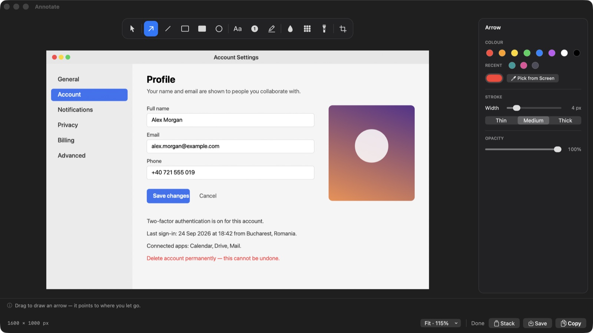
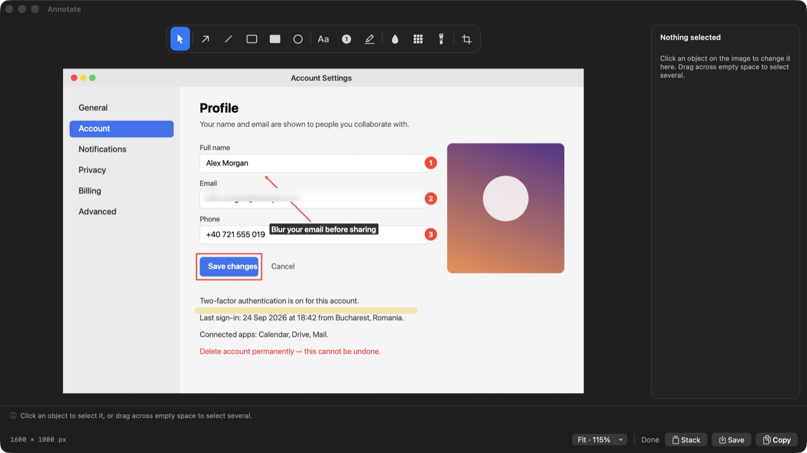

Inspector for each tool. Row 1: Select (nothing selected), Line, Filled Rectangle, Counter, Highlighter. Row 2: Blur,
Pixelate, Black-out, Spotlight, Crop.

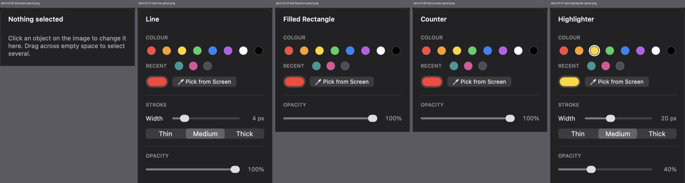
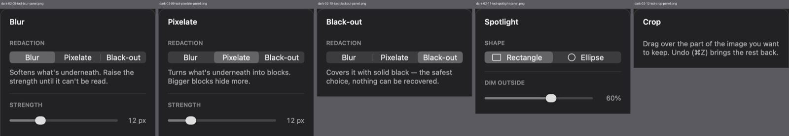

Text inspector, left to right: Text tool; selected Label text (top); the same scrolled to the bottom; Solid background
with Effects on (bottom).

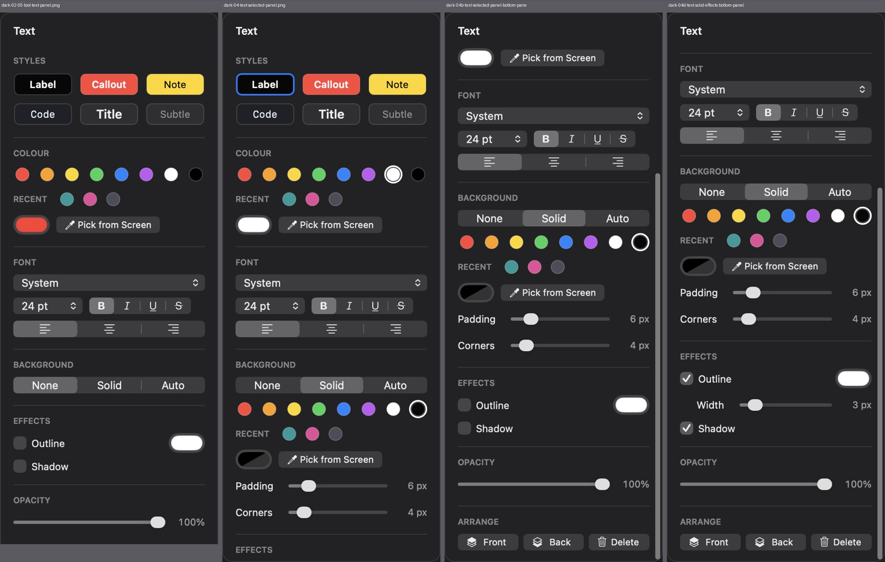

Selected objects, left to right: Blur, Highlighter, Counter, and a mixed selection of 4.

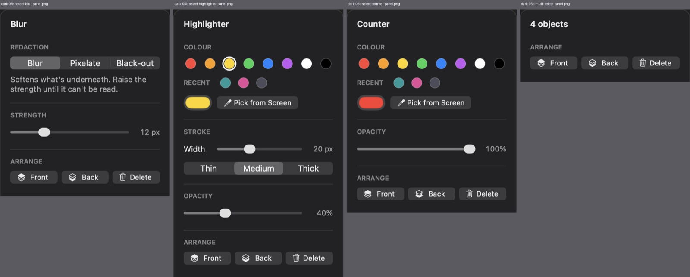

**What works**
- **Toolbar.** Tools are grouped with separators (shapes | text / counter / highlighter | redaction / spotlight | crop).
  The selected tool is an accent-filled square and hover shows a subtle fill (`editor-01`, toolbar). Tooltips name the
  tool and its single-key shortcut ("Arrow (A)").
- **Panel layout.** The inspector heading names the tool or selection ("Arrow", "Text", "4 objects", "Nothing
  selected"). Sections have small uppercase captions and hairline dividers on 16pt insets. I found nothing overlapping,
  and every label and segment fits at the 232pt column width (automated check).
- **Explanations everywhere.** The hint line changes with context: "Drag to draw an arrow — it points to where you let
  go." / "Type your text — ↩ or Esc finishes it, ⇧↩ starts a new line." / "Drag to move it, drag a corner to resize
  the text…" (`editor-13`). Redaction modes explain themselves ("Covers it with solid black — the safest choice…").
  Crop and Select show a plain note.
- **Style chips.** The Text Styles chips (Label, Callout, Note, Code, Title, Subtle) preview their own look, and the
  active one gets a blue ring.
- **Controls.** Sliders show their value with a unit ("12 px", "60%", "40%"), and Thin/Medium/Thick give quick
  presets.
- **Rendering and zoom.** Annotations render crisply (`editor-06`: arrow, box, numbered counters, highlighter, blur,
  label). Zooming to 150% keeps the chrome stable, and the zoom control reads "Fit · 115%" / "150%".

**Issues**

| # | Sev. | Where | Problem and why it matters | Suggested fix |
|---|---|---|---|---|
| E1 | **High** | Title bar, top-right (`editor-15`) | **Undo, Redo and the inspector toggle are invisible.** The title-bar accessory view has a frame width of **0** (its content needs 106×22pt), so the buttons sit at x = 1430–1462pt of a 1430pt-wide window and are clipped. Undo is only reachable with ⌘Z, and hiding the panel only with ⌥⌘I, which nobody will discover. Spec §4.2 promised a visible button. The builders' snapshots used `cacheDisplay` on the content view, which leaves out the title bar, which explains why nobody noticed. | In `EditorWindowController.buildTitlebarButtons()`, size the stack before handing it to the accessory, e.g. `stack.frame = NSRect(origin: .zero, size: stack.fittingSize)`. Then check it in the real app. |
| E2 | **High** (light mode) | Toolbar and inspector with the system in Light mode (`editor-11`, `editor-11b`) | **The dark panels wash out to mid-grey** (measured panel colour rgb 147,147,147). Section captions reach **1.8:1** contrast and white text 3.1:1. The "Subtle" chip, the selected **B** segment and the selected "None" segment all but disappear. The inactive **Copy** button's white label on a light bezel is unreadable too. The cause: the panels are forced dark-vibrant, but they blend with the light window backdrop (90% white). | Match the video editor: force the whole editor window dark (`window.appearance = .darkAqua`, with the dark backdrop). Or give the toolbar and inspector an opaque dark fill under the blur. |
| E3 | Medium | Text → Effects → Outline (`editor-07`, `editor-07b`) | **Turning on Outline makes white text an unreadable blob.** The default outline colour is white (`AnnotationStyle.textOutlineColor`), and the Label and Callout presets use white text. So the first thing a user sees after ticking Outline is "Blur your email before sharing" rendered as a white smear. | When Outline is switched on, default its colour to the contrast of the text colour (black for light text, white for dark; the Auto chip logic already works this out). Or default it to black. |
| E4 | Medium | Text inspector (`editor-04`, `editor-09`) | **The Text panel is about 830pt tall.** At the default window height only about 625pt shows, so **Opacity and Arrange (including Delete) are below the fold**. At the 884×440 minimum only Styles and Colour are visible. Nothing is truncated, but the panel is a long scroll. It is long partly because Background repeats a whole colour block (8 swatches + Recent + colour well + Pick from Screen) under the text-colour block. | Shrink the Background colour to one row (a colour well plus 4–5 swatches, or a popover). Make sections collapsible, or pin Arrange as a fixed footer. |
| E5 | Medium | A selected text object (`editor-08`, `editor-09`) | **Selection handles crowd the text.** A single-line text gets 4 corner handles and 2 side handles, which stack into a column at each end and cover the first and last letters. At "Fit · 42%" the handles are taller than the text. The corner handles (which scale the text) look identical to the side handles (which change the box width). | Draw the handles just outside the box. Hide the side handles when the box is shorter than about 3 handle heights. Give them distinct shapes (round corners, bar sides). |
| E6 | Medium | Canvas "Fit" (`editor-12`, and "Fit · 115%" in `editor-01`) | **"Fit" enlarges screenshots past their real size, so they look soft.** Fit allows up to 1 image pixel per point, which on a Retina display is 200%. A normal 1600px capture opens at 115%, and a 360×225 capture at 200%, visibly blurry. The window size is also worked out as if image pixels were points (`displayW = min(image.width, 1200)`). | Cap Fit at 100% (the capture's original on-screen size) and size the window from `image.width / backingScale`. |
| E7 | Low | Colour row, any tool (`editor-01`, `editor-02`) | The default red (1, 0.23, 0.19) is not one of the preset colours (preset red is 1, 0.27, 0.23), so **no swatch shows as selected** on first use. | Make the default equal to the preset red. |
| E8 | Low | Colour row; Effects → Outline | Two **unlabelled colour wells**: the large red capsule next to "Pick from Screen", and a white capsule at the far right of the Outline row that reads like a toggle. Only a tooltip explains them. | Add a short caption ("Custom", "Outline colour"), or put the well inside the labelled row. |
| E9 | Low | Panel rhythm | The Recent swatches don't line up with the preset swatch columns. Stroke → Width has an in-row label but Opacity, Strength and Dim don't, so slider tracks start at different x positions. The Outline Width row is indented a further 16pt. Unchecked checkboxes are dark squares (≈#3a3a3a on #232323), barely visible. | Use one slider-row template with an optional label and a fixed label column. Use a brighter checkbox outline. |
| E10 | Low | Arrange section (`editor-05`) | The Front and Back icons are almost identical at 12pt. | Use arrow-based symbols (`square.2.layers.3d.top.filled` vs `…bottom.filled`) or text only. |
| E11 | Low | Bottom bar (`editor-14`, `editor-10`) | The bar is 84pt tall for one hint plus one row of buttons. The pixel-size label is the only monospaced text in the app. "Done" is borderless grey text among bordered buttons. With the panel hidden at 600pt, the hint truncates ("…or double…"). | Put the size label and hint on one line, use the system font, and make Done a bordered button (or the window close box only). |
| E12 | Low | Typing text (`editor-13`) | There is no frame around the text being typed, so it's hard to tell it's in edit mode. (I couldn't check caret visibility: the probe window is never active.) | Show a thin dashed box while editing. |

**Score: 5.** In dark mode the inspector is organised, labelled and explained, roughly a 7 on its own. But E1 hides
primary controls in every session, E2 makes the panel near-unreadable for anyone on Light mode, and E3–E6 are visible
rough edges in the most-used flows (text, selection, first view of the image).

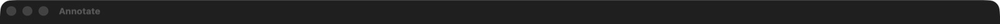
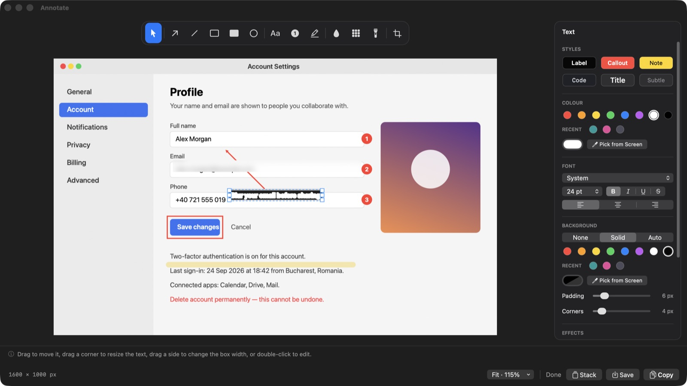
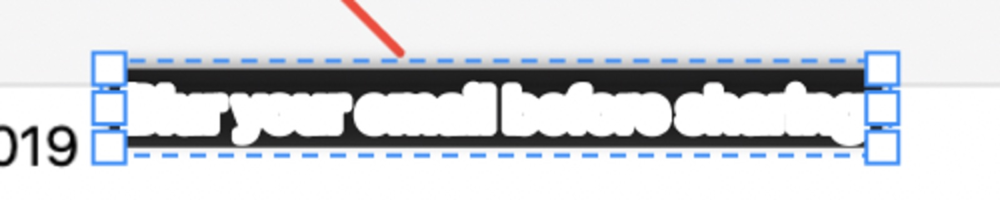
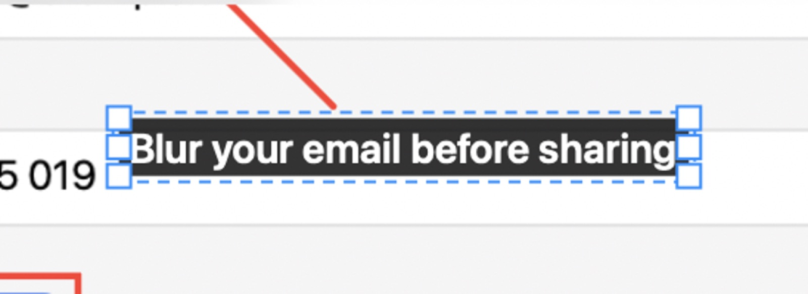
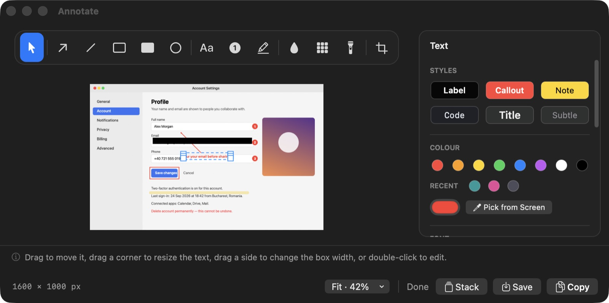
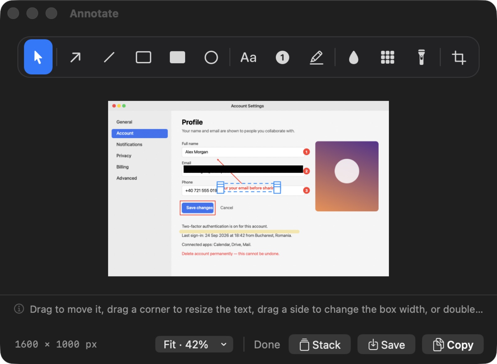
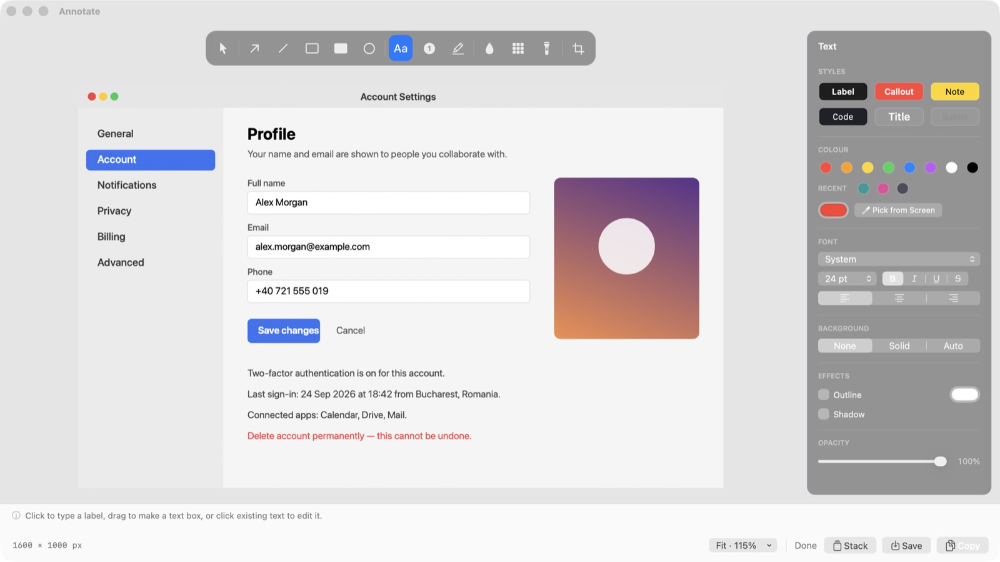
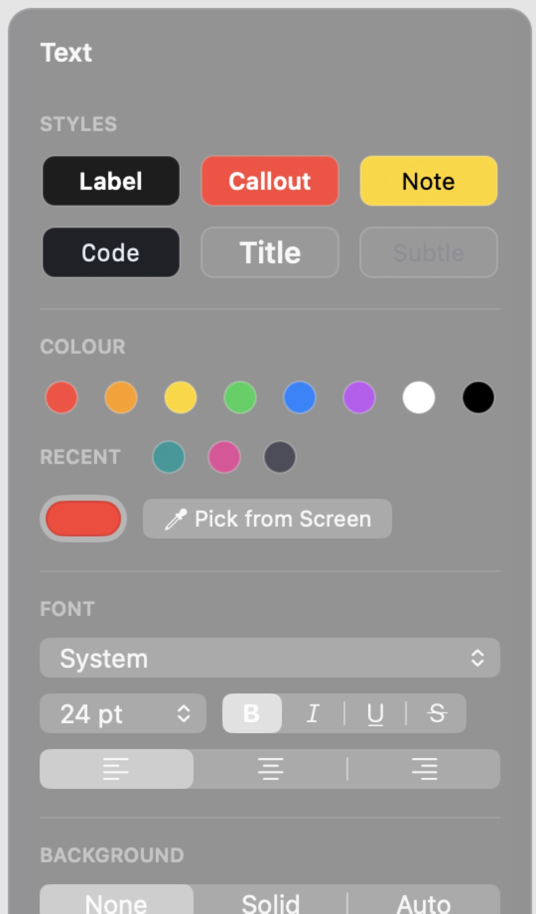
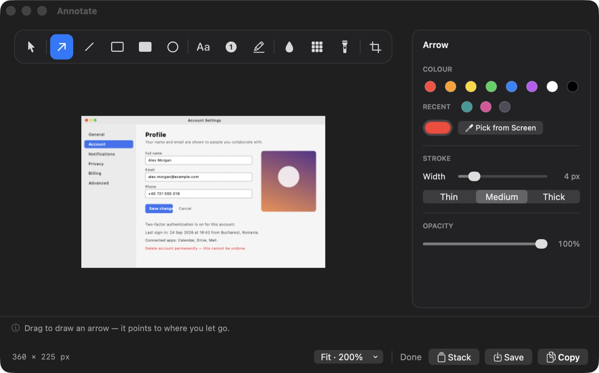
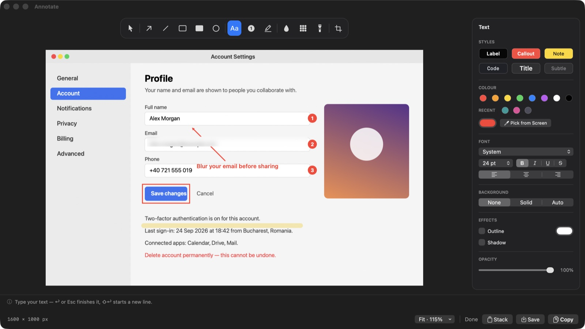
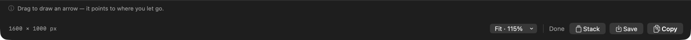

### 2.2 ★ Record setup strip

The strip is 892×182pt.

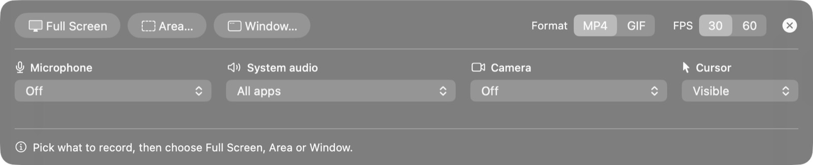

Rows, top to bottom: idle; GIF mode; mic on with the live level meter; long device names.

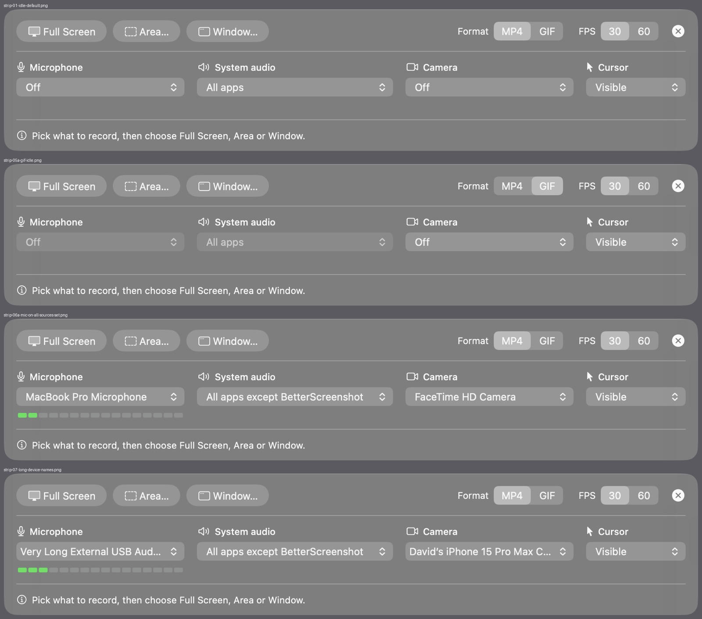
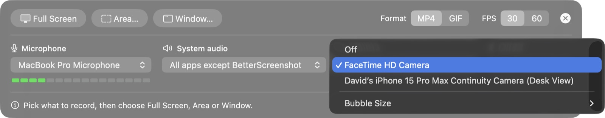

**What works**
- Each source is an icon + caption + dropdown (Microphone, System audio, Camera, Cursor), which fixes the old
  unlabelled-toggle complaint.
- The hint line explains whatever is hovered ("Microphone: records your voice from the selected input…"), and in GIF
  mode it says why audio is off ("GIFs have no sound. Switch Format to MP4 to record audio.").
- Long device names truncate cleanly. The live meter turns green, then yellow, then red. The menus are native, with
  checkmarks and a Bubble Size submenu.
- The Full Screen / Area… / Window… buttons read as the start actions, and the idle hint says so.

**Issues**

| # | Sev. | Where | Problem and why it matters | Suggested fix |
|---|---|---|---|---|
| S1 | Medium | Whole strip (`strip-01`) | **Washed-out grey instead of the dark HUD.** The strip blurs whatever is behind it and adds no dark tint (the pill adds a 25% black tint). Over light content it measured rgb 125,126,126, where white text is **3.9:1** and the grey hint text is lower. It doesn't match the dark editor HUD or the darker pill. | Add the same dark tint as the pill (25–35% black), as one shared HUD style (see C1). |
| S2 | Low | Under the dropdowns (`strip-01`) | A ~24pt **empty band** is reserved for the mic meter and shows as unexplained dead space when the mic is Off. | Collapse the row when the mic is Off, or show a dim meter placeholder. |
| S3 | Low | GIF mode (`strip-02`, row 2) | Microphone and System audio grey out, but the idle hint still says "Pick what to record…". The reason only appears on hover. | While GIF is selected, use the GIF sentence as the idle hint. |
| S4 | Low | Row layout (`strip-02`, row 4) | The four columns have uneven widths (≈216 / 250 / 216 / 128pt). Truncated dropdown titles start ~7pt further left than untruncated ones. | Use equal columns (or a 3+1 grid) and one text inset. |
| S5 | Low | Format / FPS segments | The selected segment is only a slightly lighter grey, so it's hard to see which is chosen. | Use a stronger selected fill (white 25–30%) or the accent colour. |
| S6 | Low | Hover and focus | Only the hint line reacts to hover (controls don't highlight). No focus ring was seen, but I couldn't verify one because the panel is never the key window. | Check keyboard focus rings on the real app. |

**Score: 7.** It fulfils the owner's request (labels, dropdowns, an explanatory line) with clean grouping. The
low-contrast grey and the uneven layout keep it out of the 8s.

### 2.3 ★ Live recording pill

The pill is 40pt tall, 656pt wide expanded and 178pt collapsed.

Rows, top to bottom: recording; mic and sound muted with camera on; mic and camera unavailable; paused; "Restart?"
confirm; collapsed; muted over a red backdrop.

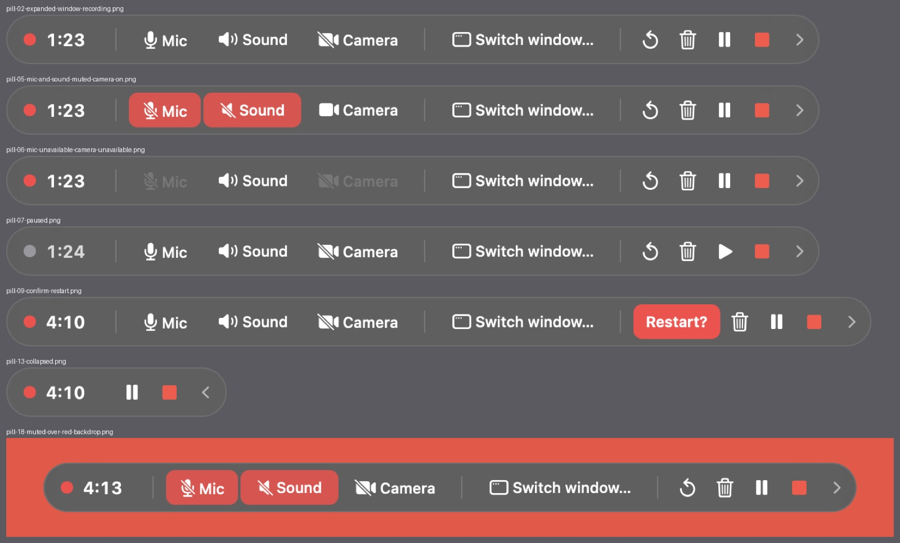

**What works**
- Mic / Sound / Camera are labelled toggles, and a muted source becomes a clear red chip with a crossed-out icon.
- Unavailable sources dim to 30%. "Switch window…" / "Switch area…" is labelled and hidden for full-screen recordings.
- The collapsed form keeps the timer, Pause and Stop.
- Contrast is good: white text 6.4:1 thanks to the dark tint. "123:45" still fits.

**Issues**

| # | Sev. | Where | Problem and why it matters | Suggested fix |
|---|---|---|---|---|
| P1 | Low–Med | "Restart?" / "Discard?" confirm (row 5) | The pill grows to 698–700pt, and because it's anchored on the right, its **left edge jumps about 44pt**. It's a layout shift right when the user must read and confirm. | Reserve the confirm width up front, or show the confirm text in place of the icon at a fixed width. |
| P2 | Low | Paused (row 4) | Paused is shown only by a grey dot, a dimmed time and a Play icon. The word "Paused" appears nowhere. | Show "Paused" next to or instead of the timer. |
| P3 | Low | ↺ 🗑 ⏸ ■ | The actions are icon-only, with tooltips but no hint line. ↺ (restart) reads like undo. | Hint text on hover, or a label on Restart. |
| P4 | Low | Camera chip (row 1 vs row 2) | "Camera off" is a normal chip with a crossed-out icon, while muted Mic/Sound are red chips with crossed-out icons. The same slash means two different things. | Show camera off as un-highlighted without the slash, or use the same red "off" styling. |
| P5 | Low | Over a red backdrop (row 7) | The red muted chips blend into red content. | Add a thin white border around the red chips. |

**Score: 7.** Clear, labelled and stateful. The remaining issues are small layout shifts and state wording.

### 2.4 ★ Video editor ("Edit Video")

The window is 960×720pt by default and 780×560pt at minimum. The test clip is a 20-second 1280×800 video with a
timestamp in every frame.

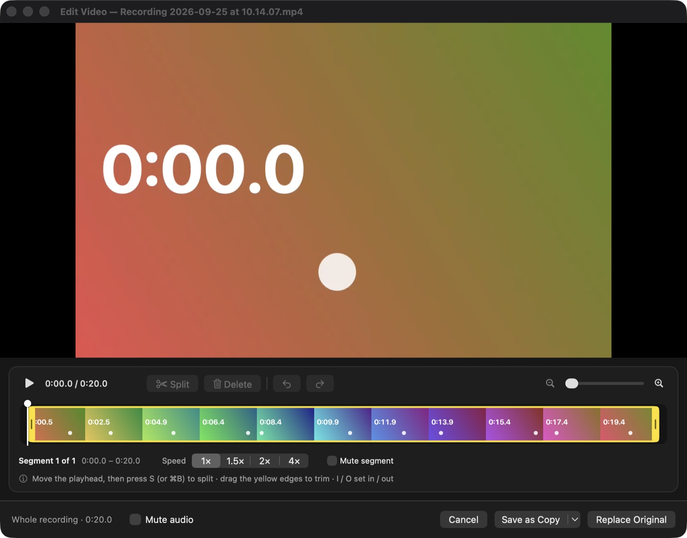
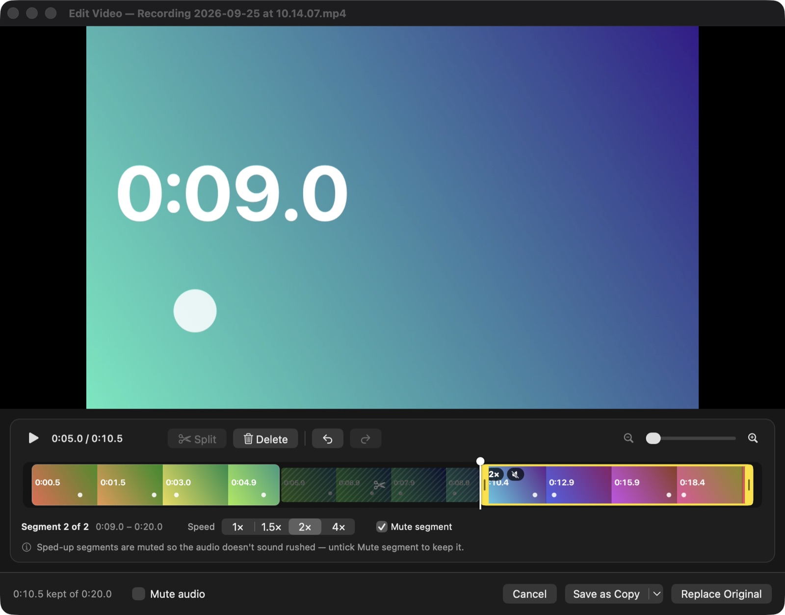
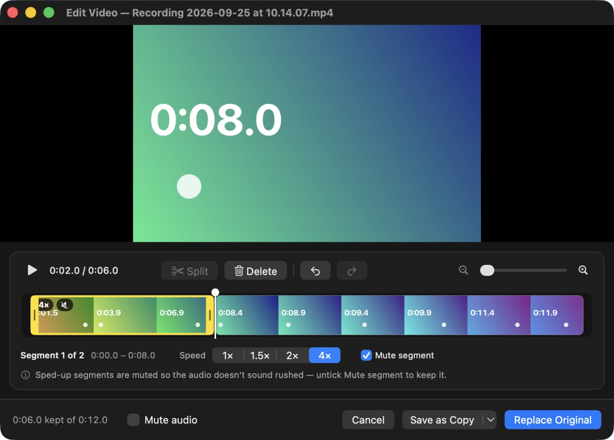

Rows, top to bottom: exporting; after Replace Original; a 1-second clip with a 0.1-second segment; a broken file.

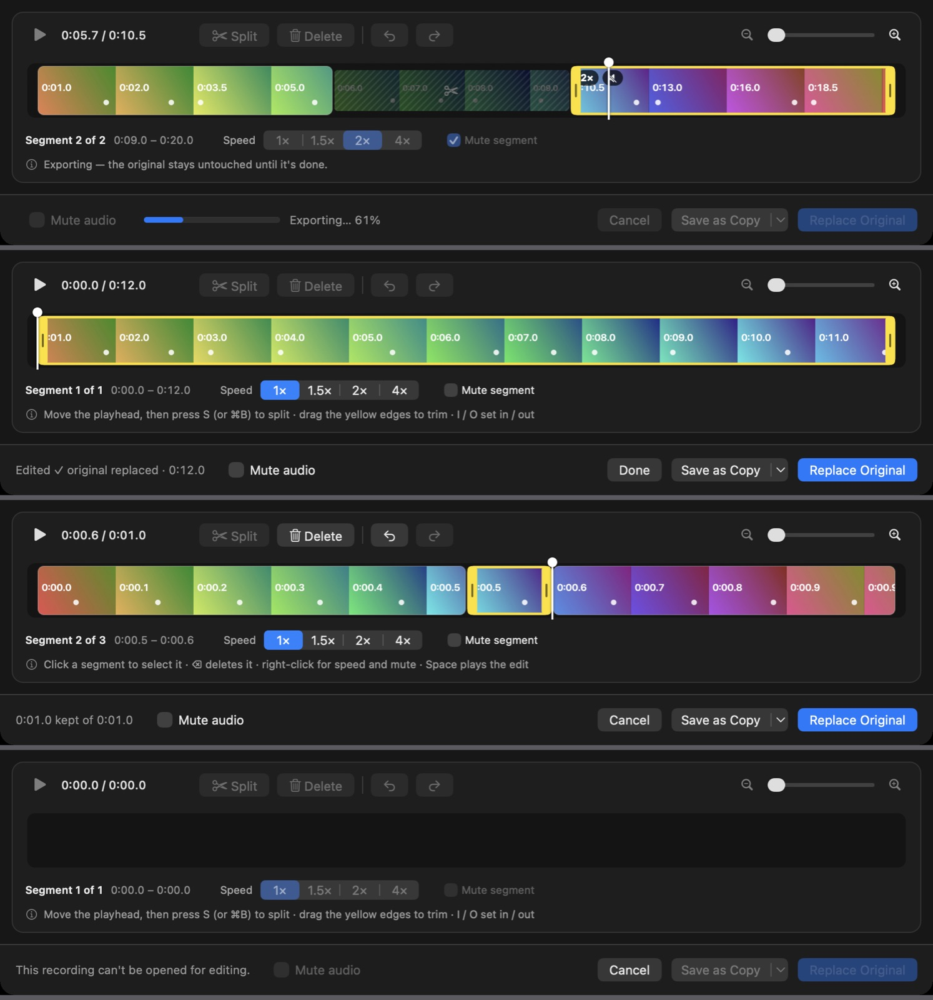

Rows: timeline zoomed 12×; mid-drag of a segment edge.

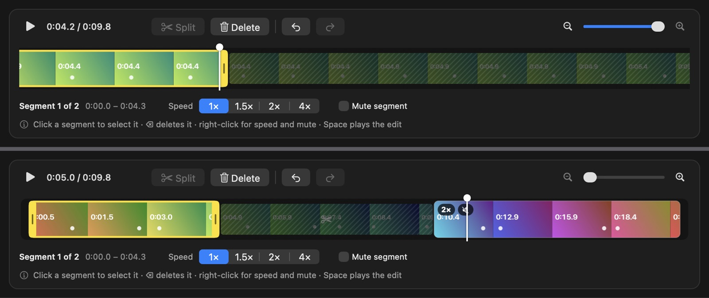

**What works**
- **Clear three-zone layout:** preview; a control card (play/time, labelled Split and Delete, undo/redo, zoom);
  a footer with Cancel, Save as Copy ▾ and a blue default Replace Original.
- **Segments read clearly.** Deleted segments are hatched with a ✂ mark. Sped-up segments are drawn narrower with a
  "2×" badge and a mute badge. The segment row says "Segment 2 of 2 · 0:09.0 – 0:20.0" next to Speed and "Mute
  segment".
- **The hint line teaches the editor:** "Move the playhead, then press S (or ⌘B) to split · drag the yellow edges to
  trim · I / O set in / out". It explains why a sped-up segment was muted and what happens during export.
- **Export feedback.** Progress is a determinate bar ("Exporting… 61%").
- **Minimum size.** Everything fits at 780×560 with no truncation.

**Issues**

| # | Sev. | Where | Problem and why it matters | Suggested fix |
|---|---|---|---|---|
| V1 | Medium | Filmstrip labels (`video-01`, `video-02`, `video-05`) | **Time labels get clipped, covered or duplicated.** In the default loaded state the first label is clipped to ":01.0" by the yellow trim handle. The "2×" and mute badges cover ":10.5". While dragging an edge, partial labels ("0:", "0:0") appear. At 12× zoom labels repeat ("0:04.4" three times, "0:04.9" four times). Label spacing is uneven (1.0, 3.0, 5.0, 6.5, 8.5…). | Start labels after the handle's width. Move badges to their own strip. Draw labels from a round-number time ruler instead of one per thumbnail. Re-generate thumbnails when zooming. |
| V2 | Medium | Broken or unreadable file (`video-04`, bottom) | The only error is small grey footer text ("This recording can't be opened for editing."), next to a black preview and an empty timeline. The hint line still gives editing instructions, and Play, zoom, undo and Speed still look enabled. | Replace the preview and timeline with a centred error (icon, message, Close) and disable the controls. |
| V3 | Low | Footer vs segment row | Two mute checkboxes: "Mute segment" in the segment row and "Mute audio" in the footer (whole file). The context menu says "Mute Segment" (different capitalisation). | Rename the footer one "Mute whole video", and match the capitalisation. |
| V4 | Low | Exporting (`video-04`, top) | The kept-duration label disappears and "Mute audio" jumps left. | Keep the label; put the progress bar in its own slot. |
| V5 | Low | After Replace Original (`video-04`, row 2) | "Replace Original" stays enabled and blue with nothing left to replace. | Disable it until there's a new edit. |
| V6 | Low | Control card | Undo/redo are icon-only while Split and Delete have labels. | Acceptable (standard glyphs); tooltips are enough. |

**Score: 7.** It does what the owner asked ("a bit more like editing software") with good explanations. The label
glitches on the timeline, the part users stare at, and the weak error state keep it at 7.

### 2.5 ★ Settings window

The window is forced dark and 960pt wide. Its content is 1262pt tall, so it scrolls.

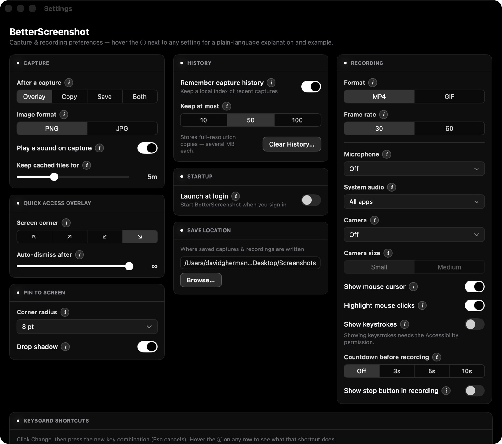
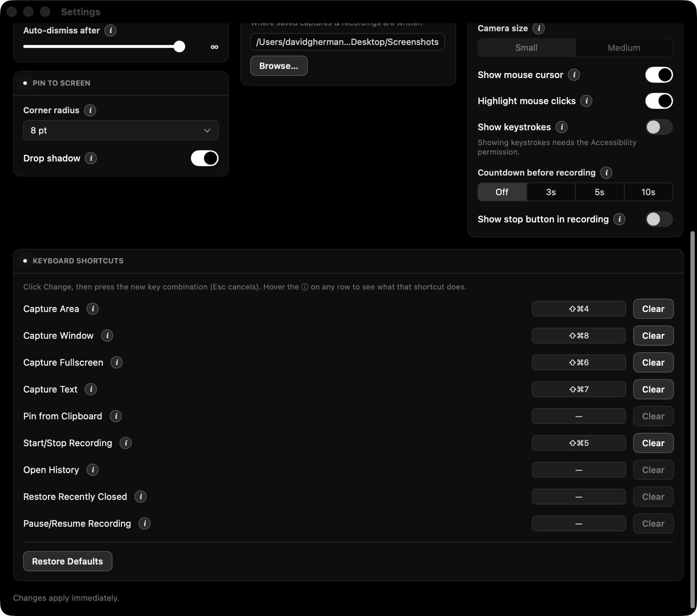

Left: two ⓘ popovers. Right: the Recording card with long device names and the camera on.

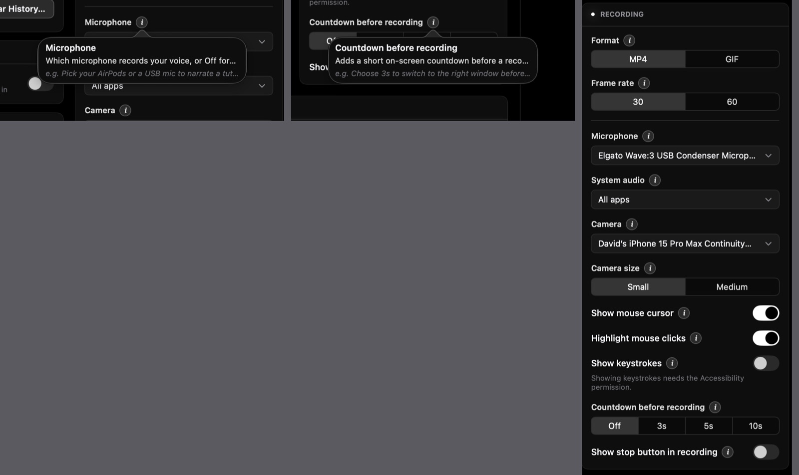
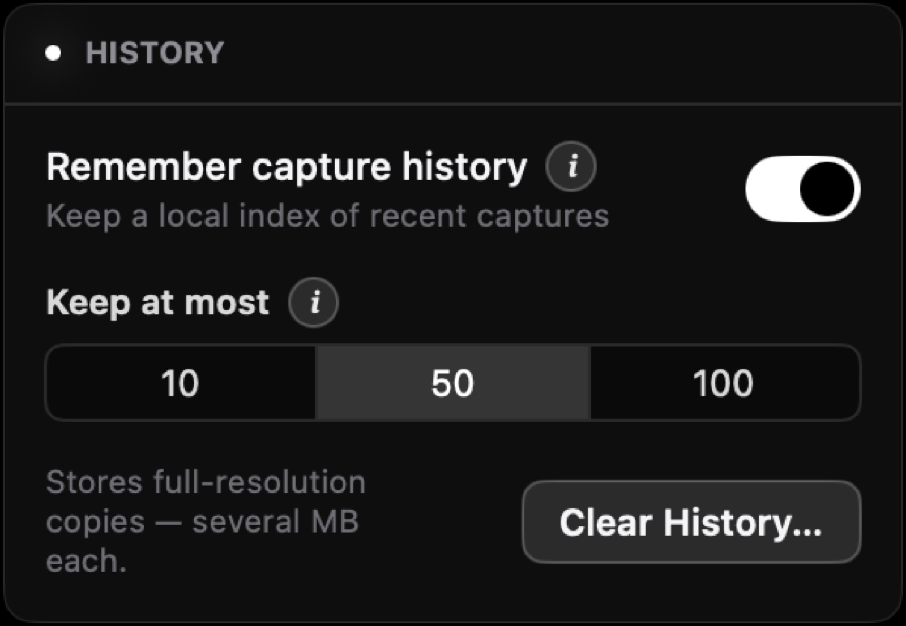

**What works**
- Strong typographic hierarchy and a consistent black card system.
- An ⓘ on every row, and "Changes apply immediately." at the bottom.
- The Recording card is logically ordered: format and frame rate, then sources, then cursor, clicks and keys, then
  countdown and the stop button.
- Dependent options dim properly (Camera size with the camera Off, Keep-at-most with history off, audio in GIF mode,
  with a note). Long device names truncate cleanly.
- Shortcut recording shows a clear "Type shortcut…" state.

**Issues**

| # | Sev. | Where | Problem and why it matters | Suggested fix |
|---|---|---|---|---|
| T1 | **High** | Every ⓘ popover (`settings-03`, left) | **The help text is cut off after one line**: "Which microphone records your voice, or Off for…" / "e.g. Pick your AirPods or a USB mic to narrate a tut…". The window's subtitle promises "a plain-language explanation and example" on hover, and every one is unreadable. (Caveat: the popover was shown through a forced binding because a background app can't be hovered; the popover content itself is unchanged.) | In `InfoTip.tooltipCard`, give the card a fixed width (`.frame(width: 300)`) and add `.fixedSize(horizontal: false, vertical: true)` to each `Text` so it wraps. Check by hovering in the real app. |
| T2 | Medium | Keyboard Shortcuts card (`settings-02`) | The help text says "**Click Change**, then press the new key combination…", but there is no Change button. The shortcut field itself is the control, and it looks like a static label. | Change the text to "Click a shortcut, then press…" and give the fields a hover/focus outline. |
| T3 | Low | Layout (`settings-01`) | The masonry is unbalanced: column 2 ends ~400pt above column 3, leaving a large black void. | Move the Save Location card, or put Startup + Save Location under Capture. |
| T4 | Low | History card (`settings-04`) | "Stores full-resolution copies — several MB each." is squeezed into three short lines beside "Clear History…". | Put the note on its own line under the button row. |
| T5 | Low | Recording card vs record strip | The same options use different controls and words: custom chevron dropdowns here vs standard popups in the strip; "Show mouse cursor" toggle vs "Cursor: Visible"; "Camera size" vs "Bubble Size". | Pick one name per option (see C3). |
| T6 | Low | "Show stop button in recording" | Ambiguous: it means the controls pill appears *in the video*. | "Show recording controls in the video". |

**Score: 6.** It is visually the most polished window in the app, but its main help mechanism (T1) is broken and the
shortcuts instructions (T2) name a button that isn't there.

### 2.6 Quick Access card

Rows: a light screenshot, a dark (code) screenshot, a busy image with a white headline, a recording, a dark card
hovering Copy, and a very wide capture.

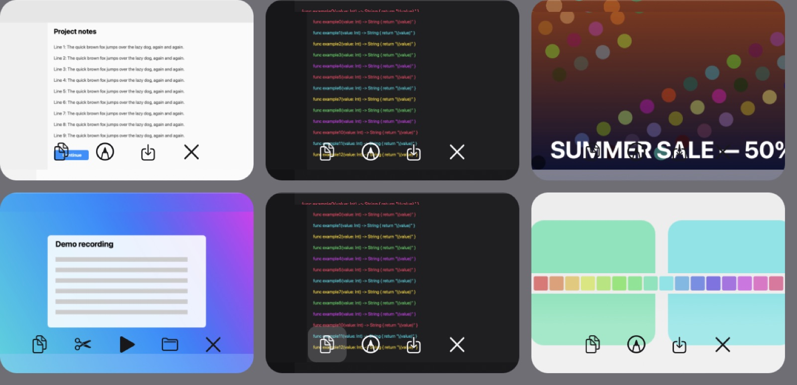

Left to right: light capture (note the grey band at the top); very wide capture (double image); very tall capture
(double image).

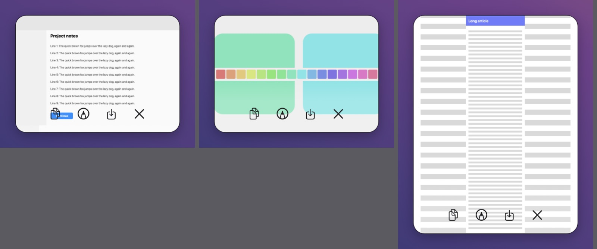

Verification: a navy image with white stripes. The contrast tint is visible only in the bottom 9pt strip, and the
dark button glyphs vanish over the navy stripes.

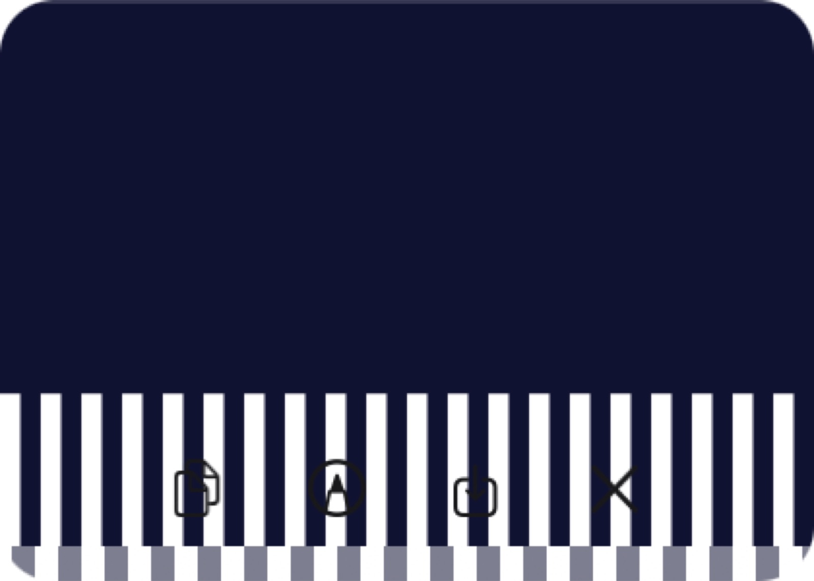
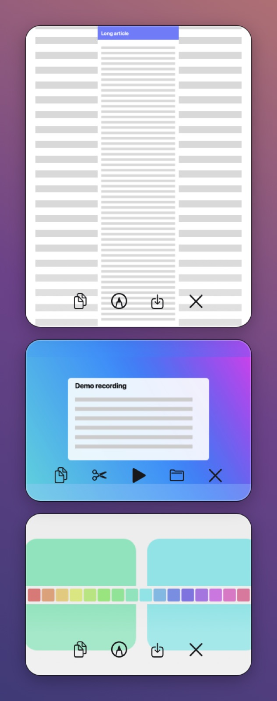

**What works**
- The cards are compact and rounded, with consistent 12pt stacking and a 24pt margin. Mixed card heights stack
  cleanly.
- Hover gives a soft fill on each button.
- Recordings get the right set of actions: Copy file, Edit video, Open, Show in Finder, Close.

**Issues**

| # | Sev. | Where | Problem and why it matters | Suggested fix |
|---|---|---|---|---|
| Q1 | **High** | Every card | **The card draws its image twice, and the contrast tint is hidden.** `DraggableImageView` is an `NSImageView`, and on this macOS (26 / Darwin 25.6) `NSImageView` adds its own internal view with a *fit-inside* copy of the image. That copy is drawn **on top of** the code's *fill-the-card* copy and on top of the tint behind the buttons. Layer dump: tint layer at y 0–67pt, `NSImageView`'s own image layer at y 9–140pt above it. What users see: **(a)** the tint only shows in the thin top and bottom bands, so on busy images the buttons are illegible (the "SUMMER SALE" card, and the stripes test above). The 4.5:1 guarantee from v2.9.0 does not hold on screen. **(b)** Normal captures get grey bands at the top and bottom instead of edge-to-edge images. **(c)** Very wide or tall captures show two overlapping images. The app passes the same kind of `NSImage` (`CaptureCoordinator.swift:161`), so this is not a probe artefact. | Stop `NSImageView` from drawing the picture: make the drag source a plain `NSView` that keeps the `NSImage` only for the drag preview, or clear `image` after setting up the drag and store it elsewhere. Then re-check the busy-image case on screen. |
| Q2 | Low | Recording card | There is no duration or format badge; a recording card looks like a screenshot card with more buttons. | Add a small "0:42 · MP4" badge in a corner. |
| Q3 | Low | Button row | The buttons are icon-only (tooltips: Copy / Edit / Save to screenshots / Close). CleanShot does the same, so this is acceptable once Q1 is fixed. | none |

**Score: 3.** The card users see after every single capture shows layered images and illegible buttons. The design
underneath is sound, and the fix is small.

### 2.7 History window

The window is 700×500pt by default and 520×360pt at minimum. It follows the system appearance.

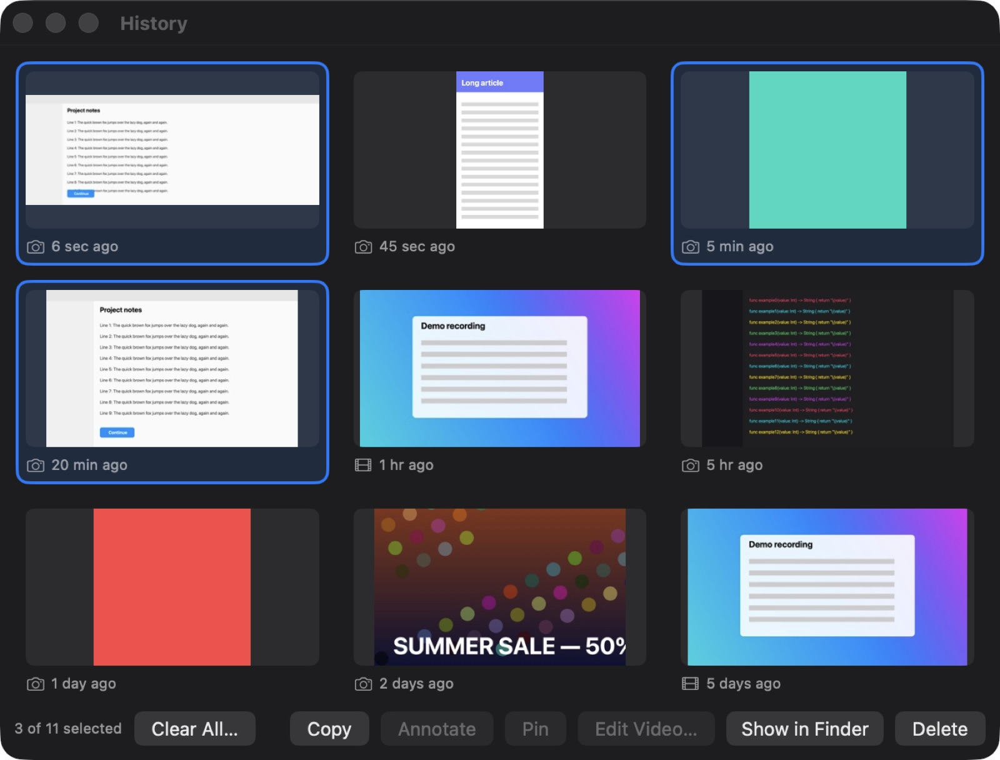
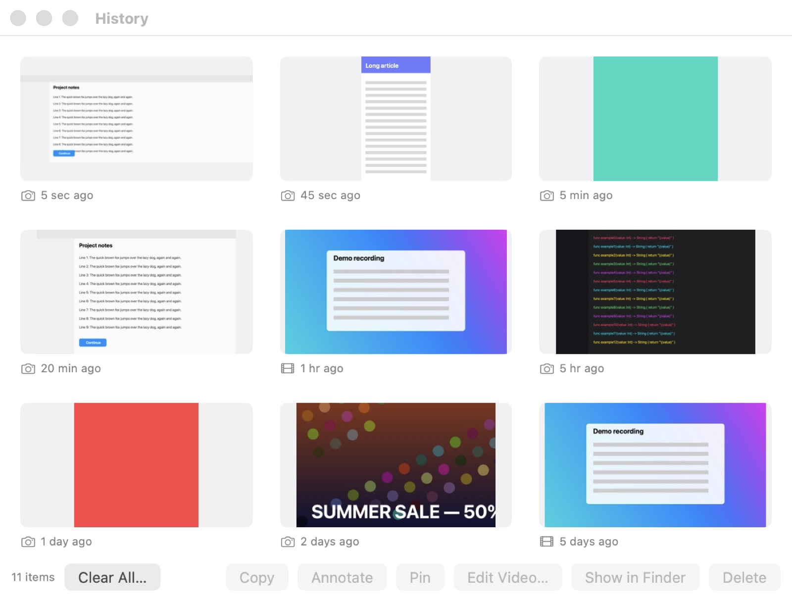
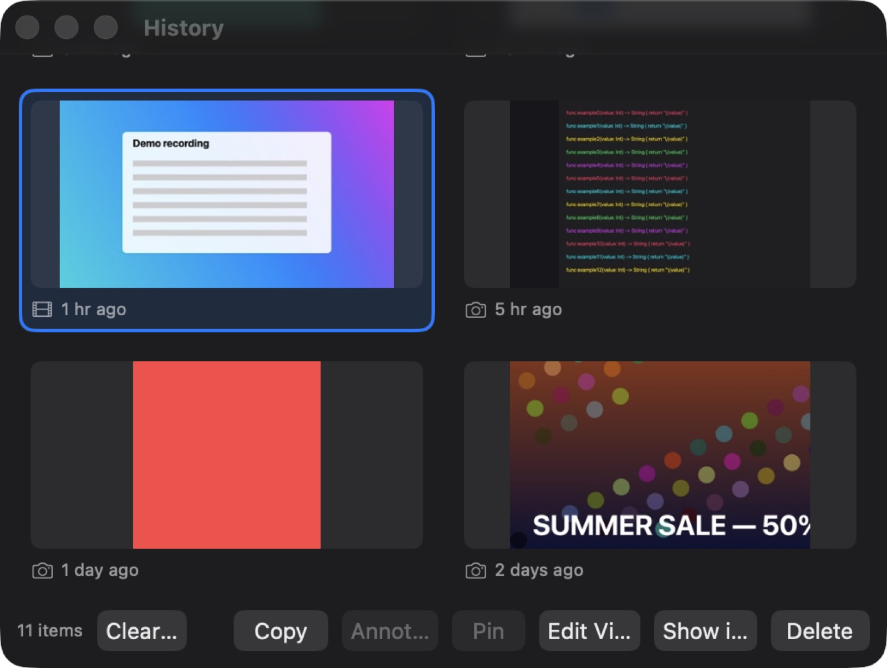
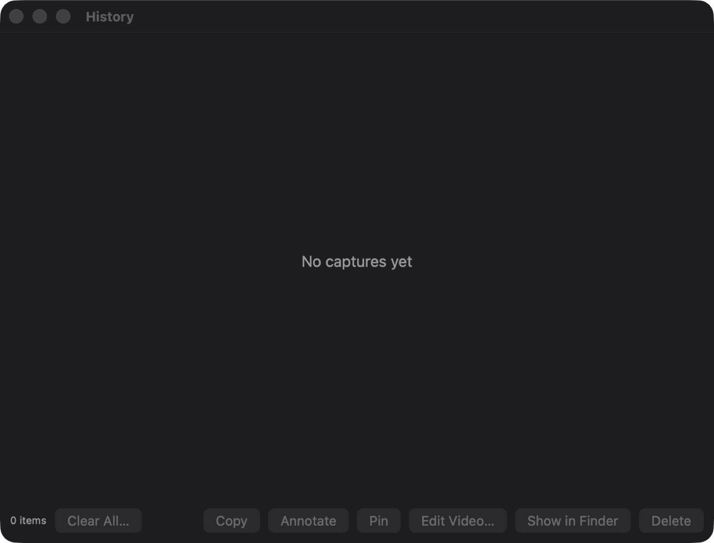

**What works**
- A clean three-column grid with a strong accent selection ring and tint.
- A "3 of 11 selected" count.
- Actions that don't apply to the selection disable themselves (Annotate/Pin for recordings, Edit Video… for
  screenshots).
- Both appearances read well.

**Issues**

| # | Sev. | Where | Problem and why it matters | Suggested fix |
|---|---|---|---|---|
| H1 | Medium | Action bar at 520pt (`history-03`) | The labels truncate: "Clear…", "Annot…", "Edit Vi…", "Show i…". This is exactly the squeezing the v3 principles forbid. | Raise the minimum width to fit the bar (≈700pt), or use icon + label buttons that collapse to icons with tooltips. |
| H2 | Low–Med | Cells | Each cell shows only a type icon and a relative time: no file name, pixel size or recording duration. Recordings differ only by a tiny film icon. | Add "1600×1000" / "0:42" under the time, and a play badge on video thumbnails. |
| H3 | Low | Empty state (`history-04`) | A single grey line, "No captures yet", with no guidance. | Add an icon and "Press ⇧⌘4 to take your first screenshot." |
| H4 | Low | "Clear All…" | A destructive whole-history action sits next to the count, styled like Copy. | Move it into a menu, or style it as destructive and keep it away from the primary actions. |

**Score: 6.** Solid and readable, but it truncates at minimum size and gives little information per item.

### 2.8 Welcome / onboarding

Left to right: needs permission, waiting, all set (dark), all set (light).

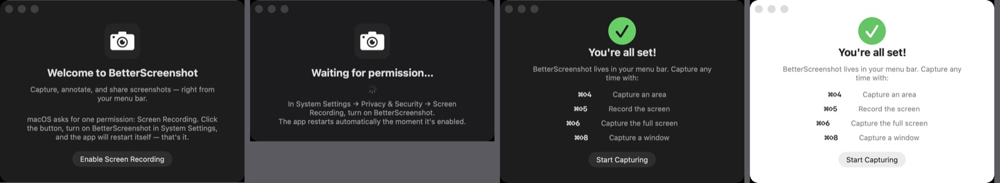
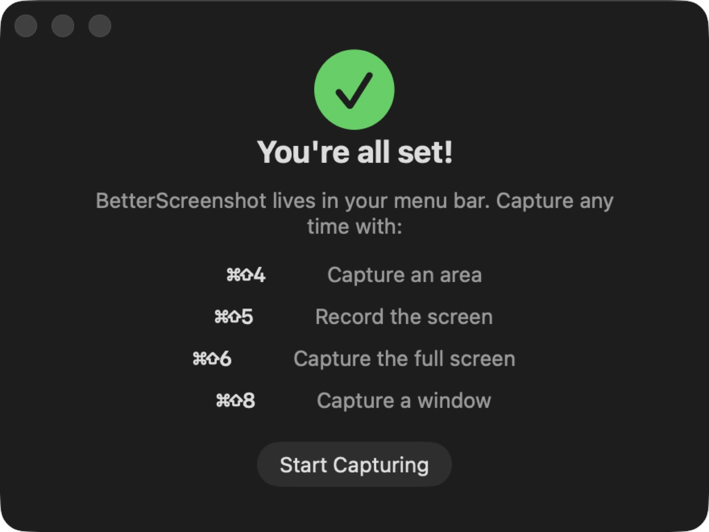

**What works**
- Short, friendly, one clear action per step.
- It explains the one permission it needs and that the app restarts itself.
- A spinner shows while waiting, and both appearances are fine.

**Issues**

| # | Sev. | Where | Problem and why it matters | Suggested fix |
|---|---|---|---|---|
| O1 | Medium | "You're all set!" list (`onboarding-02`) | Each shortcut row is centred on its own, so the key column and the description column are ragged. It looks unfinished on the first screen a user ever sees. | A two-column grid: keys right-aligned, descriptions left-aligned. |
| O2 | Low | Same list | The shortcuts are shown as **⌘⇧4** while the menu and Settings show **⇧⌘4** (Apple's order). They are hard-coded (`OnboardingController.swift:94–97`), so a rebinding won't show, and Capture Text (⇧⌘7) is missing. | Read the live bindings and format them with the same helper as the menu. |
| O3 | Low | Window size | The height changes between states (329 → 255 → 330pt), so the window jumps. | Use a fixed height. |

**Score: 6.**

### 2.9 Overlays & small HUDs

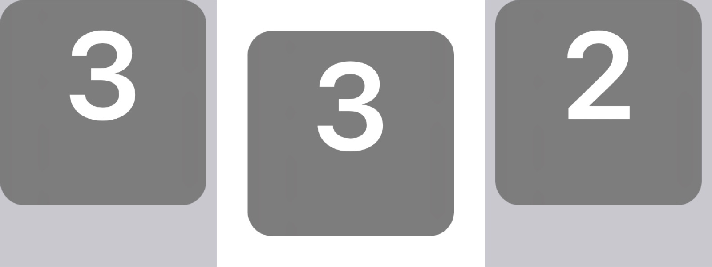
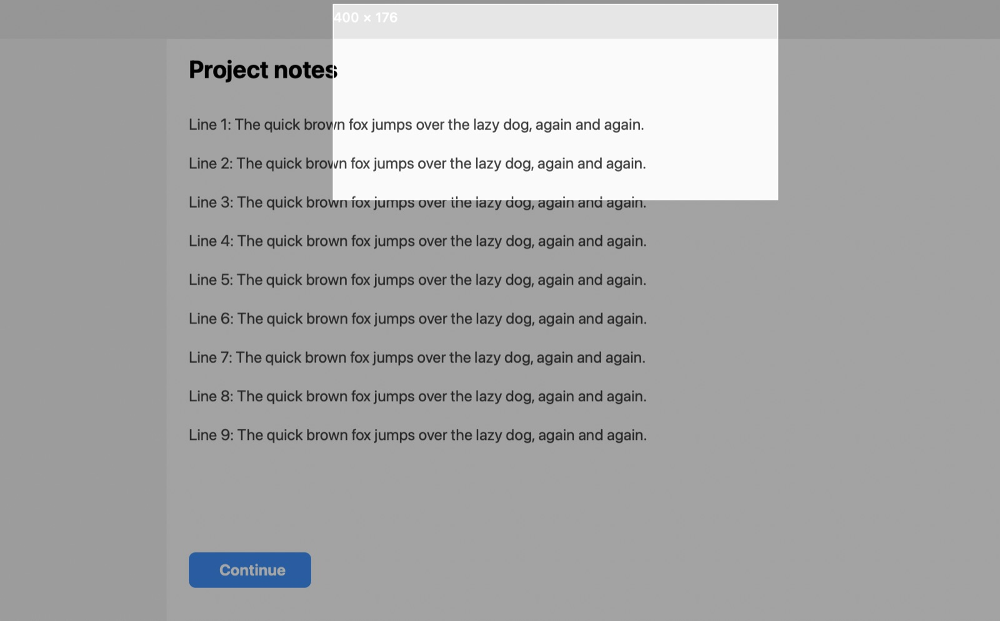
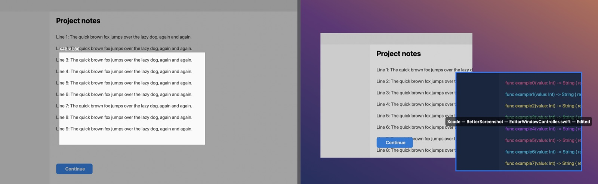
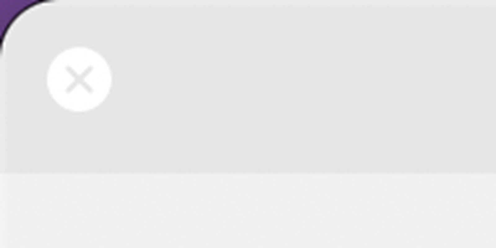
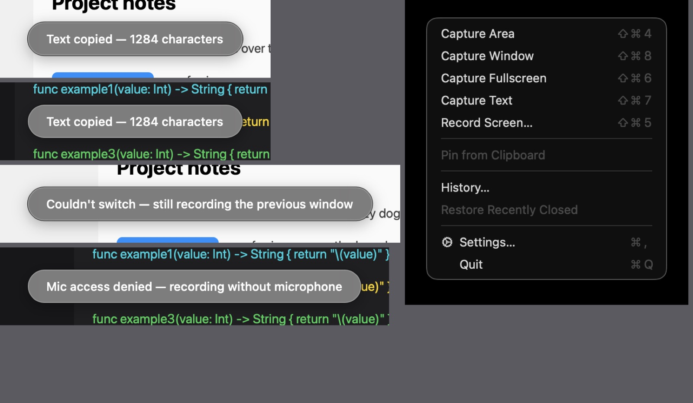

**What works**
- The menu has standard shortcuts and correct disabled states.
- The area selection dims the screen to 35%.
- The window picker's highlight is a clear accent border with a tint and a title chip.
- Toasts are short, single-line and never truncated (the longest is 372pt).

**Issues**

| # | Sev. | Where | Problem and why it matters | Suggested fix |
|---|---|---|---|---|
| X1 | Medium | Countdown | **The number sits about 26pt above centre** in its 200pt box (glyph centre measured at y = 147 of 400px). The label fills the box, and a text label draws at the top of its frame. It is the first thing shown when a recording starts. It also doesn't say that clicking skips it. | Centre the label vertically with constraints (or adjust its baseline). Add a small "Click to start now" line. |
| X2 | Medium | Area-selection size label | The "400 × 176" label is bare white text with no background. Near the top edge it sits inside the selection, white on light grey, and is unreadable. Mid-drag it overlaps page text. | Put it on a dark rounded chip outside the selection's corner (what CleanShot does). |
| X3 | Low | Pin close button | A white ⓧ with no backing; nearly invisible on light images. | Give it a dark circular backing, like the macOS Screenshot thumbnail. |
| X4 | Low | Window picker title chip | A long window title runs past the highlighted window's edges. | Truncate to the window width. |
| X5 | Low | Toasts | The same grey HUD with no dark tint as the strip (see C1). No icon. | Use the shared dark HUD style, and add an optional SF Symbol. |
| X6 | Low | Menu-bar menu | macOS 26 draws a gear icon only on "Settings…", which pushes Settings and Quit out of line with the other items. | Icons on all items or none (for example, set `image` on every item). |

**Score: 5.** Each piece works, but two of them (countdown and selection label) look unfinished in normal use.

---

## 3. Cross-cutting issues

- **C1. There is no single HUD style yet (spec §2 goal).** I measured four "dark HUD" backgrounds:
  - editor panels ≈ #222, blending within the window over a dark backdrop;
  - the pill ≈ #5f5f5f, blurred with a 25% black tint;
  - the strip, countdown and toasts ≈ #7d7e7e over light content, blurred with no tint;
  - editor panels in light mode ≈ #939393.

  Fix: one shared helper (material + a fixed dark tint of about 35–45% black + the 10% white border) that every
  surface uses.
- **C2. Two control styles.** Settings uses custom monochrome controls (white toggles, chevron dropdowns, black cards);
  everything else uses standard AppKit controls. Either is fine, but the *same setting* looks different in Settings
  and in the strip.
- **C3. Terminology drift.** Pick one term per concept:
  - "System audio" (strip, Settings) vs "Sound" (pill)
  - "Camera size" vs "Bubble Size"
  - "Show mouse cursor" vs "Cursor: Visible"
  - "Full Screen" (strip) vs "Fullscreen" (menu, Settings: "Capture Fullscreen")
  - "Mute segment" vs "Mute Segment"
  - "Edit Video…" (History) vs "Edit video" (card tooltip)
  - ⌘⇧ (onboarding) vs ⇧⌘ (everywhere else)
- **C4. Icon-only buttons rely on tooltips.** The editor and strip back icons up with a hint line. The Quick Access
  card, the pill's actions and the video editor's undo/redo don't. That's acceptable for standard glyphs, but the spec
  says "no unexplained icons".
- **C5. Light mode.** Settings, strip, pill, video editor and countdown are forced dark, which is consistent. History
  and onboarding adapt properly. The annotation editor half-adapts (light window, washed-out dark panels) and is the
  one surface that breaks in light mode (E2).
- **C6. Typography and spacing.** The system font is used throughout, apart from the editor's monospaced size label.
  The small uppercase section captions are shared by the editor and Settings, which is good. The 8pt grid and 16pt
  insets hold in the editor panel and Settings. The strip's vertical rhythm is broken by the empty meter band (S2).
- **C7. Colour.** The accent colour marks selection consistently: editor tool, video speed/segment, History cells,
  shortcut recording. Red is used only for recording and mute states. Good.

---

## 4. Top 10 fixes (ranked by impact ÷ effort)

1. **Quick Access: stop `NSImageView` drawing its own copy of the image (Q1).** Minutes of work. It restores
   edge-to-edge images, removes the doubled images and makes the button tint work again, on every capture.
2. **Editor: give the title-bar accessory a real width (E1).** One line. Undo, Redo and the inspector toggle reappear.
3. **Settings: make the ⓘ popovers wrap (T1).** Two modifiers. The whole help system becomes readable.
4. **Countdown: centre the number (X1).** A few lines.
5. **One dark HUD style (C1, E2, S1, X5).** Add the pill's dark tint to the strip, countdown and toasts, and force the
   editor window dark (or give its panels an opaque dark fill). This fixes light-mode legibility and delivers spec §2's
   "one visual language".
6. **Outline colour follows the text colour (E3).** Small. It removes an unreadable result from the text tool.
7. **Area-selection size label on a dark chip (X2).** Small. A readable size readout on any background.
8. **Cap "Fit" at the capture's real size, and size the editor window in points (E6).** Small. Every screenshot opens
   sharp, and small crops stop looking blurry.
9. **History action bar: no truncation at minimum width (H1).** Small: raise the minimum width, or use icon + label
   buttons that collapse.
10. **Shorten the Text inspector and tidy the handles (E4, E5).** Medium effort: compact Background colour row,
    collapsible sections or an Arrange footer, handles outside the box.

Next in line: timeline label clipping (V1), onboarding shortcut grid and live bindings (O1, O2), the "Click Change"
wording (T2), the video editor's error state (V2), and the terminology pass (C3).

---

## 5. Method & limits

**How the screenshots were made**
- Headless probe programs (small command-line Swift packages that open the real windows off to the side and
  screenshot them) were built outside the repo, under the session scratchpad at
  `/private/tmp/claude-501/…/scratchpad/agents/ui-review/`. That folder is temporary and may already be gone; to redo
  a capture, rebuild a probe the same way. The probes link the repo's `EditorKit`, `RecordingKit` and `OverlayKit`
  packages by absolute path and create the real UI classes.
- App-target classes were copied fresh from `App/` with minimal stubs: `RecordStripController`,
  `RecordingControlsController`, the Settings views, the History window, onboarding and the menu. The stubs are a
  separate UserDefaults suite, a temporary History folder, a stubbed permission manager, and a forced-show switch for
  `InfoTip`.
- The content is realistic: a synthetic "Account Settings" screenshot (1600×1000, also 360×225 and 700×2400), busy,
  bimodal, very wide and very tall images, and a generated 20-second 1280×800 MP4 with a timestamp in every frame.
- Interaction used synthetic mouse and key events delivered straight to the views, `performClick`, and `insertText`
  for typing.
- Windows were captured with `CGWindowListCreateImage(.optionIncludingWindow, [.boundsIgnoreFraming, .bestResolution])`.
  This shows blur effects and video layers, unlike `cacheDisplay`.
- Environment: MacBook with a 2560×1664 Retina display at 1470×956pt, macOS 26 (Darwin 25.6), system in dark mode.
  Light mode was tested with `NSApp.appearance = .aqua`.
- Two helper agents built the recording and app-window probes and captured their screenshots. I looked at every image
  myself and did all the judging. I re-checked the two biggest findings independently:
  - **E1:** printed the accessory's frame (width 0, needs 106×22pt).
  - **Q1:** my own stripe-image probe plus a layer dump.
- Automated checks: truncated labels, squeezed buttons and segments, controls outside the panel column, and WCAG
  contrast measured from captured pixels.

**What couldn't be captured, or may differ on a real screen**
- The probe apps run in the background, so their windows render *inactive*: grey traffic lights, grey default buttons,
  and no key-window focus rings or text caret. These were not penalised. Some video-editor shots did become active.
- **Tooltips** (OS windows) weren't captured. Hover states were produced by calling the views' hover handlers
  directly. The Settings ⓘ popovers were shown through a forced binding.
- **Blurred surfaces** (strip, pill, countdown, toasts) take their colour from whatever is behind them, so the measured
  greys (S1, C1) depend on what was on screen during the capture. On a dark wallpaper they'll look darker.
- The area-selection overlay and window picker were captured as 900×560 stand-ins, not full-screen. The picker's
  drawing code was copied because its view class is private.
- Not captured:
  - the camera bubble (camera permission is not granted in this environment);
  - the menu-bar status icon;
  - the "Allow microphone access…" link;
  - the Clear History / Delete confirmation dialogs;
  - the History "file missing" badge;
  - the real full-screen overlays.

**For a human to check on the real app, in priority order**
1. Q1: take a screenshot of a busy web page and a very wide one, and look at the Quick Access card.
2. E1: open the editor and look at the top-right of its title bar.
3. T1: hover an ⓘ in Settings.
4. The editor with the Mac in Light mode.
5. The countdown before a recording.
6. How the strip and toasts look over your usual wallpaper.
7. Keyboard focus rings in the strip.
