# Guided tours review — 2026-09-26

**Overall: 6/10** — Good, with noticeable issues. I ran all 64 steps through the real `TourCoordinator`, the real tag overlay and the real windows. Every step I could run landed on the right control, and every Try step (drawing, a menu opening, a split, a click) reacted at once. No tour got stuck, and every step body fits its two lines with the default shortcuts. The shortcuts the tags show match the code. What stops this reaching the 8+ band is a set of Medium issues that a typical new user will hit:
- **The tag's text contrast is below 4.5:1.** It fails WCAG AA on every tag.
- **Placement near very large controls covers the controls next to them.** The tag lands over the editor's side panel, the video timeline, the Settings Capture card, and the label of the row it explains.
- **The "n of m" counter skips numbers when steps are skipped.** A new user's recording pill goes 1 → 3 → 4 → 6.
- **The recording tours are long, and the pill tour runs during a live recording.** Its "Mute the mic" Try step leaves the mic muted.
- **Esc is taken away from Settings' shortcut recorder.** A Settings step itself tells the user to press Esc.

There are no High issues. These match the target's "6" anchor almost word for word: *right controls, reads clearly, but placement sometimes covers useful content, some steps add little.*

**Standard:** Apple HIG quality, plus the best in-product coach marks (Figma, Notion, Linear). · **Method:** live flows through the real tour code, every step captured. · **Reviewer:** independent subagent.

## Calibration
- **Terms:**
  - A **tour** is a sequence of **steps**. Each step outlines one real control, its **anchor**, with a red box and a red **tag** (the bubble with a title, a body, "n of m", and buttons), joined by a leader line. The anchor is a string id like `editor.canvas`, set with `view.tourAnchor`.
  - **Explain (E)** steps advance on Next. **Try (T)** steps advance when the user does the action.
  - A **hand-over** is one tour starting the next: Welcome → Quick Access → Editor, and First recording → Recording pill.
  - The steps are data in `Packages/TourKit/Sources/TourKit/Catalog/*.swift`. Placement is in `Packages/TourKit/Sources/TourKit/Overlay/`. Triggers and persistence are in `App/Tours/TourCoordinator.swift`. The design is in `docs/superpowers/specs/2026-09-24-betterscreenshot-editor-recording-v3-design.md` §14.
  - **WCAG AA** is the web accessibility contrast minimum: 4.5:1 for normal-size text.
  - **`keepOut`** is the rectangle the tag avoids (the host panel, for borderless panels).
  - Issue ids (T1, E1…) are used across sections.
- **What this is:** a native macOS menu-bar app (AppKit + SwiftUI). The tours are coach marks laid over real windows and over panels that never take focus: the record strip, the recording pill and the Quick Access card.
- **Audience:** first-time users who chose "Show Me Around". They want to learn fast and get back to work. Existing users never see a tour unless they replay it.
- **Maturity:** a personal, local tool built to shipping quality.
- **A 10 looks like this:** each tag sits right beside its control and never hides what it explains. Each tag says one clear idea in plain words. Try steps react instantly. The whole thing feels native and calm.
- **Anchors on the owner's 1–10 scale:**
  - **3:** tags on the wrong or missing control, cut-off text, stuck steps, or tags covering what they explain.
  - **6:** right controls and clear text, but placement sometimes covers useful content, the copy is uneven, or some steps add little.
  - **9:** every tag sits beside its control, the copy is tight and accurate, Try steps are instant, and hand-overs between tours are seamless in both appearances and on a small screen.
- **Severity:**
  - **High:** breaks or badly confuses a tour, points at the wrong control, looks broken, or gives misleading information.
  - **Medium:** noticeable friction that a typical user would hit.
  - **Low:** polish.
- **Scoring rules:** an area with a High issue can't score 8 or more. The overall score is weighted toward Welcome → Quick Access → Editor and First recording.

## Scoreboard
| Area | Score | Verdict (one line) |
|---|---|---|
| Tag UI (look & placement) | **6/10** | Consistent and clean, and never on top of its own control. But contrast is below AA, the counter skips, big controls push the tag onto nearby UI, and the pill tag jumps on hover. |
| Welcome + question | **8/10** | The question is exact and native. The status-item step works and the hand-over is seamless. Only Low nits. |
| Quick Access | **8/10** | Tags sit beside the card, the card stays up, and the drag and Edit Try steps work. Nits: step 4 changes side, one copy slip. |
| Editor intro | **6/10** | All 9 steps are correct and "Pick a colour" matches the owner's mock. But the canvas step's tag covers the side panel, and 16 steps in a row (with Welcome and Quick Access) is long. |
| Editor tool tours (Text/Redaction/Highlighter/Spotlight) | **6/10** | Short and accurate, and the Try steps work. But canvas steps cover the side panel's Font and Background sections. "Resize your text" can't be done once "Click to type" is skipped. |
| First recording | **6/10** | Covers every choice, and tags never sit on the strip. But the level-meter claim is false for new users, and 11 steps is long. |
| Recording pill | **5/10** | Every control is explained correctly. But the tour runs during a live recording, the Mute Try leaves the mic muted, the counter jumps 1→3→4→6, and hovering moves the tag. |
| Video editor | **6/10** | All 7 steps work with S / ⌫. But the Preview tag covers the timeline's buttons, "Delete a part" can't be done if Split was skipped, and at the minimum window size a tag covers the timeline. |
| Settings | **5/10** | Three short, accurate steps. But two of them cover what they explain, and Esc is taken from the shortcut recorder. |
| History | **8/10** | Clean placement and a real-click Try step. Only an empty-History oddity. |
| ⓘ / Help & Tours / Settings row | **8/10** | The ⓘ is consistent top-right on every window, the shortcut lists are accurate, the menu is Title Case, and there's a HUD note for tours that start later. Only Low issues. |
| Copy & info accuracy (all tours) | **7/10** | Plain, short and mostly exact: I verified the shortcuts and modifier keys against the code. But one false claim (the mic meter), a folder name slip, and mixed apostrophes. |

Issue count (unique issues): **High 0 · Medium 17 · Low 24**.

---

## Tag UI (look & placement) — 6/10
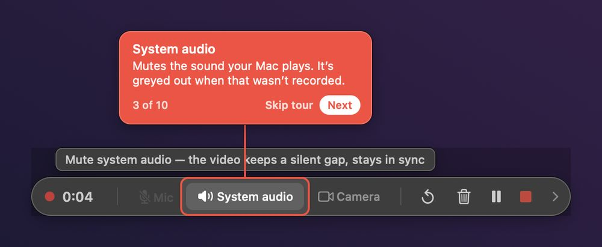
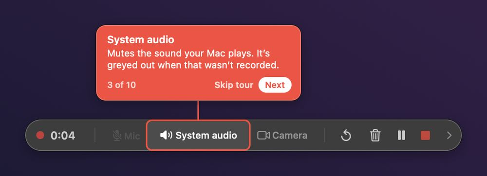

**Works well:**
- **One consistent bubble.** Every tag measured 260 × 96 pt. The hierarchy is clear: a semibold title, then the body, then a footer reading "n of m · Skip tour · Next". The Try-step "Skip step" is an outline button, so it reads differently from "Next" / "Done".
- **The outline box and leader line match the owner's mock.** The box is a 2 pt red outline around the control, with a 2 pt leader line to the tag.
- **The tag is never placed on top of its own control.** My probe checked all 64 steps. The only exception is Settings step 1, where the control is huge.
- **Tags always stayed inside the screen's visible frame, including on this 1470 × 831 visible screen.** On borderless panels (strip, pill, card) the tag stays off the panel completely.
- **The "✓ Done" state appears the moment a Try step completes.** It is visible for 0.8 s, then the next step shows.
- **The same red works in Light and Dark.**

**Issues:**
| # | Severity | Tour · step | Problem | Why it matters | Suggested fix (file:line) |
|---|---|---|---|---|---|
| T1 | Medium | All | White text on the tag red `#FF453A` is **3.41:1**. The counter and "Skip tour" (80 % white) are **2.64:1**. The red "Next" label on the white capsule is 3.41:1. | Fails WCAG AA (4.5:1) for 11–12 pt text on every tag. That is hard to read for low-vision users and in bright light. | `TagStyle.swift:9` — deepen the red to about `#C62D22` (white 5.53:1). Raise `secondaryTextAlpha` at `TagStyle.swift:45` to 0.9 (4.73:1). |
| T2 | Medium | Pill (new user: 1,3,4,6,7,8,9,10 of 10) · Strip in GIF mode (3 → 8 of 11) · empty History (1 → 4 of 4) | The counter uses the catalog index and the catalog length, even when steps are skipped. | Looks like a bug, and suggests the user missed steps. | `TourCoordinator.swift:310-311` — number and total over the steps that are presentable now (add a TourEngine helper that counts steps whose anchors exist). |
| T3 | Medium (root cause of E1, X1, V1, S1) | Editor canvas steps ×8, Video 1, Settings 1 | When a step's control fills most of a window (canvas, video preview, Settings cards), the tag goes "beside" it. That means onto the side panel or the timeline card, and up to ~10 pt past the window's edge. If there is no room beside it, it falls back to "over" the top-left corner, covering content. | The tag hides the controls the next steps are about. | `TagLayout.swift:47-69` / `TagOverlayController.swift:167-173` — for an anchor larger than about half of its titled host, place the tag *inside* the anchor's top-right corner, inset 16 pt, with no leader. Or pass the neighbouring panel as `keepOut`. |
| T4 | Medium | Pill, any step | Hovering a pill control grows the pill's window by 30 pt (for its hint bubble). The tag then moves up 30 pt, back again on exit. The 20 % dim is drawn as a **square band** over the window's transparent area. | Users hover pill controls while reading about them, so the tag jumps and a dark rectangle flashes. | `TagOverlayController.swift:172` and `:182` use `host.frame`. `cornerRadius(of:)` (`:262-271`) returns 0 while hovering. Keep out and dim only the capsule rect (`RecordingControlsController.swift:407-432`, `pillFrame`). |
| T5 | Low | Strip 4, 5, 10 · Quick Access 4 · Editor 7 | Leader lines run across other controls: the strip's top row, the System audio menu, the screenshot on the card, the hint text. | Visual noise, and it can look like the line points at the wrong thing. | Prefer sides where the leader doesn't cross the panel. Or route the line to the box's nearest edge (`TagLayout.swift:101-120`). |
| T6 | Low | All | "Skip tour" / "Skip step" are sentence case (the macOS convention is Title Case). The last step still offers "Skip tour" next to "Done". | Platform fit, and redundant choices. | `TagStyle.swift:50-51` → "Skip Step", "Skip Tour". Hide `skipTourButton` when `number == total` (`TagViews.swift:186-195`). |
| T7 | Low | Editor, video, strip, Settings | The 20 % black dim is nearly invisible over these always-dark windows. Only the red box does the highlighting. | Weaker focus in dark UIs. The red box still carries it. | Optionally dim at 35 % over dark hosts (`TagStyle.swift:11`). |
| T8 | Low | Quick Access, pill; all Try steps | Return and Esc do nothing on tours hosted by panels that never take key status (correct: no typing is taken from other apps). On any Try step there is no key for "Skip step". | Keyboard-only users must use the mouse there. | Document it. Optionally make ⌘. or Tab + Space reach the tag's buttons. |

**Why 6:** Every tag lands on the right control and never on top of it. But T1–T4 are visible on a typical first run: contrast on every tag, a skipping counter on the pill, big-control placement in the editor, video editor and Settings, and the hover jump. That is the "sometimes covers useful content" 6 anchor, not 8.

## Welcome + question — 8/10
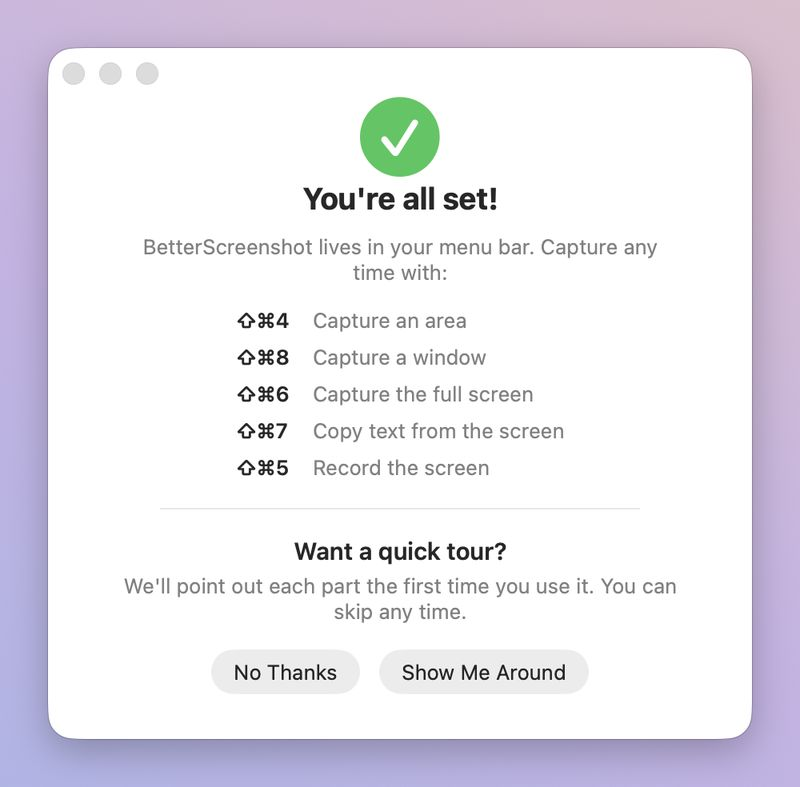
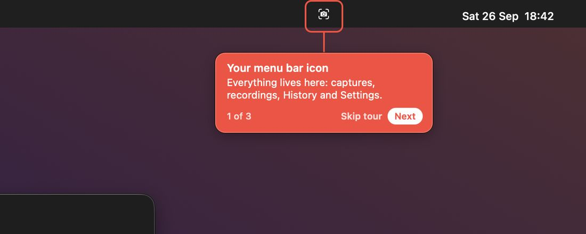
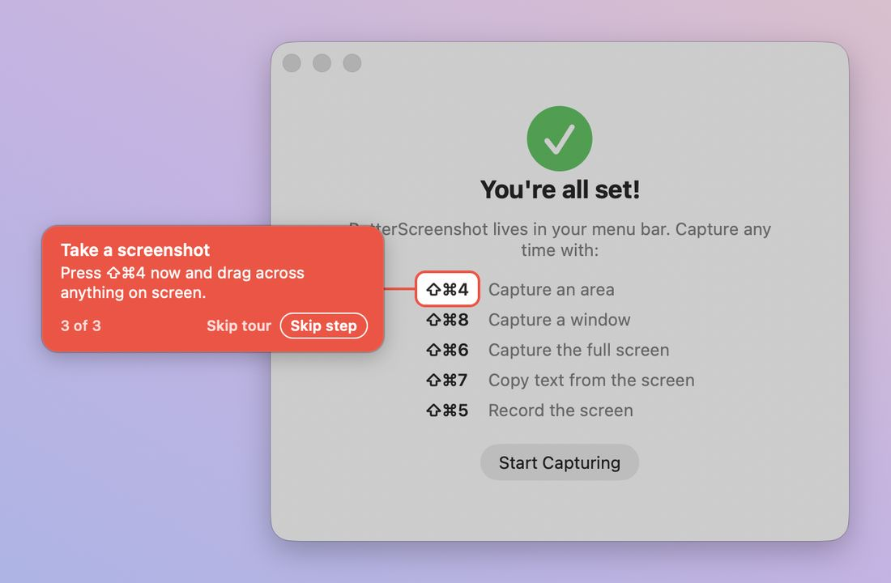

**Works well:**
- **The question matches spec §14.9 exactly.** Title "Want a quick tour?", the specified body, then **No Thanks** (Esc) and **Show Me Around** (the default button, Return). Both appearances look native.
- **Step 1 hangs directly below the menu-bar icon.** It gets a short vertical leader and no dim (`welcome-1-menubar-*`).
- **Step 2 resolves the user's real bindings in ⇧⌘ order:** "⇧⌘4 area, ⇧⌘8 window, ⇧⌘6 full screen".
- **The capture completes the Try step, and the Quick Access tour starts on the new card in the same turn.** The hand-over is seamless. The Welcome tour is marked seen.
- **Return advances step 2** (verified through the real key monitor).

**Issues:**
| # | Severity | Tour · step | Problem | Why it matters | Suggested fix (file:line) |
|---|---|---|---|---|---|
| W1 | Low | Welcome 3 | The tag, left of the ⇧⌘4 label, covers the start of the page text: "~~Be~~tterScreenshot lives in your menu bar…". | Hides page content. | Prefer the right side for this anchor, or nudge the tag below the text line (`TagLayout` order). |
| W2 | Low | Welcome 2 | The box outlines five shortcuts but the body names three. The line wraps between "⇧⌘8" and "window". | A small mismatch; the keycap is split from its meaning. | Anchor the first three rows only. Or join each shortcut to its word with a non-breaking space (`WelcomeTours.swift:10`). |
| W3 | Low | Welcome 2 (replay after rebinding) | With long combos (e.g. ⌃⌥⇧⌘F12) or unbound actions ("Capture Area area…"), the body needs 3 lines and is truncated with "…". | An edge case, but a truncated tag looks broken. | Fall back to a shorter body when the resolved text exceeds 2 lines. Measure it in `TagFitTests` with long keys (`WelcomeTours.swift:10`). |
| W4 | Low | Welcome end | The Welcome window stays open behind the Quick Access and Editor tours, still showing "Start Capturing". Return on the Try step presses that button and closes the window (the tour pauses and recovers). | A stray window left on screen after onboarding. | Close the Welcome window when its tour finishes, or at the capture (`OnboardingController.swift:246-249`). |

**Why 8:** Right controls, exact copy, seamless hand-over in both appearances, and only Low nits.

## Quick Access — 8/10
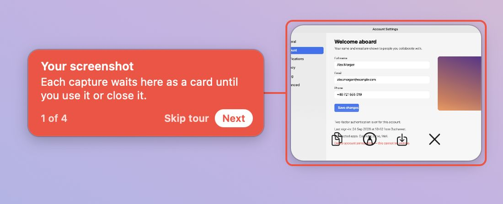
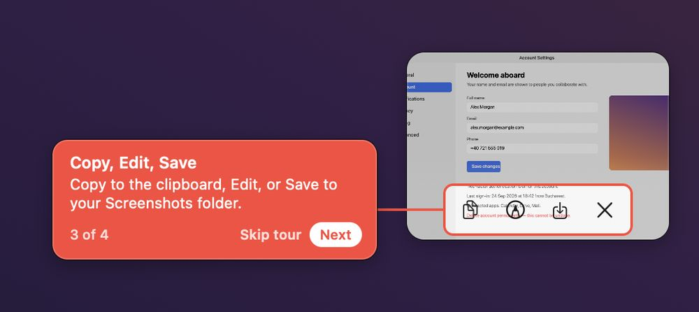
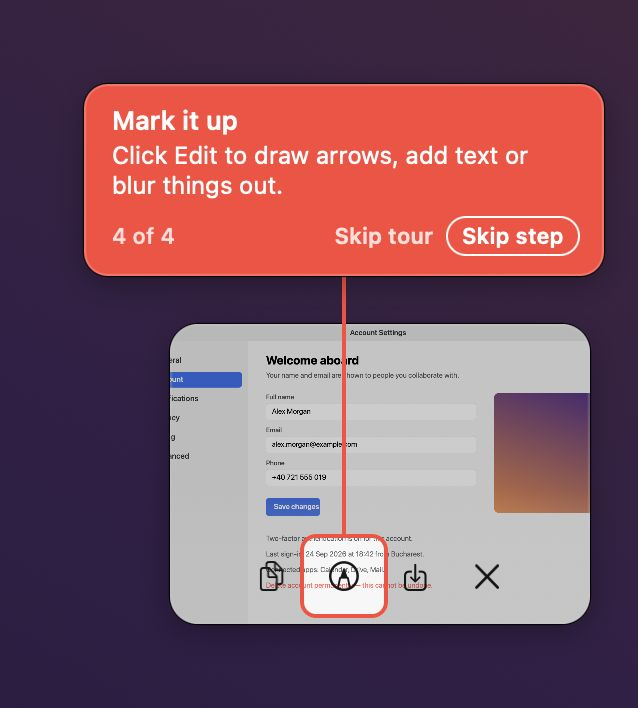

**Works well:**
- **Steps 1–3 sit left of the card with short leaders and never cover it.**
- **The card stays up after a drop while the tour runs.** A drop normally closes it; I verified it stays.
- **The drag Try step and the Edit Try step both complete.** Edit opens the editor and the Editor tour starts on it at 1/9 (`07-editor-01-handover-light.jpg`).

**Issues:**
| # | Severity | Tour · step | Problem | Why it matters | Suggested fix (file:line) |
|---|---|---|---|---|---|
| Q1 | Low | Quick Access 4 | The tag switches from left of the card to above it: the button row is a wide, short strip, so the layout prefers vertical sides. The leader then crosses the whole screenshot. | An inconsistent jump, and a line drawn across the user's image. | Force left/right order for anchors inside the card (`TagOverlayController.swift:167`). |
| Q2 | Low | Quick Access 3 | The box also outlines the ✕ Close button, but the tag says "Copy, Edit, Save". | A small mismatch. | Anchor only the three buttons, or add "✕ closes it" (`QuickAccessOverlayController.swift:158-167`). |
| Q3 | Low | Quick Access 3 | "Save to your Screenshots folder". The button saves to the macOS screenshot location, which is the Desktop by default (`SettingsStore.systemScreenshotLocation`). | Users may look for a folder that doesn't exist. | "…or Save it where macOS keeps screenshots." (`WelcomeTours.swift:24`) |

**Why 8:** Placement beside the card is exemplary and the Try steps are solid. Only Low polish remains.

## Editor intro — 6/10
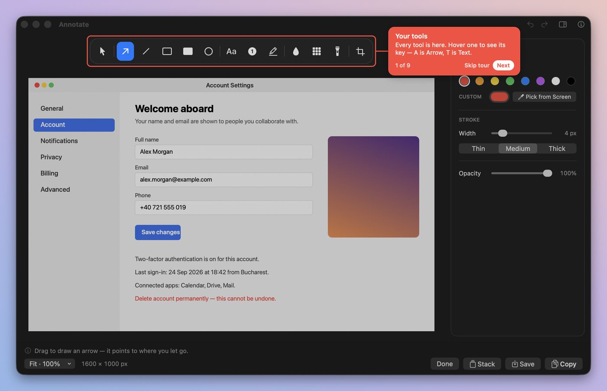
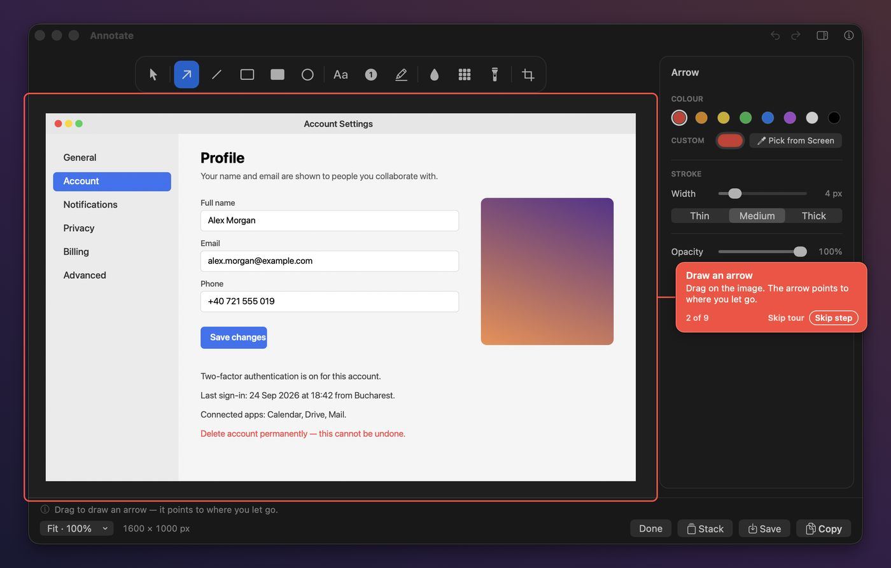
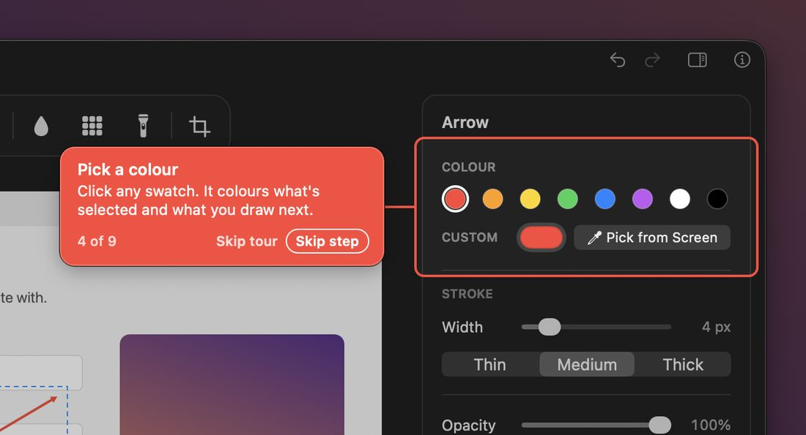
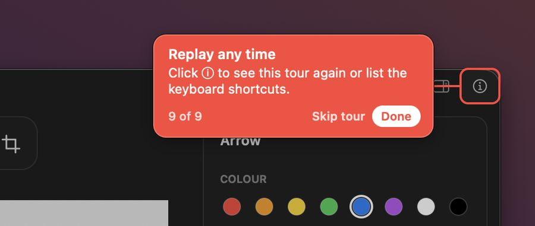

**Works well:**
- **All 9 anchors are correct.** Return advances; Return passes through on Try steps.
- **The Arrow Try step completes on the drag.** "✓ Done" shows at once.
- **"Pick a colour" puts the tag left of the Colour section, exactly like the owner's mock.** Clicking a swatch recoloured the selected arrow, which is what the tag promises.
- **The copy is accurate:** A/T keys, "Opacity, just below", "⌘0 fits, ⌘1 real size", Done/Stack/Save/Copy.

**Issues:**
| # | Severity | Tour · step | Problem | Why it matters | Suggested fix (file:line) |
|---|---|---|---|---|---|
| E1 | Medium | Editor 2 (and Editor 1 when the window sits near the left of the screen) | The canvas fills the window, so the "Draw an arrow" tag goes to its right: over the side panel and ~10 pt past the window's edge. In a 1240 × 772 window, step 1 also covers the panel's heading and the COLOUR caption (`23-…small…`). | Covers the panel the next three steps explain. Hanging off the window looks unfinished. | T3's fix (place the tag inside the canvas's top-right corner). Or anchor step 2 to a smaller view (`EditorTours.swift:13`). |
| E2 | Medium | Whole chain | Welcome 3 + Quick Access 4 + Editor 9 = **16 steps in a row** before the user edits freely. Some add little: "The hint line", "Replay any time", and "Your tools" (tooltips already show the keys). | Best-in-class onboarding keeps a sequence to about 3–5 steps. Users skip long chains and miss the useful parts. | Cut the editor intro to about 5 steps (tools+arrow, colour, width, finish up). Mention ⓘ in the last step's body (`EditorTours.swift:10-30`). |
| E3 | Low | Editor 3 | The "side panel" tag (left of the panel) covers the tip of the arrow the user just drew. | Hides the user's own work. | Corner placement per T3, or prefer above/below for tall anchors. |
| E4 | Low | Editor 9 | The tag, left of ⓘ, covers the title bar's Undo, Redo and panel buttons, and the panel heading. | Covers neighbouring controls. | Prefer below for title-bar anchors (`TagOverlayController.swift:167`). |
| E5 | Low | Any editor step | Esc goes back to Select, then clears the selection, and only then skips the tour. That took 3 presses in my run. The design is documented, but the tag never mentions Esc. | Esc = Skip tour isn't discoverable in the editor. | Fine as is. Optionally add a keyboard hint to the VoiceOver announcement. |

**Why 6:** Everything is correct and the Try steps are instant. But the key canvas step covers the side panel, and the sequence is long.

## Editor tool tours (Text/Redaction/Highlighter/Spotlight) — 6/10
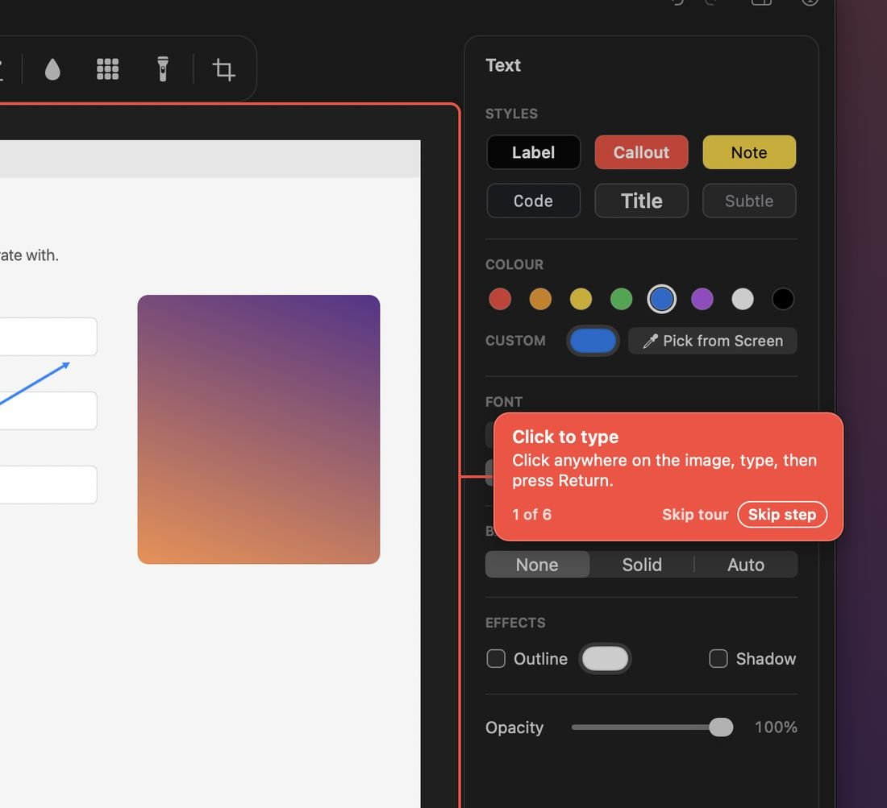
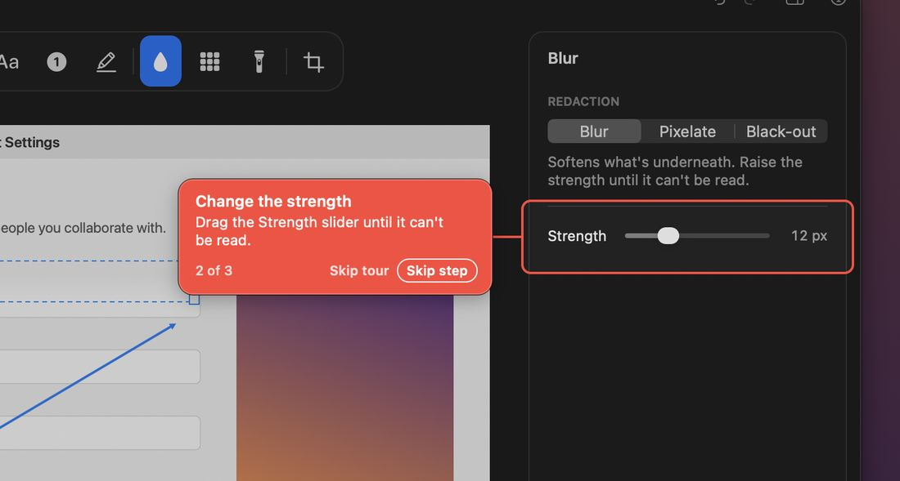

**Works well:**
- **Each tour starts on the first use of its tool.**
- **Every Try step completed through the real canvas and side panel:** click-type-Return, corner scale, blur drag, Strength slider, highlighter stroke, spotlight drag.
- **The copy is correct against the code:** ⇧ gives a straight highlighter line (`EditorCanvasView.swift:404`), ⌥ gives an elliptical spotlight (`:409`), and Black-out is described as irreversible.
- **Return and Esc are left to the text field while typing.**

**Issues:**
| # | Severity | Tour · step | Problem | Why it matters | Suggested fix (file:line) |
|---|---|---|---|---|---|
| X1 | Medium | Text 1–3; Redaction 1, Highlighter 1, Spotlight 1 | Same cause as E1: canvas-anchored tags go over the side panel. In Text they cover the **Font** section and the Background caption. | The Text tour then explains Styles, Background and Effects, which sit in the panel it just covered. | T3's fix. |
| X2 | Medium | Text 3 "Resize your text" | If the user pressed Skip step on "Click to type", no text exists, so the Try step can't be done. Only Skip step moves on. | A dead end: the tag asks for something that isn't possible there. | Let a Try step name a prerequisite event and skip it when that event wasn't observed (`TourEngine.swift:117-130`; `EditorTours.swift:38`). |
| X3 | Low | Text 5, Redaction 2, Spotlight 2 | The tag touches or covers the object just made: the top of the text, the end of the blurred region, the spotlight's top handles. | The user can't fully see the effect they are adjusting. | Corner or vertical placement for panel anchors when the selection sits beside them. |
| X4 | Low | Highlighter 2 | The title is "Marker width", but the body only says the pen keeps its own colour and width. It never says what the outlined Stroke control does. | Title and body disagree. | "Pick Thin, Medium or Thick. The marker keeps its own settings." (`EditorTours.swift:68-69`) |

**Why 6:** Short, accurate and interactive. But covering the side panel on 6 of 13 steps, plus one dead-end Try step, keeps this at 6.

## First recording — 6/10
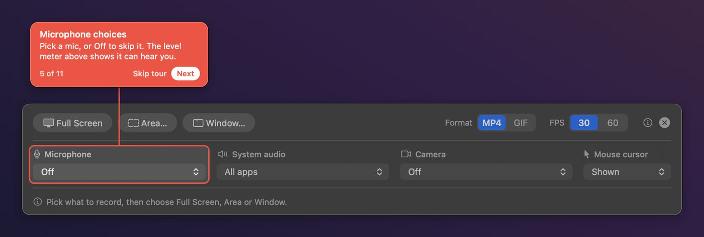
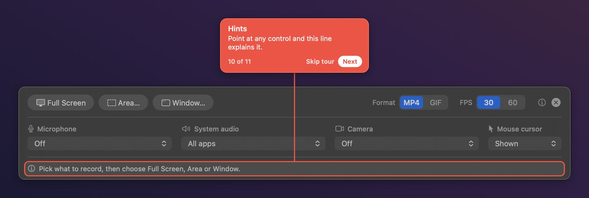

**Works well:**
- **All 11 steps sit above the strip and never cover it.**
- **The Try steps work:** "Open the Microphone menu" and "Open System audio" complete through the menus' delegate path (`menuWillOpen`), and "Start recording" completes through the real Full Screen / Area… buttons.
- **The hand-over to the pill tour works,** both for Full Screen (immediate) and for Area (0.6 s later).
- **In GIF mode the four audio steps are skipped,** as designed.
- **The copy matches the strip's own hint line.**

**Issues:**
| # | Severity | Tour · step | Problem | Why it matters | Suggested fix (file:line) |
|---|---|---|---|---|---|
| R1 | Medium | First recording 5 | "The level meter above shows it can hear you." With the defaults (mic **Off**) there is no meter. After picking a mic, a new user sees the "Allow microphone access…" link instead (the meter needs the permission first). It only appeared in my run with mic access pre-granted. | Misleading for exactly the audience of this tour. | "Pick a mic, or Off to skip it. Once it's on, a level meter shows it hears you." (`RecordingTours.swift:18-19`) |
| R2 | Medium | Whole tour | 11 steps before the first recording, then the pill tour's 8–10: **about 20 tags to make one video**. "Frame rate", "Mouse cursor" and "Hints" add little over the strip's own hint line. | Long tours get skipped wholesale. | Merge Format + FPS. Drop Mouse cursor and Hints (or fold them into one "Point at anything for a hint" step). Aim for about 6 steps (`RecordingTours.swift:8-34`). |
| R3 | Low | Steps 4, 5, 10 | The leader lines cross the strip's top row, and on step 10 the System audio menu. | Visual noise on a dense panel. | Route the leader to the nearest point of the box. |

**Why 6:** A correct and complete walk-through, but one misleading step and too many steps.

## Recording pill — 5/10
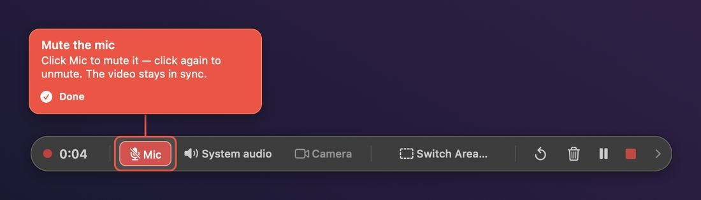

**Works well:**
- **Every tag sits above the pill** with a short leader.
- **The explanations are exact:** Restart/Discard "Click twice to confirm" (`RecordingControlsController.swift:486-492`); the greyed System audio when no audio is recorded; "Your video then opens in a card".
- **The Stop Try step completes and ends the tour.**
- **Controls that aren't there are skipped correctly:** Switch on full-screen recordings, and Mic without a mic track.

**Issues:**
| # | Severity | Tour · step | Problem | Why it matters | Suggested fix (file:line) |
|---|---|---|---|---|---|
| P1 | Medium | Whole tour | The tour starts when the pill appears, and with the default 0 s countdown the recording has already started. All 8–10 steps are read **while the user's first real recording runs**. | That first recording is mostly the user reading tags, the opposite of "learn fast, get back to work". | Cut it to about 4 steps (time + drag, Pause, Restart/Discard, Stop). Or show it on the first Pause, or while the countdown runs (`RecordingTours.swift:39-60`). |
| P2 | Medium | Pill 2 "Mute the mic" (mic track present) | The Try step completes on mute and the tour moves on. The mic stays muted unless the user remembers "click again to unmute". | It is easy to end the first recording with a silent mic. | Make it an Explain step. Or, on completion, show "Click Mic again to unmute" as a Try step waiting for the unmute (`RecordingTours.swift:42-43`). |
| P3 | Low | Pill 8 → 9 → 10 | The order goes Pause → "Fewer controls" (the rightmost chevron) → Stop, jumping back left. | The eye has to bounce back and forth. | Put "Fewer controls" before Pause, or drop it (`RecordingTours.swift:54-59`). |
| P4 | Low | Pill 4 | On Macs without a camera, "Camera bubble" still points at a greyed button whose tooltip says "No camera found". | Explains a control that can't be used. | Clear `pill.camera` when the camera is `.unavailable` (`RecordingControlsController.swift:168`, like the mic at `:306`). |

T2 (the counter goes 1 → 3 → 4 → 6 for a new user) and T4 (the hover jump) also show up here.

**Why 5:** Accurate copy, but four Medium issues that every new user meets (P1, P2, T2, T4). The flow works against the user's first recording.

## Video editor — 6/10
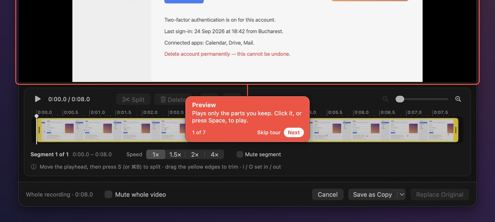
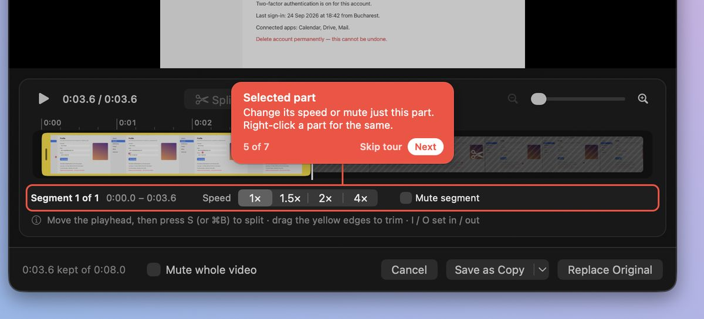

**Works well:**
- **All 7 steps on the right controls.**
- **Both Try steps complete through real input:** a real click on the timeline plus S splits the clip; a click on a part plus ⌫ deletes it.
- **The copy is exact:** Space, "S or click Split" (S or ⌘B in code), the ▾ menu that exports a GIF, and Replace reloading the file.
- **"Save a copy" and "Replace the original" are placed cleanly.**

**Issues:**
| # | Severity | Tour · step | Problem | Why it matters | Suggested fix (file:line) |
|---|---|---|---|---|---|
| V1 | Medium | Video 1 "Preview" | The preview spans the window, so the tag goes **below** it, onto the timeline card. It covers the Delete, Undo and zoom controls and part of the filmstrip. | Covers the controls the next steps use. | T3: place the tag inside the preview's top-right corner (`VideoEditorTours.swift:6`). |
| V2 | Medium | Video 5 at the minimum window size (780 × 560) | "Selected part" goes **above** the segment row. It covers the timeline and the Split/Delete buttons. | Hides the part being described. | Prefer below for `video.segment`. Or anchor the step to the selected segment on the timeline. |
| V3 | Medium | Video 4 "Delete a part" | If "Split the clip" was skipped there is only one part. `CutList.remove` refuses to delete the only part (`CutList.swift:125`) and ⌫ just beeps. | A dead-end Try step. | The same prerequisite mechanism as X2, requiring `video.split` (`VideoEditorTours.swift:13-15`). |
| V4 | Low | Video 2–5 | The tags sit below the timeline and hang past the window's bottom edge, over the action bar. | Looks unanchored to the window. | Prefer above for the timeline (there's room over the preview). |

**Why 6:** Accurate and interactive, but placement covers the work area and there is one conditional dead end.

## Settings — 5/10
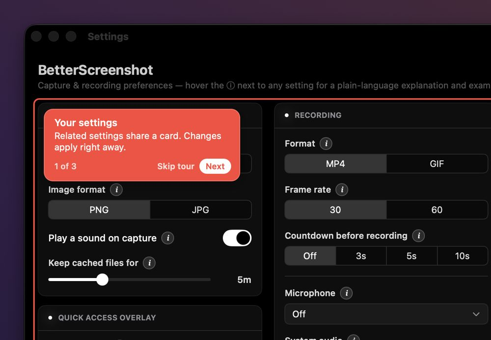
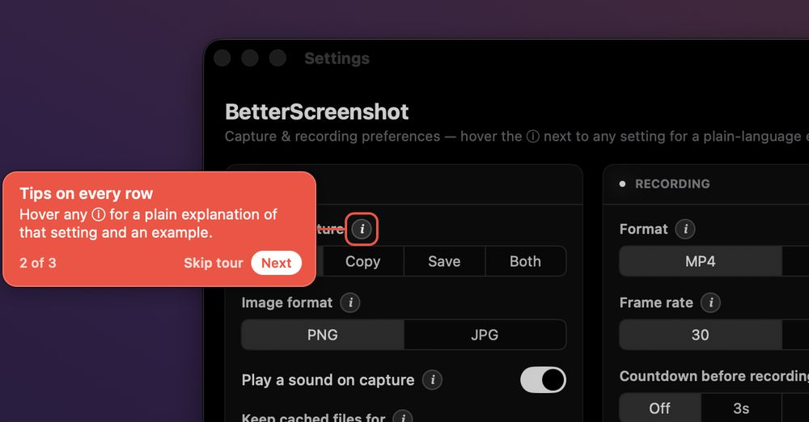

**Works well:**
- **Three short, accurate steps.**
- **The Keyboard Shortcuts card is scrolled into view before its tag shows.**
- **The copy matches the behaviour:** "Changes apply right away"; "press new keys… Esc cancels".

**Issues:**
| # | Severity | Tour · step | Problem | Why it matters | Suggested fix (file:line) |
|---|---|---|---|---|---|
| S1 | Medium | Settings 1 | `settings.cards` covers the whole masonry, so the tag can't go beside it. It falls back to "over" the top-left corner, covering the CAPTURE card header and the "After a capture" row. | Covers the very row step 2 points at. | Anchor the header, or just column A. Or use T3's inside-corner placement (`ShellTours.swift:5`; `SettingsView.swift:55`). |
| S2 | Medium | Settings 2 | The ⓘ is tiny and sits right after its label. The tag goes left, covering "After a capture", so the user can't see which setting the ⓘ belongs to. | The tag hides the thing it explains. | Anchor the whole label + ⓘ (`fieldLabel`, `SettingsView.swift:489-499`). Or prefer above/below for anchors under 24 pt. |
| S3 | Medium | Any Settings step (step 3 invites it) | TourKit's key monitor is added when the tour starts, before the shortcut recorder's. I confirmed that local monitors run in the order they were added. So pressing **Esc to cancel** a recording, as step 3 says, **skips the tour instead**, and the recorder stays armed at "Type shortcut…". | Takes a key away from a control, against the "never hijack typing" rule. | Make the Settings window a `TourEscapeClaiming` host while any `ShortcutRecorderField` is recording (`TagOverlayController.swift:225-233`; `ShortcutRecorderField.swift:47-50`). |

**Why 5:** A three-step tour where two steps cover their own subject and one steals a key from the control it teaches.

## History — 8/10
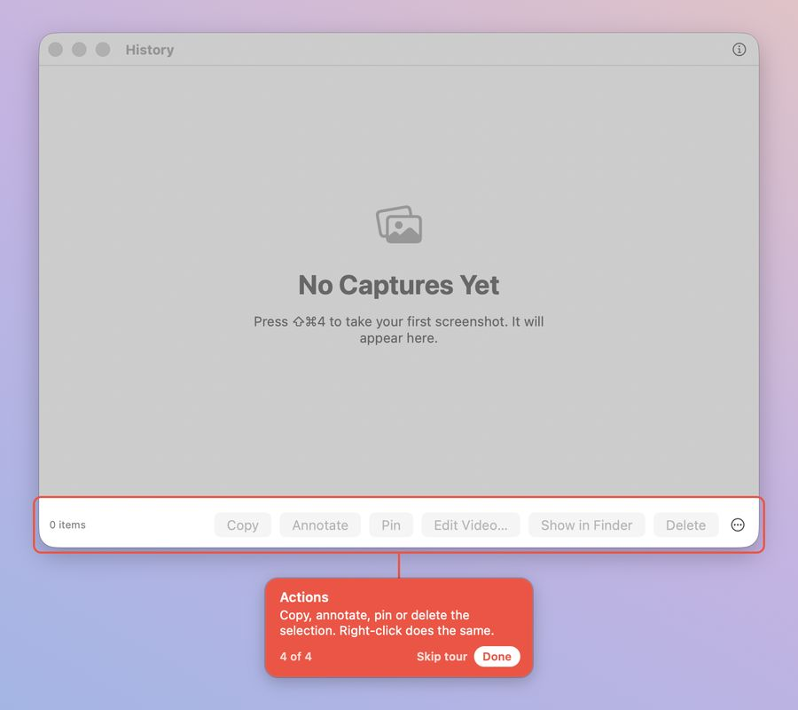

**Works well:**
- **Every tag sits beside the grid, the cell or the action bar** and never covers them.
- **A real click on the first capture completes "Select a capture"** (`history.selected`).
- **The copy matches:** ⌘-click / ⇧-click to add, dragging several items, right-click for the same actions.

**Issues:**
| # | Severity | Tour · step | Problem | Why it matters | Suggested fix (file:line) |
|---|---|---|---|---|---|
| H1 | Low | History with no captures | Steps 2–3 are skipped (correct), but the counter jumps 1 → 4 (T2). "Actions" then describes a selection that can't exist, over disabled buttons. | Rare, since the Welcome tour asks for a screenshot first, but it reads oddly. | Also skip `history.actions` when the grid is empty (`ShellTours.swift:22-23`). |
| H2 | Low | History 4 | The body lists Copy, annotate, pin, delete. The bar also has Edit Video… and Show in Finder. | Minor gap; "Right-click does the same" covers it. | Optional: "…or open it in Finder." |

**Why 8:** Clean placement, a real-click Try step, and accurate copy.

## ⓘ / Help & Tours / Settings row — 8/10
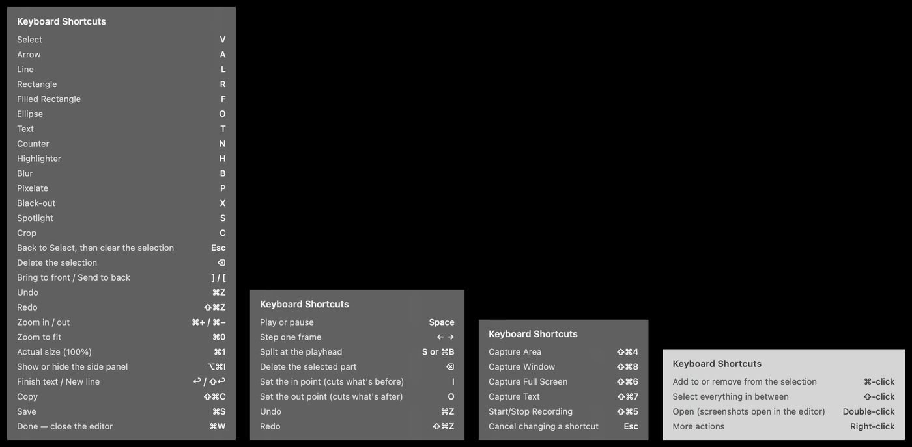
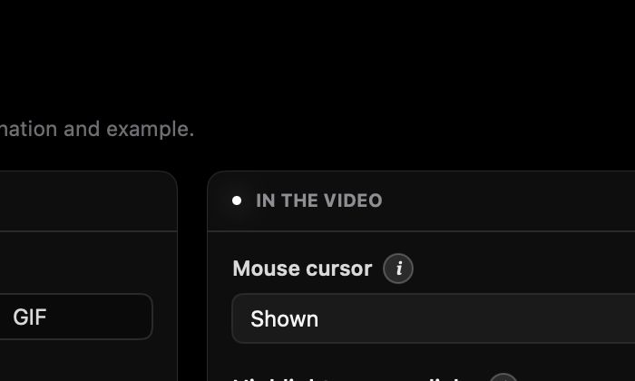

**Works well:**
- **The ⓘ sits at the far right of the title bar on the editor, video editor, Settings and History windows**, 6 pt from the edge, beside the editor's Undo/Redo/panel buttons. On the record strip it sits beside ✕.
- **Every ⓘ menu offers "Replay Tour · Keyboard Shortcuts".** Replay restarts at step 1 (checked on the editor).
- **The shortcut lists are complete and correct against the code.** Editor: all 14 tool keys plus 13 more. Video: Space, ← →, S or ⌘B, ⌫, I, O, ⌘Z, ⇧⌘Z. Settings: the live bindings + Esc. History: 4 gestures.
- **The Help & Tours submenu:** "Take the Welcome Tour" · 11 tours, Title Case, each with its own SF Symbol · "Reset All Tours".
- **Replaying a tour whose window can't be opened shows a HUD note:** "Editor Tour starts the next time you use it".
- **The Settings row has the specified switch and Reset All Tours**, with a "Tours reset" confirmation.

**Issues:**
| # | Severity | Tour · step | Problem | Why it matters | Suggested fix (file:line) |
|---|---|---|---|---|---|
| I1 | Low | Help & Tours → Reset All Tours (and the Settings button) | Users with first-use tours **off** (existing users, No Thanks) get a "Tours reset" HUD, but nothing will ever start by itself. | The HUD implies a result that doesn't happen. | In the menu, also turn on first-use tours. Or say "Tours reset — turn on Tours & tips to see them" (`AppDelegate.swift:85-88`). |

**Why 8:** Consistent, accurate and platform-fit. I judged the menus from code and from the item lists I built, without opening them.

## Copy & info accuracy (all tours) — 7/10
**Works well:**
- **Every body fits two lines at 236 pt with default keys.** All 64 were measured in the real bubble, with no truncation. Every title is at most 4 words, and every Try step starts with a verb.
- **Every shortcut and modifier I checked matches the code:** A/T (`EditorTool.swift:52-68`), ⌘0 / ⌘1 / ⌘-scroll / pinch (`EditorZoom.swift:9-15`), ⇧ and ⌥ on the canvas, S or ⌘B and ⌫ in the video editor, and ⇧⌘4 / ⇧⌘8 / ⇧⌘6 from the live bindings.
- **Plain words, one idea per step in most tags.** VoiceOver text reads "Title. Body Step n of m.", then "Done" when a Try step completes.

**Issues:**
- **Medium:** R1 (the mic meter).
- **Low:**
  - Q3 (the folder name), X4 (Highlighter title vs body), W3 (truncation with long bindings).
  - **C1:** apostrophes are mixed. `EditorTours.swift` uses straight quotes ("it's", "can't"), while `RecordingTours.swift` and `VideoEditorTours.swift` use curly ones ("you’ve", "part’s"). Suggested fix: use typographic ’ everywhere.

**Why 7:** Tight and accurate overall, with one misleading line.

---

## Step-by-step table
Legend: ✓ = OK · ~ = OK with a Low nit · ✗ = Medium problem · "skipped" = the engine skipped the step because its control is absent (correct).

| Tour | # | Kind | Title | Anchor found & correct? | Text accurate? | Tag placement OK? | Notes |
|---|---|---|---|---|---|---|---|
| Welcome | 1 | E | Your menu bar icon | ✓ (stand-in status item) | ✓ | ✓ below the icon | Skipped if the status item isn't on screen (code) |
| Welcome | 2 | E | Capture shortcuts | ✓ | ✓ user's keys, ⇧⌘ | ✓ left | W2, W3 |
| Welcome | 3 | T | Take a screenshot | ✓ | ✓ | ~ | W1: covers the page's first line |
| Quick Access | 1 | E | Your screenshot | ✓ | ✓ | ✓ left of card | |
| Quick Access | 2 | T | Drag it anywhere | ✓ | ✓ | ✓ | Card stays up after the drop |
| Quick Access | 3 | E | Copy, Edit, Save | ✓ (includes ✕) | ~ Q3 | ✓ | Q2 |
| Quick Access | 4 | T | Mark it up | ✓ | ✓ | ~ above; leader crosses card | Q1; hands over to Editor 1/9 |
| Editor | 1 | E | Your tools | ✓ | ✓ | ~ left (centred window) / ✗ over panel (small window) | E1 |
| Editor | 2 | T | Draw an arrow | ✓ | ✓ | ✗ over side panel, past window edge | E1 |
| Editor | 3 | E | The side panel | ✓ | ✓ | ~ covers the arrow tip | E3 |
| Editor | 4 | T | Pick a colour | ✓ | ✓ | ✓ the owner's mock | |
| Editor | 5 | E | Width and opacity | ✓ | ✓ | ✓ | |
| Editor | 6 | E | The hint line | ✓ | ✓ | ✓ above | Adds little (E2) |
| Editor | 7 | E | Zoom | ✓ | ✓ | ~ past window edge | |
| Editor | 8 | E | Finish up | ✓ | ✓ | ✓ above | |
| Editor | 9 | E | Replay any time | ✓ | ✓ | ~ covers Undo/Redo | E4; "Done" plus redundant "Skip tour" |
| Text | 1 | T | Click to type | ✓ | ✓ | ✗ covers Font section | X1 |
| Text | 2 | E | Or drag a box | ✓ | ✓ | ✗ same | X1 |
| Text | 3 | T | Resize your text | ✓ | ✓ | ✗ same | X1, X2 (dead end if 1 was skipped) |
| Text | 4 | E | Styles | ✓ | ✓ | ✓ left | |
| Text | 5 | E | Background | ✓ | ✓ | ~ touches the user's text | X3 |
| Text | 6 | E | Effects | ✓ | ✓ | ✓ | |
| Redaction | 1 | T | Hide something | ✓ | ✓ | ~ over panel (blank area) | X1 |
| Redaction | 2 | T | Change the strength | ✓ | ✓ | ~ touches the blur | X3 |
| Redaction | 3 | E | Three ways to hide | ✓ | ✓ | ✓ | |
| Highlighter | 1 | T | Highlight something | ✓ | ✓ ⇧ verified | ~ over panel | X1 |
| Highlighter | 2 | E | Marker width | ✓ | ~ | ✓ | X4 |
| Spotlight | 1 | T | Spotlight something | ✓ | ✓ ⌥ verified | ~ over panel | X1 |
| Spotlight | 2 | E | Dim outside | ✓ | ✓ | ~ touches the spotlight's top edge | X3 |
| First recording | 1 | E | What to record | ✓ | ✓ | ✓ above | |
| First recording | 2 | E | MP4 or GIF | ✓ | ✓ | ✓ | |
| First recording | 3 | E | Frame rate | ✓ | ✓ | ✓ | Adds little (R2) |
| First recording | 4 | T | Open the Microphone menu | ✓ (skipped in GIF) | ✓ | ~ leader crosses top row | R3 |
| First recording | 5 | E | Microphone choices | ✓ (skipped in GIF) | ✗ no meter for new users | ~ | R1 |
| First recording | 6 | T | Open System audio | ✓ (skipped in GIF) | ✓ | ✓ | |
| First recording | 7 | E | Sound choices | ✓ (skipped in GIF) | ✓ | ✓ | Sentence fragment; fine |
| First recording | 8 | E | Camera bubble | ✓ | ✓ | ✓ | |
| First recording | 9 | E | Mouse cursor | ✓ | ✓ | ✓ | Adds little (R2) |
| First recording | 10 | E | Hints | ✓ | ✓ | ~ leader crosses System audio | R3 |
| First recording | 11 | T | Start recording | ✓ | ✓ | ✓ | Hands over to the pill (Full Screen and Area both checked) |
| Recording pill | 1 | E | Recording time | ✓ | ✓ | ✓ above | P1 (live recording) |
| Recording pill | 2 | T | Mute the mic | ✓ (skipped with no mic track: the default) | ✓ | ✓ | P2 leaves the mic muted; T2 counter gap |
| Recording pill | 3 | E | System audio | ✓ | ✓ | ~ jumps on hover | T4 |
| Recording pill | 4 | E | Camera bubble | ✓ | ~ | ✓ | P4 (no-camera Macs) |
| Recording pill | 5 | E | Record something else | ✓ (skipped on full screen) | ✓ | ✓ | T2 counter gap |
| Recording pill | 6 | E | Restart | ✓ | ✓ | ✓ | |
| Recording pill | 7 | E | Discard | ✓ | ✓ | ✓ | |
| Recording pill | 8 | E | Pause | ✓ | ✓ | ✓ | |
| Recording pill | 9 | E | Fewer controls | ✓ | ✓ | ✓ | P3 order |
| Recording pill | 10 | T | Stop when done | ✓ | ✓ | ✓ | |
| Video editor | 1 | E | Preview | ✓ | ✓ | ✗ below, over timeline controls | V1 |
| Video editor | 2 | E | The timeline | ✓ | ✓ | ~ hangs below the window | V4 |
| Video editor | 3 | T | Split the clip | ✓ | ✓ | ~ | Completed with a click + S |
| Video editor | 4 | T | Delete a part | ✓ | ✓ | ~ | V3: dead end if Split was skipped |
| Video editor | 5 | E | Selected part | ✓ | ✓ | ~ (normal) / ✗ (minimum window) | V2 |
| Video editor | 6 | E | Save a copy | ✓ | ✓ | ✓ above | |
| Video editor | 7 | E | Replace the original | ✓ | ✓ | ✓ | |
| Settings | 1 | E | Your settings | ✓ (huge anchor) | ✓ | ✗ over the Capture card | S1 |
| Settings | 2 | E | Tips on every row | ✓ | ✓ | ✗ covers the row label | S2 |
| Settings | 3 | E | Keyboard shortcuts | ✓ (scrolled into view) | ✓ | ✓ above | S3 (Esc hijack) |
| History | 1 | E | Your capture history | ✓ | ✓ | ✓ left | |
| History | 2 | T | Select a capture | ✓ (skipped when empty) | ✓ | ✓ | Real click completed it |
| History | 3 | E | Several at once | ✓ (skipped when empty) | ✓ | ✓ | |
| History | 4 | E | Actions | ✓ | ✓ | ✓ below | H1 when empty |

## Cross-cutting issues
1. **Contrast (T1).** Every tag is below WCAG AA. It is one constant in `TagStyle.swift`.
2. **Big-control placement (T3 → E1, X1, V1, S1).** The layout only knows "beside, else over the top-left corner". For a canvas, a preview or a masonry of cards, "beside" means onto the neighbouring UI and "over" means onto content. One rule fixes 11 steps: place large controls' tags inside the control's corner.
3. **The counter doesn't match skipped steps (T2).** It shows up in the pill (every new user), GIF recordings and empty History.
4. **Length and timing.** Welcome→QA→Editor is 16 steps, and First recording + pill is about 20, with the pill tour running over a live recording (E2, R2, P1). Best-in-class coach marks stay at about 3–5 steps per burst.
5. **Try steps without their prerequisite (X2, V3).** A skipped setup step turns the next Try step into a dead end.
6. **Keys.** Esc/Return are consumed by the first-added local monitor, so any control with its own Esc handling loses it (S3). On panel-hosted tours the keys do nothing (T8).
7. **Light/Dark.** The tag is identical in both, and I found no appearance-specific bug. The dim just matters less on the app's always-dark windows (T7).
8. **Small screen.** This Mac's visible area is 1470 × 831. I also ran the editor at 1240 × 772 and the video editor at its 780 × 560 minimum. Every tag stayed on screen, but the small windows made E1 and V2 worse.

## Top fixes (ranked by impact ÷ effort)
1. **Accessible tag colours:** `TagStyle.tourRed` → about `#C62D22` and `secondaryTextAlpha` → 0.9 (`TagStyle.swift:9`, `:45`). Two constants; affects every tag (T1).
2. **Count only presentable steps** in "n of m" (`TourCoordinator.swift:310-311`, plus a small `TourEngine` helper). Fixes the pill, GIF and empty-History gaps (T2).
3. **Inside-corner placement for large controls** (`TagLayout.place`, `TagOverlayController.swift:167-173`). Fixes E1, X1, V1, S1 and part of E3/X3: 11 steps.
4. **Shorter recording tours and no muting Try:** cut the pill tour to about 4 steps, make "Mute the mic" an Explain step, and trim First recording to about 6 steps (`RecordingTours.swift`) (P1, P2, R2).
5. **Stop taking Esc from the shortcut recorder:** Settings claims Esc while a well is recording (`TourEscapeClaiming`; `TagOverlayController.swift:225-233`, `ShortcutRecorderField.swift:47-50`) (S3).
6. **Pill hover:** keep out and dim the capsule rect, not the window frame (`TagOverlayController.swift:172`, `:182`, `:262-271`) (T4).
7. **Mic copy** (`RecordingTours.swift:18-19`) (R1). One line.
8. **Prerequisites for Try steps:** skip "Resize your text" and "Delete a part" when their setup step was skipped (`TourEngine.swift:117-130`) (X2, V3).
9. **Settings anchors:** anchor the label + ⓘ, and a smaller area than all the cards (`ShellTours.swift:5-8`, `SettingsView.swift:55`, `:489-499`) (S1, S2).
10. **Trim the editor intro to about 5 steps** (`EditorTours.swift:10-30`) (E2).
11. **Polish:** Title Case "Skip Step"/"Skip Tour"; hide "Skip tour" on the last step; straight vs curly apostrophes; "Screenshots folder"; the Highlighter body; close the Welcome window after its tour (T6, C1, Q3, X4, W4).

## Method & limits
- **The probe.** A throwaway SwiftPM executable at `/private/tmp/claude-501/-Users-davidghermansteinberg-Desktop-Home-Projects-Code-BetterScreenshot/2e46f71a-afe5-428b-9b11-8224d2880911/scratchpad/agents/tours-review/probe/`. It is a temporary folder and may be gone. linked to the repo's six packages by path. `sync.sh` copies all of `App/` except `Main.swift`, with probe-only patches: windows parked at desktop level +2 and never ordered front or activated, the mic permission status faked, settings in a probe suite, History in scratch.
- **What was real.** The real `TourCoordinator` (with a new user's `UserDefaults(suiteName:)`: `tourAudience=new`, "Show Me Around" answered), the real `TagOverlayController` (via `probeLevel`), and the real surfaces: `OnboardingController`, `QuickAccessStackController` via `CaptureCoordinator.keepInStack`, `EditorWindowController`, `RecordStripController`, `RecordingControlsController`, `TrimWindowController` on a generated 8 s 1280 × 800 MP4, `SettingsWindowController.makeWindow`, and `HistoryWindowController.makeWindow` with 5 synthetic captures.
- **How it was driven.** Explain steps used the tag's own Next button, and Return through `handleKey`. Try steps used the real action: a synthetic canvas drag/click/type, a swatch click, the slider action, `menuWillOpen` (the popup menus' delegate path, since no real menu was opened), `performClick` on Full Screen / Area… / Mic / Stop, a real click + `keyDown("s")` / ⌫ on the timeline, a real click on a History cell, and `DraggableImageView.onDragEnded(true)` for the card drop.
- **Captures.** `CGWindowListCreateImage` over the host + tag windows + a gradient backdrop, in both `.aqua` and `.darkAqua`. Editor at 1132 × 708 (centred) and 1240 × 772. Video at 960 × 720 and its 780 × 560 minimum.
- **Limits.**
  - I used a **stand-in status item**, not a real `NSStatusItem`, so I couldn't test the menu-bar notch or a hidden icon. The code skips the step when the item's window isn't on screen.
  - **No real pop-up menus were opened.** So I couldn't see whether the step after a menu's Try step appears while the menu is still open, and I didn't click through the ⓘ menu or Help & Tours. I judged those from the item lists and from code.
  - **No real screen capture or recording.** I posted `.captureTaken` and `recording.started`/`stopped` the way `CaptureCoordinator.run` and `RecordingCoordinator` do, and drove the pill through its controller with synthetic `Status` values. That covered the default new user (mic off, full screen), mic on + Area, and GIF.
  - **The mic level meter** was shown only by faking an "authorized" status. No MicCapturer was started.
  - **Windows were inactive,** so traffic lights look grey and default buttons aren't blue. I didn't count that against the design.
  - **VoiceOver was not run.** I only checked the announcement strings.
- **The Esc finding (S3)** is backed by a small standalone test. It showed that local `NSEvent` monitors run in the order they were added, and that a monitor returning nil hides the event from later ones.
- **Screenshots** are in `docs/reviews/2026-09-26-tours/` (25 JPEGs, about 1.1 MB).
- **To reproduce:** `./sync.sh`, then `swift build -j 2 --package-path probe`, then `./run.sh <welcome|editor|strip|strip-mic|strip-gif|video|settings|history|history-empty|misc> <light|dark> [small]`. Run it from the scratchpad folder above.
