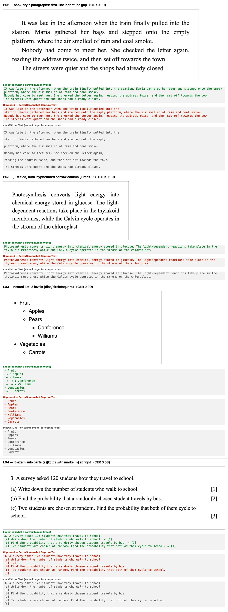
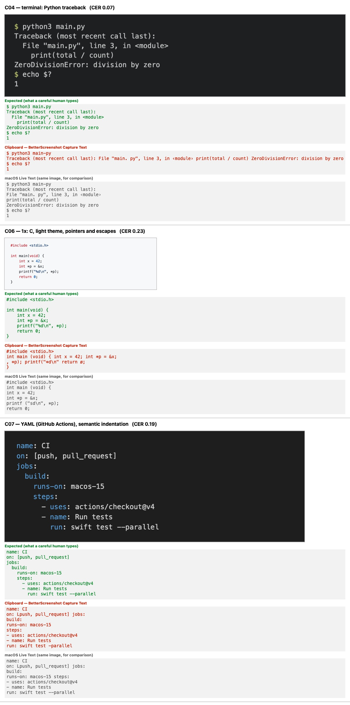
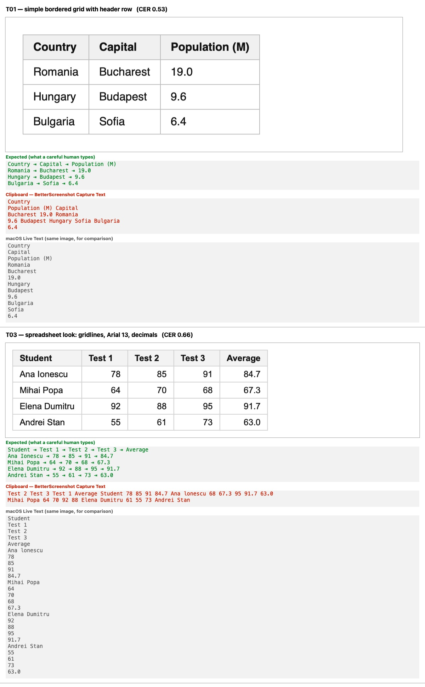
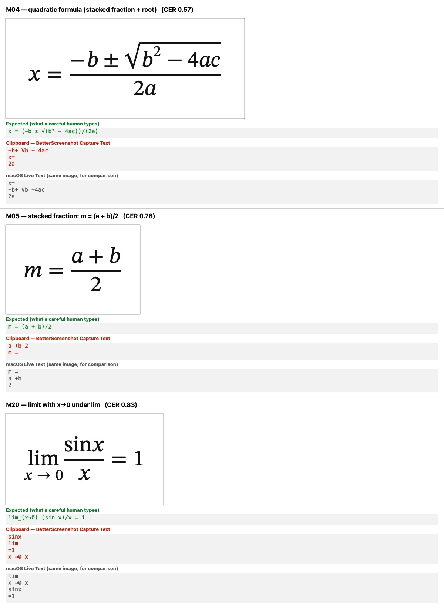
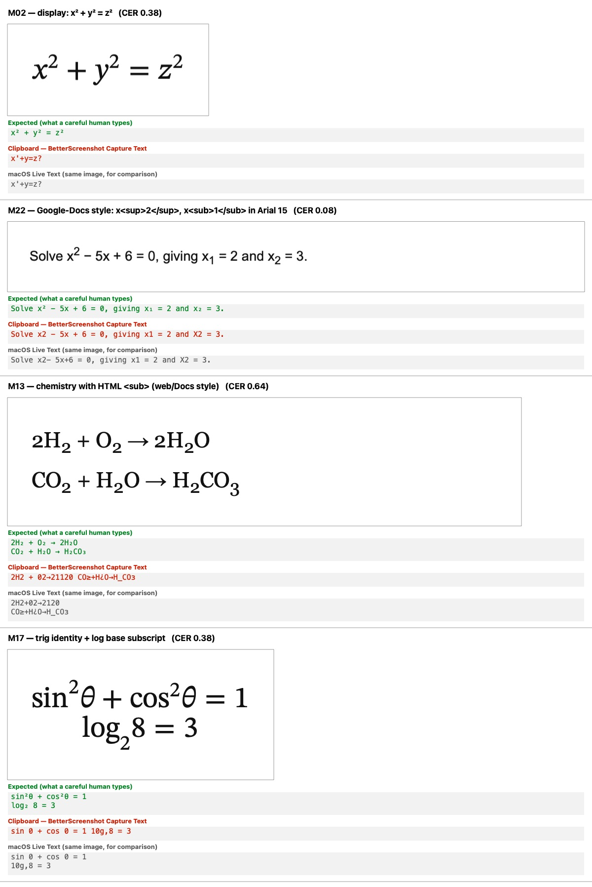
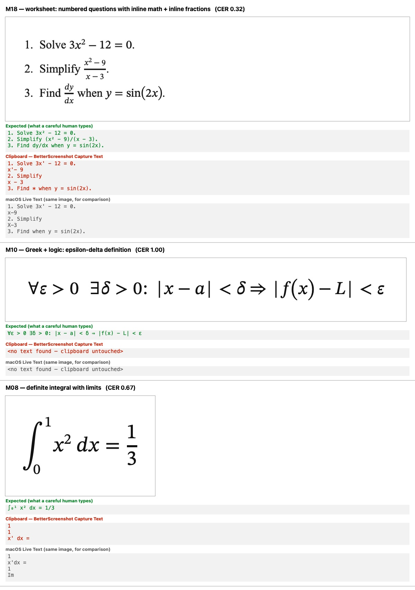
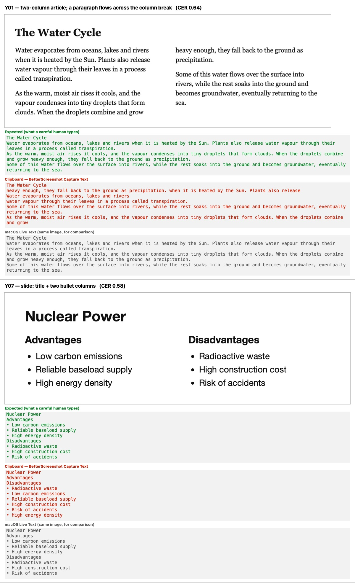
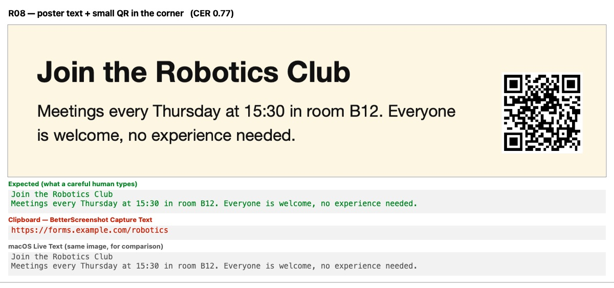

# Capture Text (OCR) review — 2026-09-28

**Overall: 3/10** — On the owner's scale this is "not to our standard". Plain single-column prose
and simple bullet/numbered lists mostly paste well (right characters, wrapped lines rejoined), and
recognition itself is robust (dark mode, coloured backgrounds, Romanian diacritics, 1× monitors,
QR codes). But everything with structure comes out scrambled or with changed meaning: **0 of 22
math cases** paste correctly (`x²` → `x'`/`x2`/dropped, `10⁸` → `108`, fractions split with the
numerator above `x =`, one Greek formula → "No text found"), **0 of 7 tables** (cells reversed within
rows and mixed across rows, no tabs), **0 of 8 code snippets** (indentation always lost, lines
merged), and multi-column pages are interleaved mid-sentence. On tables and multi-column layouts
BetterScreenshot is clearly **worse than macOS Live Text on the same image** (layout CER 0.32 vs
0.13, tables 0.56 vs 0.11), and the cause is our own line-rebuilding step (`TextReflow`), not Vision:
Vision's raw output in its own order scores layout CER 0.05. That matches the calibration's anchor
for 3 exactly ("a textbook equation, a simple table, a two-column page … scrambled or
meaning-changing"). Several of the worst problems have small, well-located fixes (see Top fixes).

**Standard:** the clipboard holds what a careful human would retype on the first try (paragraphs
rebuilt, lists with markers and nesting, code with indentation, tables as tab-separated rows,
columns in reading order, math as readable Unicode), matching or beating CleanShot X and macOS Live
Text · **Method:** test corpus (66 cases, rendered offscreen, run through the real
`TextRecognizer.recognize`) + code analysis of the 3 pipeline files and their tests · **Reviewer:**
independent subagent

## Calibration

- **Product:** BetterScreenshot, a free local macOS clone of CleanShot X (native Swift menu-bar app,
  macOS 14+, SwiftPM, no Xcode). **Capture Text** (⌘⇧7): the user drags a screen region → Apple
  **Vision** (on-device OCR, `VNRecognizeTextRequest`, `.accurate`, language correction on, languages
  from the user's preferred languages — on the owner's Mac `en-US` + `ro-RO`) + QR detection →
  recognized lines rebuilt into paragraphs → clipboard.
- **Audience:** the owner (IB high-school student) and general users. Typical captures: lecture
  slides, PDFs/textbooks, worksheets and **math**, web articles, code in editors/terminals,
  tables/spreadsheets, video frames. Pasted into Google Docs, Notes, chat/AI apps, code editors,
  spreadsheets.
- **Maturity:** tagged releases (v3.0.0); expected to feel finished.
- **Hard constraints:** fully local (no cloud OCR, ever). **Math output = readable Unicode plain text**
  (owner decision 2026-09-28): `x² + y² = z²`, `xᵢ`, `(a + b)/2`, `√(x + 1)`, `∫₀¹ f(x) dx`,
  `∑ᵢ₌₁ⁿ i`, Greek, `≤ ≥ ≠ ± × ÷ → ∞ ∈`. Not LaTeX. `^`/`_` (`x^(n+1)`) only where Unicode has no
  glyph; flattening `x²` to `x2` is **wrong** (changes meaning).
- **A 10:** exact characters; wrapped lines rebuilt into paragraphs; headings on their own line;
  lists one item per line with markers and recognisable nesting; code line-per-line with indentation
  and exact symbols; tables one row per line with **tab**-separated cells (pastes as a grid in
  Sheets/Numbers); multi-column pages in reading order; math as Unicode above.
- **Anchors:** **3** = on a common input (textbook equation, simple table, two-column page) the output
  is scrambled or meaning-changing — the user must retype it. **6** = prose, lists and code paste
  correctly; math and tables lose structure fixable by hand in under a minute. **9** = every category
  correct first try apart from rare glyph misreads that Live Text also makes.
- **Scale:** 8–10 basically perfect · 4–7 great app / good code with noticeable issues · 1–3 not to
  our standard. An area with a High issue can't score 8+. Severity: **High** = meaning changes,
  content lost/scrambled, or the user must retype a common input; **Medium** = noticeable cleanup
  (wrong line breaks, lost indentation, spacing, table cells on separate lines); **Low** = rare or
  cosmetic.

**Terms used below.** *CER* (character error rate) = edit distance between the clipboard and the
expected text ÷ expected length (0 = perfect; 0.5 = half the characters wrong). *Glyph CER* = the
same with all whitespace removed, i.e. character recognition without line breaks/tabs/indentation.
*TextReflow* = the app's line→paragraph step (`Packages/CaptureKit/Sources/CaptureKit/TextReflow.swift`).
*Live Text baseline* = macOS's own text-from-image engine (VisionKit `ImageAnalyzer` transcript) on the
same image. *Raw Vision baseline* = the app's exact Vision request, observations kept in Vision's own
order, one per line, **without** TextReflow. Case ids (P01, M04, …) refer to the corpus; the harness
section says how to rerun them.

## Scoreboard

| Area | Score | Pass rate | Mean CER | Verdict (one line) |
|---|---|---|---|---|
| Prose & paragraphs | **6/10** | 2/6 | 0.003 | Characters right; ~half of multi-paragraph captures get a stray mid-sentence line break or two lines merged |
| Lists | **6/10** | 2/6 | 0.031 | Flat bullet/numbered lists perfect; nesting flattened, right-aligned marks glued to the wrong item |
| Code | **3/10** | 0/8 | 0.111 | Indentation and blank lines always lost; lines merged (a 5-line traceback → 1 line); language correction corrupts tokens |
| Tables | **2/10** | 0/7 | 0.559 | Cells from different rows mixed and reversed; no tabs; far worse than Live Text (CER 0.113) |
| Math | **2/10** | 0/22 | 0.430 | Every case wrong: exponents/subscripts lost or turned into `'` `?`, fractions split, symbols misread, one formula → no text |
| Layout & reading order | **2/10** | 1/8 | 0.322 | Two-column/sidebar/two-bullet-column pages interleaved mid-sentence; Vision's own order would be right (CER 0.054) |
| Robustness | **7/10** | 5/9 | 0.093 | Dark mode, colours, diacritics, 1×, QR, empty region all fine; a small QR in a poster wipes out all its text |
| Pipeline code quality | **3/10** | 0/7 probes | — | Clean and short, but three High geometry bugs (unit mix, discarded reading order, fragment order) and tests that can't see them |
| **Overall** | **3/10** | **10/66** | **0.271** | Fine for plain prose; not usable for math, tables, code or multi-column pages |

Same 66 images, other engines (for scale — not scored):

| Area | BetterScreenshot pass / CER | macOS Live Text pass / CER | Raw Vision order, no reflow pass / CER |
|---|---|---|---|
| prose | 2/6 · 0.003 | 3/6 · 0.002 | 0/6 · 0.010 |
| lists | 2/6 · 0.031 | 1/6 · 0.026 | 0/6 · 0.037 |
| code | 0/8 · 0.111 | 0/8 · 0.096 | 0/8 · 0.093 |
| tables | 0/7 · 0.559 | 0/7 · 0.113 | 0/7 · 0.715 |
| math | 0/22 · 0.430 | 0/22 · 0.373 | 0/22 · 0.369 |
| layout | 1/8 · 0.322 | 3/8 · 0.127 | 1/8 · 0.054 |
| robustness | 5/9 · 0.093 | 7/9 · 0.117 | 4/9 · 0.119 |
| **all** | **10/66 · 0.271** | **14/66 · 0.182** | **5/66 · 0.237** |

Forcing every case to a 1× capture (`--density 1`) gives 10/66 · CER 0.276 — density is not the
problem. Speed is fine: 16–243 ms per capture (mean 67 ms), Vision-dominated.

---

## Prose & paragraphs — 6/10



**Works well:** character accuracy is essentially perfect (glyph CER 0.002 — the only misread,
"genetically" → "gentically" in P05, is Vision's and Live Text makes it too). Headings stay on their
own line (P01, P02, P05). Wrapped lines rejoin into paragraphs on slides and web text (P01, P04), in
dark mode (R01) and in chat bubbles (Y08). Hyphenated soft breaks rejoin (`portfo-lio` → `portfolio`; the existing unit test `hyphenatedBreakJoinsWithoutSpace` passes).

**Issues:**

| # | Severity | Case(s) | Expected → Actual | Why it matters | Suggested fix (with file:line) |
|---|---|---|---|---|---|
| 1 | Medium | P02, P05, P06, L06, R02, Y04 (and P01 at 1×) | `…over millions of years.` → `…over millions of⏎years.`; `…pulled into the station.` → `…pulled into the⏎station.` | A stray line break inside a sentence in ~half of multi-paragraph captures; which captures break flips between 1× and 2× (P01 passes at 2×, fails at 1×; P02 the reverse) | The "font-size change" rule compares Vision **box heights** (`TextReflow.swift:41` `maxHeightRatio = 1.5`, applied at `:90`), but Vision's heights vary up to 1.9× between lines of the *same* font (P06: 0.090–0.149; L06: 0.072 vs 0.134; P02 `years.` 0.043 vs 0.069). Estimate font size from character width (`box.width / text.count`) or baseline pitch instead, or drop the rule. Probe **R2**. |
| 2 | Medium | R06 (and C02–C07, M07, M16, M17) | `…crème brûlée.⏎El niño tiene cinco años.` → `…crème brûlée. El niño tiene cinco años.` | Separate short lines (addresses, poems, captions, one-line statements) merge whenever the first is the longest line in its column | `wrapped()` (`TextReflow.swift:97-102`) always says "wrapped" for the longest line, because `columnRight` (`:59-60`) *is* that line's right edge (documented "known limit", `:18-20`). Require that at least two lines of the column reach the same right edge (a real text column) before trusting the fit test. Probe **R3**. |
| 3 | Low | P03 | `The light-dependent reactions` → `The lightdependent reactions` | A hyphenated compound broken at its hyphen loses the hyphen (Live Text keeps it) | `TextReflow.swift:168` drops any line-final `-` before a lowercase letter. Keep it when both halves are dictionary words and the joined form isn't (`NSSpellChecker`). Probe **R4**. |
| 4 | Low | (code review) | a wrapped line starting `— ` (em-dash dialogue, common in Romanian) or `A. ` (an initial) | Treated as a list marker → paragraph split | `listMarker` regex `TextReflow.swift:45-46`. Only treat a marker as a list start if the previous line didn't wrap, or if ≥2 lines in the column start with the same marker. |

**Why 6:** no High issues and the characters are right, so the user never retypes prose — but the
stray breaks are frequent enough (4 of 6 prose cases fail, all on line structure) that a lot of
pastes need a manual fix. Live Text does slightly better (3/6). "Good, with noticeable issues."

## Lists — 6/10

(Image: see the prose image above — L03 and L04.)

**Works well:** flat bullet lists with wrapping items (L01 — better than Live Text, which splits item
3) and numbered lists (L02) paste perfectly, markers included; bullet look-alikes (`●`, `·`) are
normalized to `•`.

**Issues:**

| # | Severity | Case(s) | Expected → Actual | Why it matters | Suggested fix (with file:line) |
|---|---|---|---|---|---|
| 1 | Medium | L03 | `• Fruit⏎⇥◦ Apples⏎⇥⇥▪ Conference` → `• Fruit⏎• Apples⏎• Conference` | Nesting is gone; sub-points look like top-level points | Vision already reports the indent (item `minX` 0.067 / 0.125 / 0.183) but TextReflow never uses x for indentation and trims whitespace (`TextReflow.swift:124-130`). Emit leading indentation from `minX` relative to the block's leftmost line (same logic as the code fix). Vision itself outputs `•` for ◦/▪ (Live Text flattens too), so indentation is the only signal. |
| 2 | Medium | L04 | `(a) Write down … school.⇥[1]⏎(b) Find … bus.⇥[2]` → `(a) Write down … school.⏎[1] [2]⏎(b) Find … bus.` | IB-style marks: the `[2]` belonging to (b) is glued onto (a)'s marks | Right-aligned `[1]`,`[2]`,`[3]` form their own "column", and the wrap test merges `[1]` with `[2]` (`TextReflow.swift:70-75`, `:97-102`). Row-cluster first: a same-row fragment far to the right joins its row with a tab (see Tables fix). On macOS 26, `RecognizeDocumentsRequest` returns exactly `(a) … ⇥ [1]` rows for this image. |
| 3 | Low | L05 | `☐ Buy milk⏎☑ Call the dentist` → `• Buy milk⏎• Call the dentist` | Checked/unchecked state lost | Vision emits `•` for both glyphs (Live Text same). Would need a pixel check of the marker box; low priority. |
| 4 | Low | L06 | `– Passport` → `- Passport` | En-dash marker becomes a hyphen | Vision glyph (Live Text same). |

**Why 6:** the common case (flat bullets/numbers, wrapped items) is perfect; nesting and annotated
lists lose structure but no text, and the user can fix them quickly.

## Code — 3/10



**Works well:** most characters are right (glyph CER 0.043; overall CER 0.111 vs Live Text's 0.096);
regexes survive (C08 line 1 exact); short-line code keeps one statement per line in several places.

**Issues:**

| # | Severity | Case(s) | Expected → Actual | Why it matters | Suggested fix (with file:line) |
|---|---|---|---|---|---|
| 1 | High | all 8 (C02, C07 break semantics) | `    if score >= 80:⏎        return "7"` → `if score >= 80:⏎return "7"`; YAML `  build:⏎    runs-on:` → `build:⏎runs-on:` | Python/YAML change meaning; every snippet must be re-indented by hand | `normalize` trims leading whitespace (`TextReflow.swift:125`) and nothing reconstructs it from geometry. Vision's `minX` is exact (C07: 0.037 / 0.068 / 0.096 = 0 / 2 / 4 spaces). For monospace blocks, indent = round((minX − block minX) ÷ char width) spaces. Probe **R7**. |
| 2 | High | C04, C02, C03, C07, C06 | 7-line traceback → `Traceback (most recent call last): File "main. py", line 3, in ‹module› print(total / count) ZeroDivisionError: division by zero $ echo $?` (one line); `…item.qty, 0);⏎if (total === 0) {` → one line | Code lines merged into prose; the user must split them again | `wrapped()` (`TextReflow.swift:97-102`) merges a line whenever the next line's first token would not fit before the longest line's right edge — true for most code/terminal lines. Never reflow monospace blocks (detect: near-constant `box.width / text.count` across lines). |
| 3 | High | C06 | `printf("%d\n", *p);⏎return 0;` → `, *p); printf("*d\n" return ø;` | Tokens reversed — silent corruption | Vision split the row into two fragments whose tops differ by a hair; `appendToLastLine` joins in arrival (top-sorted) order, not x order (`TextReflow.swift:151-157`; the sort at `:53-55` uses exact float equality on `minY`). Sort row fragments by `minX` before joining. Probe **R1**. |
| 4 | Medium | C01, C03, C04, C07, C08 | `items.reduce((sum, item) => …` → `items. reduce (sum, item) = …`; `main.py` → `main. py`; `--parallel` → `-parallel`; `<module>` → `‹module›` | Language correction "fixes" code into prose | `usesLanguageCorrection = true` for everything (`TextRecognizer.swift:69`). The dump shows correction **off** reads C03 line 1 exactly, `main.py`, `--parallel`, `main(void)`. Re-run code-like regions with correction off (keep it on for prose, where off produced `genntically`). |
| 5 | Medium | C01, C02, C05, C06 | blank line between `import Foundation` and `struct Student {` → gone | Loses code structure | No blank-line emission anywhere; `RecognitionResult.swift:32` also filters empty strings. Emit an empty line when the vertical gap ≥ ~1.6× the block's pitch (code only). |
| 6 | Medium | C05 | `function fib(n) {⏎  if (n < 2) return n;` → `function fib (n) { 1⏎if (n < 2) return n; 2⏎4 } 5` | Gutter line numbers glued onto the *end* of code lines | Same-row glue across a wide gap (unit bug, Pipeline #1) + arrival order (#3). With x-sorted rows the numbers would at least lead; better: drop a leading column of consecutive integers left of a monospace block. |
| 7 | Low | C01, C03, C06, C07 | `0` → `ø`, `[` → `L`, `` ` `` → `'`, a lone `}` dropped | Glyph misreads | Vision (Live Text makes the same ones). |

**Why 3:** every snippet loses its indentation and blank lines, five of eight have lines merged, and
one is reordered — for Python/YAML that is meaning-changing, so the user effectively retypes the
structure. Live Text also loses indentation, so this is "matches Live Text on glyphs, worse on
lines", well below the 6 anchor ("code pastes correctly").

## Tables — 2/10



**Works well:** the cell *text* is almost all recognized (only `Ana Ionescu` → `Ana lonescu`, which
Live Text also does); empty cells don't crash anything.

**Issues:**

| # | Severity | Case(s) | Expected → Actual | Why it matters | Suggested fix (with file:line) |
|---|---|---|---|---|---|
| 1 | High | T01–T07 | T01 `Romania⇥Bucharest⇥19.0⏎Hungary⇥Budapest⇥9.6⏎Bulgaria⇥Sofia⇥6.4` → `Bucharest 19.0 Romania⏎9.6 Budapest Hungary Sofia Bulgaria⏎6.4`; T03 the whole 5×5 grade table → 2 lines | Values attached to the wrong row/cell — meaning changes; worse than Live Text, which at least keeps row-major order one cell per line (CER 0.113 vs 0.559) | Three compounding bugs: (a) `isAdjacent` compares an x-gap normalized by image **width** with a height normalized by image **height** (`TextReflow.swift:118-121`), so the "2 characters" join threshold grows with the aspect ratio (×3.0 for T01, ×4.4 for T03) and whole rows glue together; (b) glued fragments join in arrival order (`:151-157`); (c) a column's cells merge vertically through the wrap test (`:97-102`) and blocks are re-sorted by top (`:78-80`). Probes **R1**, **R5**. |
| 2 | High | T01–T07 | cells never separated by `⇥` | Nothing pastes into Sheets/Numbers as a grid — the calibration's explicit bar | No row/column model exists. On macOS 26+, Vision's `RecognizeDocumentsRequest` returns tables as rows × cells: in a probe on this corpus it reproduced the exact row/cell structure of **T01–T06** (including empty cells and the wrapped T04/T06 cells; only Vision's `Ana lonescu` glyph error remains). Emit `cell⇥cell` per row, inner cell line breaks → space. Guard false positives (it also reported P06's prose as a 2-column table with an all-empty first column). Fallback for macOS 14–15: cluster lines into rows (`isSameRow` on pixel boxes), call it a table when ≥2 rows share ≥2 aligned column edges, join cells with `\t`. |

**Why 2:** a simple 3×4 table — the calibration's own example of a common input — comes out with
cells reversed and rows mixed. That is below the 3 anchor ("cells interleaved") because it is also
clearly worse than the free built-in alternative.

## Math — 2/10





**Works well:** simple relation operators are read (`≤ ≥ → ∞ × ÷` in M11); plain digits, `=`, `+`,
brackets and `sin`/`cos`/`lim` letters survive; lines of inline math inside prose keep the prose
around them intact (M03, M19, M22).

**Issues:**

| # | Severity | Case(s) | Expected → Actual | Why it matters | Suggested fix (with file:line) |
|---|---|---|---|---|---|
| 1 | High | M01, M02, M03, M14, M15, M17, M18, M19, M22 (every exponent) | `E = mc²` → `E = mc`; `x² + y² = z²` → `x'+y=z?`; `A = πr²` → `A = Tr?`; `10⁸ m s⁻¹` → `108 m s-1`; `x³ − 2x` → `x3 - 2X` | Exponents vanish or become digits (`10⁸` → `108` is off by 10⁶) — meaning changes on every formula | Vision can't express super/subscripts, and **`boundingBox(for:)` can't locate them**: in the dump every character of a word (M01, M03, M22) — sometimes of the whole line (M02, M06) — gets the same box, so there is no per-glyph vertical position. The signal *is* in the pixels: inside Vision's word box for `x2` (M22), the `2`'s ink spans rows 56–73 while the `x` spans 70–85 (baseline 85) → raised; for `x1`, the `1` spans 76–93 → below the baseline. Add a connected-component pass per word box (`TextRecognizer.swift:23-28`, which currently keeps only `topCandidates(1)` + the line box) and map raised/lowered trailing components to `⁰¹²³⁴⁵⁶⁷⁸⁹⁺⁻ⁿ` / `₀…₉ₙᵢ`; where Vision dropped the glyph or emitted `'`/`?`, re-recognize that small component (crop, upscale, Vision). |
| 2 | High | M06, M13, M17, M22 | `aₙ = a₁ + (n − 1)d` → `an=ay+(n-1)d`; `log₂ 8` → `10g,8`; `x₁ = 2` → `x1 = 2` | Subscripts flattened or misread (`a₁` → `ay`) | Same pixel pass as #1 (lowered components). |
| 3 | High | M04, M05, M09, M15, M18, M20 | `x = (−b ± √(b² − 4ac))/(2a)` → `-b+ Vb - 4ac⏎x=⏎2a`; `m = (a + b)/2` → `a +b 2⏎m =` | Numerator printed *before* `x =`, denominator on its own line — unusable | Two causes. Ours: the re-sort by top (`TextReflow.swift:53-55`, `:78-80`) moves the numerator above `x =` (Vision's own order is `x=`, numerator, denominator — raw baseline CER 0.42 vs ours 0.57 on M04, 0.33 vs 0.78 on M05). Missing feature: rebuild stacks — a block directly above another, both centred on a thin horizontal rule, with a same-row neighbour whose vertical centre lies between them → `left (num)/(den)`; `lim` with a line underneath → `lim_(x→0)`. |
| 4 | High | M10 | `∀ε > 0 ∃δ > 0: \|x − a\| < δ ⇒ \|f(x) − L\| < ε` → *nothing* ("No text found") | Content lost entirely; the HUD claims there was no text | Vision returns 0 observations for this line (Live Text too). Only a math-capable recognizer fixes it (see Top fixes #8). |
| 5 | High | M13 | `2H₂ + O₂ → 2H₂O⏎CO₂ + H₂O → H₂CO₃` → `2Н2 + 02→21120 СО≥+H¿O→H_СОз` | Looks like `CO` but is **Cyrillic** `С О` (U+0421, U+041E) and `Н` (U+041D): searching, spell-check and chemistry tools silently fail; `H₂O` → `1120` | Vision mixes scripts even with only `en-US` + `ro-RO` requested. Live Text returns the same Cyrillic letters, so this is Vision passing through unfiltered. Map Cyrillic/Greek look-alikes (`А В С Е Н К М О Р Т Х а е о р с у х` → Latin, `з` → `3`) when no Cyrillic/Greek language is in `recognitionLanguages` (`TextRecognizer.swift:74-77`). Plus #2 for the subscripts. |
| 6 | Medium | M03, M07, M11, M17, M08, M09 | `π` → `T`, `θ` → `0`, `∈ ℝ` → `E R`, `≠` and `±` → `‡`, `√` → `V`, `∑` → `Z`, `∫` dropped, `∛8 = 2` → `18 = 2` | Symbols misread, some into digits that change values (`∛8` → `18`) | Vision's character set has no math symbols (Live Text identical). A few safe context rules help (`V` directly followed by an overlined group → `√`); the full fix is a math recognizer. |
| 7 | Medium | M07, M16, M17 | two display equations → one line (`Vx+1=3 18 = 2`) | Separate equations merged | Longest-line merge (Prose #2). |

**Why 2:** not one of 22 math inputs is usable, and many outputs are silently wrong in ways a
student won't notice (`10⁸` → `108`, `∛8` → `18`, Cyrillic letters). Live Text fails math too, so
the 10-standard needs more than Apple's engine; but our own pipeline makes the fraction ordering
worse than Vision's raw order and lets the Cyrillic look-alikes through unfiltered, which is why
this is below the 3 anchor.

## Layout & reading order — 2/10



**Works well:** single-column pages with a figure and caption keep their order (Y04, apart from a
Prose #1 break); chat screenshots with left/right bubbles paste in order (Y08).

**Issues:**

| # | Severity | Case(s) | Expected → Actual | Why it matters | Suggested fix (with file:line) |
|---|---|---|---|---|---|
| 1 | High | Y01 | left column then right column → `heavy enough, they fall back to the ground as precipitation. when it is heated by the Sun. Plants also release⏎Water evaporates from oceans…` | A two-column page (textbooks, papers) is scrambled mid-sentence; Live Text gets it **exactly** right | Vision already returns lines column by column (dump). TextReflow throws that order away by sorting every line by `minY` (`TextReflow.swift:53-55`) and every block by top (`:78-80`), then glues lines from both columns that share a row because of the x/y unit bug (`:118-121`: for this 1520×524 image the "2 characters" threshold becomes ~5.8 characters, wider than the 36 pt column gap). Keep Vision's order; build blocks from consecutive observations. Raw Vision order scores Y01 CER 0.02. Probe **R6**. |
| 2 | High | Y07 | `Advantages⏎• Low carbon emissions⏎…⏎Disadvantages⏎• Radioactive waste…` → `Advantages⏎Disadvantages⏎• Radioactive waste⏎• Low carbon emissions⏎…` | Advantages end up listed under "Disadvantages" — meaning changes; common lecture-slide layout | Same re-sort (`:78-80`). Live Text and raw Vision order are both exact. |
| 3 | High | Y02, Y03 | Y03: the sidebar "Key term…" is inserted between line 1 and line 2 of the main paragraph; Y02: lines of three columns glued into one (`Sports day will take place on Friday 14 The library has added 200 new books…`) | Content interleaved | Same causes; Y02's 1800×288 image inflates the join threshold ×6.25. Raw Vision order: Y02 0.02, Y03 0.02. |
| 4 | Medium | Y06 | `Display name:⇥David Popescu⏎Email:⇥david@example.com` → `Display name: David Popescu⏎david@example.com Email:⏎Dark Theme:` | Form labels after their values | Arrival-order row join (`:151-157`). Sort row fragments by x and join label/value with a tab. |
| 5 | Low | Y05 | `Chapter 4 · Kinematics⇥57` → `57⏎Chapter 4 • Kinematics` | Running header reversed; `·` read as `•` | Row fragments sorted by exact top (`:54`); `·` → `•` is Vision. |

**Why 2:** the calibration's example input (a two-column page) is scrambled mid-sentence, and the
same happens to sidebars and two-column slides — worse than Live Text, and worse than doing nothing
(raw Vision order). The fix is mostly *removing* re-sorting, which is why it ranks first below.

## Robustness — 7/10



**Works well (checked):** dark mode light-on-dark (R01 exact); coloured backgrounds and low-contrast
grey (R04 exact); white text on a gradient (R03 text right); Romanian diacritics including the correct
comma-below `ș ț` (R05 exact); German/French/Spanish accents (R06 characters exact); a QR code alone
(R07 exact — Live Text can't do this); a region with no text → "No text found" and the clipboard is
left alone (R09); 10 px text at 1× (R02 characters exact). **1× vs 2×:** forcing all 66 cases to 1×
changes the totals only from 10/66 · 0.271 to 10/66 · 0.276, so the upscale path works (in the real
app it rarely runs — see Pipeline #8).

**Issues:**

| # | Severity | Case(s) | Expected → Actual | Why it matters | Suggested fix (with file:line) |
|---|---|---|---|---|---|
| 1 | Medium | R08 | `Join the Robotics Club⏎Meetings every Thursday…` → `https://forms.example.com/robotics` | A small QR in a corner wipes out all the text of a poster/slide/handout | "Any QR wins" (`RecognitionResult.swift:31`), enshrined by the test `qrBeatsTextInMixedImage` (`Packages/CaptureKit/Tests/CaptureKitTests/TextRecognizerTests.swift:139-146`). Return the text and append the payload on its own line; QR-only when the code covers most of the selection or there is no other text. |
| 2 | Low | R03 | `21 March · Main Hall · 14:00–17:00` → `21 March • Main Hall • 14:00-17:00` | Middle dot → bullet, en dash → hyphen | Vision (Live Text same). |
| 3 | Low | M02 at forced 1× | display equation → no text at all | Small display math at 1× can vanish | Vision; would improve with the math work. |

**Why 7:** recognition itself holds up across every condition tested; the one real issue is a
design rule that discards text, which is easy to change.

## Pipeline code quality — 3/10

Files: `Packages/CaptureKit/Sources/CaptureKit/TextRecognizer.swift` (93 lines),
`TextReflow.swift` (175), `RecognitionResult.swift` (35); tests `TextReflowTests.swift` (14 cases),
`RecognitionResolverTests.swift` (6), `TextRecognizerTests.swift` (7). The CaptureKit suite passes
120/120 today, while the corpus passes 10/66 — the tests don't see the failure modes. The harness's
`probes` command reproduces each TextReflow bug with synthetic lines (no Vision): **0/7 pass**.

**Works well:** small, pure, well-commented; TextReflow has no Vision dependency and is unit-testable;
language mapping is tested and sensible; Vision is warmed up during the drag and run off the main
actor; QR + text in one `perform`; fast (≤ 243 ms).

**Issues:**

| # | Severity | Where | Problem | Suggested fix |
|---|---|---|---|---|
| 1 | High | `TextReflow.swift:118-121` | `isAdjacent` mixes units: `gap` is normalized by image **width**, `charWidth = min(height) × 0.6` by image **height**. The join threshold scales with width ÷ height (×3–6 on typical wide selections) → table cells and neighbouring columns glue together. | Give `Line` pixel geometry (pass `image.width/height` from `TextRecognizer.swift:23-28`) and compare in pixels. Probe R5. |
| 2 | High | `TextReflow.swift:53-55`, `:78-80` | Vision's observation order is already reading order (column-aware — Y01, Y07 dumps); TextReflow re-sorts by `minY` and loses it. Raw Vision order: layout CER 0.054 vs 0.322. | Build blocks from Vision's sequence; only reorder within a row. Probe R6. |
| 3 | High | `TextReflow.swift:151-157` (+ `:54` exact-float tie-break) | Row fragments are concatenated in arrival order, so a right fragment whose top is 0.0005 higher comes first (C06, T01, Y06). | Collect a row's fragments, sort by `minX`, join (space if close, tab if far). Probe R1. |
| 4 | Medium | `TextReflow.swift:41`, `:90` | Height-ratio rule on Vision box heights, which vary up to 1.9× within one same-size paragraph. | Font size from char width or pitch. Probe R2. |
| 5 | Medium | `TextReflow.swift:97-102` (+ `:18-20`) | "Would the next word fit?" is always true for the longest line → merges code, terminal output, short lines, stacked equations. | Require a real justified/ragged column edge (≥2 lines at the same right edge); never reflow monospace blocks. Probe R3. |
| 6 | Medium | `TextReflow.swift:124-130`, `RecognitionResult.swift:32-33` | Structure is discarded, never produced: leading whitespace trimmed, x never turned into indentation, no blank lines, no tabs. The output format is always "lines joined by `\n`". | Add indentation (monospace + lists), blank lines (code), tabs (rows). Probe R7. |
| 7 | Medium | `TextRecognizer.swift:23-28`, `:66-72` | Uses only `topCandidates(1)` + the line box; language correction on for all content; no second pass. Richer data checked: `boundingBox(for:)` is word/line-granular in revision 3 (only revision available), so it can't locate super/subscripts; alternative candidates rarely help (M02 cand1 `x'+y2=z2`); `minimumTextHeight` is 0 (fine); `customWords` unused. The big available upgrade is macOS 26 `RecognizeDocumentsRequest` (tables, lists, paragraphs), not used. | Correction off for code regions; pixel pass for scripts; `RecognizeDocumentsRequest` behind `if #available(macOS 26, *)`. |
| 8 | Low | `TextRecognizer.swift:12-13`, `:60-64` vs `CaptureService.swift:68-69` | The upscale branch is effectively unreachable from the app: `CaptureService` always captures at 2× the display's point size (SCK upscales 1× monitors itself), so `pixelWidth ≈ 2 × pointWidth` and the factor is 1. Harmless, but the unit test suggests a path the app doesn't take. | Leave it (harmless) or document it. |
| 9 | Low | `TextRecognizer.swift:74-77` | `languages` is a `static let`, fixed at first use — changing preferred languages needs an app relaunch. | Recompute per request (cheap) or on `NSLocale.currentLocaleDidChangeNotification`. |
| 10 | Medium | `TextReflowTests.swift` | All 14 fixtures use idealized geometry (every height 0.05, square-ish coordinates, no aspect ratio, no near-equal tops); no table, code-indent, real multi-column or fraction fixture; `qrBeatsTextInMixedImage` locks in Robustness #1. | Add fixtures copied from `ocr-bench dump` output (real Vision boxes) and the 7 probes; keep the corpus pass rate as a tracked number. |

**Why 3:** the structure and style are good, but three High correctness bugs sit in a 175-line
geometry module and are the direct cause of the table and layout scrambling; the tests are green
because they never exercise realistic geometry. "Good code with noticeable issues" (4+) would need
the core geometry to be right.

---

## Cross-cutting issues

1. **The reflow step makes output worse than Vision's raw order on structured content.** Raw Vision
   order: layout CER 0.054 vs our 0.322; M05 0.33 vs 0.78; M20 0.33 vs 0.83. TextReflow helps prose
   (it rejoins wrapped lines) but its re-sorting, unit-mixed row gluing and arrival-order joins
   (Pipeline #1–#3) scramble everything with columns, cells or stacked math.
2. **No structure is ever emitted.** The clipboard is always lines joined by `\n`: no tabs, no
   indentation, no blank lines. Tables, code, nested lists and forms can't meet the standard until
   the output format can carry them.
3. **Vision's box heights are noisy (up to 1.9× within one paragraph)** — any rule keyed on them
   (height ratio, `isAdjacent`'s char width, gap ratio) is fragile, and it shows up as results that
   flip between 1× and 2×.
4. **Language correction everywhere** helps prose slightly and corrupts code (`items. reduce`,
   `=>` → `=`, `--` → `-`).
5. **Math needs more than Vision.** Vision (and therefore Live Text) cannot output super/subscripts,
   has no math symbols, and gives no per-glyph boxes. Pixel analysis can recover script positions
   (verified signal on M22); fractions can be rebuilt geometrically; symbols and whole-formula lines
   (M10) need a local math recognizer.
6. **Silent wrong characters:** Cyrillic homoglyphs in Latin text (M13), `10⁸` → `108`, `∛8` → `18`.
   These look right on screen and are the most dangerous for a student.
7. **Tests vs reality:** 120/120 unit tests pass; 10/66 corpus cases pass; 0/7 probes pass.

## Top fixes (ranked by impact ÷ effort)

1. **Keep Vision's reading order and fix row joining** (small; `TextReflow.swift:53-55`, `:78-80`,
   `:118-121`, `:151-157`). Build blocks from consecutive Vision observations instead of re-sorting;
   pass the image's pixel size in and do all geometry in pixels; sort a row's fragments by x and join
   near ones with a space, far ones with a tab. Expected: Y01/Y02/Y03/Y07 go from CER ~0.3–0.6 to
   ≈0.02 (raw-order baseline), C06/Y06 stop reversing, table rows stop mixing. Probes R1, R5, R6.
2. **Tables (and paragraphs) via `RecognizeDocumentsRequest` on macOS 26** (medium). It reproduced
   the row × cell structure of T01–T06 exactly and rebuilt Y01's paragraphs across the column break. Emit rows as
   `cell⇥cell`, keep the geometric pipeline as the macOS 14–15 fallback (row clustering + aligned
   column edges → tabs). Guard false positives (P06 prose reported as a table with an empty column).
3. **Fix the paragraph rules** (small; `TextReflow.swift:41/90`, `:97-102`, `:168`). Replace the
   box-height ratio with a font-size estimate from char width or pitch; only trust the "next word
   would fit" test inside a real text column (≥2 lines sharing the right edge); keep the hyphen of
   dictionary compounds. Expected: P02, P05, P06, L06, R02, R06, Y04 pass; code/terminal/equation
   lines stop merging. Probes R2, R3, R4.
4. **Code mode** (medium). Detect monospace blocks (constant `width / characters` across lines); for
   them: no reflow, indentation from `minX`, blank lines from large gaps, and re-recognize with
   `usesLanguageCorrection = false` (`TextRecognizer.swift:69`). The same indentation logic restores
   nested list levels (L03). Probe R7.
5. **Two tiny correctness fixes.** (a) Map Cyrillic/Greek homoglyphs to Latin when no such language
   is requested (M13). (b) QR + text: return the text and append the payload (`RecognitionResult.swift:31`;
   update `TextRecognizerTests.swift:139-146`).
6. **Superscripts/subscripts from pixels** (medium–large; after `TextRecognizer.swift:23-28`). Per Vision
   word box, find ink components raised above the x-height midline or dropped below the baseline and map
   them to Unicode super/subscripts; re-recognize a small component when Vision dropped it or emitted
   `'`/`?`. Fixes the exponent/unit/chemistry cases (M01–M03, M13, M14, M17, M19, M22).
7. **Rebuild stacked fractions and limits** (medium). Numerator above a rule above denominator, with a
   left neighbour centred between them → `x = (num)/(den)`; `lim` over `x→0` → `lim_(x→0)`
   (M04, M05, M09, M15, M18, M20).
8. **A bundled on-device math recognizer** (large). Only this fixes symbols (`π θ ∈ ℝ √ ∑ ∫`) and
   formula lines Vision ignores (M10): e.g. a Core ML image→LaTeX model run on regions that look like
   math, then LaTeX → Unicode per the owner's format. Stays fully local. Without it, math tops out
   around 5–6 even after fixes 6–7.
9. **Tests.** Move the harness into the repo, add real-geometry fixtures and the 7 probes to
   `TextReflowTests.swift`, and track the corpus pass rate per release.

## Harness

- **Path:** `/private/tmp/claude-501/-Users-davidghermansteinberg-Desktop-Home-Projects-Code-BetterScreenshot/af9dbdf5-785f-49a9-819c-e68202e8f1f4/scratchpad/ocr-bench/`
  (session scratchpad — may be cleared; copy it into the repo, e.g. `Tools/ocr-bench/` without
  `.build/` and `out/`, before relying on it). Its `README.md` has full details.
- **What it is:** a SwiftPM executable depending on the repo's `Packages/CaptureKit` by absolute path,
  so it runs the app's real `TextRecognizer.recognize(in:pointWidth:)` and scores
  `RecognitionResult.clipboardString`. Cases render offscreen in a WKWebView (MathML via STIX Two Math,
  HTML tables, CSS columns, styled code) inside a window that is never ordered in; 1× cases are
  downscaled from the 2× render and passed with `pointWidth = pixelWidth`.
- **Build/run (from the harness directory):**
  ```sh
  swift build
  (./.build/debug/ocr-bench run --livetext --rawvision > run.log 2>&1 & PID=$!; (sleep 300; kill $PID) & wait $PID); tail -12 run.log
  ./.build/debug/ocr-bench probes              # the 7 Vision-free TextReflow reproductions
  ./.build/debug/ocr-bench dump M02 T01        # raw Vision boxes, candidates, per-char boxes, correction on/off
  ./.build/debug/ocr-bench all --density 1     # every case as a 1x capture
  ```
  Options: `--only ID,ID`, `--area math`, `--render` (force re-render).
- **Add a case:** append a `Case(...)` in `Sources/ocr-bench/Cases.swift` (id, area, density, width,
  CSS, HTML, accepted expected variants, `mode: .ignoreSpaces` for math, `keepBlankLines` for code),
  render it, look at `out/images/<ID>.png`, then run.
- **Results:** `out/results.txt` (per case: expected vs actual with `⇥` for tabs, CER, glyph CER, and
  the Live Text / raw-Vision baselines), `out/results.json`, `out/summary.md`,
  `out/results-forced-1x.*`, `out/probes.txt`, images in `out/images/`. Tools: `tools/evidence.swift`
  (the report's images), `tools/sheet.swift` (contact sheets), `tools/docprobe.swift`
  (`RecognizeDocumentsRequest` probe).

## Method & limits

- **Evidence:** 66 hand-written cases (6 prose, 6 lists, 8 code, 7 tables, 22 math, 8 layout,
  9 robustness; 6 at 1×) with ground truth per the calibration, each rendered image inspected by eye
  before use; results from the real CaptureKit code; failing cases dumped at the Vision level
  (boxes, top-3 candidates, per-character boxes, language correction on vs off); root causes confirmed
  with deterministic probes; code read line by line; the existing CaptureKit suite run (120/120).
- **Not exercised:** the real screen-capture path (ScreenCaptureKit crop, HUD, pasteboard write) —
  images come from WebKit, not the screen; `runCaptureText` writes exactly `clipboardString`, so the
  pasted text should match, but real captures include UI chrome, subpixel rendering and compression
  (video frames). 1× cases are simulated by downscaling. CleanShot X was not available to compare.
- **Live Text** was measured through VisionKit's `ImageAnalyzer` transcript, which may differ slightly
  from selecting text in Preview. `RecognizeDocumentsRequest` was probed on 12 corpus images only.
- **Ground-truth choices** that are the reviewer's: matrix notation (three accepted forms), limit
  notation (`lim_(x→0)`, `lim(x→0)`, `lim x→0` accepted), tab-or-space variants for label/value rows
  and exam marks, indentation units for lists and code. Scores don't hinge on these — every math and
  table case also fails on characters or order.
- **Environment:** macOS 26.6.2, Apple Silicon, recognition languages `en-US` + `ro-RO` (from the
  owner's `en-RO`, `ro-RO`); fonts available on this Mac (Helvetica, Georgia, Times New Roman, Menlo,
  Arial, STIX Two Math). No handwriting, photos of paper, scanned PDFs or non-Latin scripts.
- **A human should still verify:** with the installed app (⌘⇧7), capture a real Google Sheet, a
  two-column PDF page, a VS Code Python file and an IB maths worksheet, paste into Docs/Sheets, and
  confirm the same failure modes; after any `RecognizeDocumentsRequest` change, also test on macOS
  14/15 (where it doesn't exist).
