# Native look review — 2026-09-29
**Overall: 6/10.** On the owner's scale this is a good app with noticeable issues. The redesign did most of what the spec asked. There is one shared HUD recipe, every piece of chrome uses continuous corners, and Settings now follows light/dark on a system material with native controls. The acceptance greps are clean, and the build plus all 7 test suites pass. Most surfaces now look like they belong on macOS 26. Two defects keep it out of the 7–8 range, and users hit both of them daily:

1. **The live recording pill's Liquid Glass turns light over bright content.** Measured over a white page, its background goes from rgb 76 to rgb 166 within about 1 s and stays there. White text then drops to about 2.4:1 contrast. This breaks the spec's contrast guarantee exactly where it matters: the HUD that is visible for the whole recording.
2. **Settings scrolls its content under a transparent title bar.** The window is always shorter than its content (815 pt of 1143 pt on a 14″ screen), so as soon as you scroll, section headers slide under the traffic lights and the "Settings" title and overlap them.

The rest is smaller: popup menus with uneven widths, 60 %-white secondary HUD text at 4.3:1 contrast, editor panels that read as flat black slabs, a few non-concentric radii, and some fixed small fonts left in the trim window.

**Standard:** Apple native / MacStats design language (`MacStats/docs/design-language/README.md` + `betterscreenshot-native-redesign.md`) · **Method:** screenshots + code · **Reviewer:** independent subagent

## Terms
- **HUD:** a small floating dark panel over other apps (toast, record strip, recording pill…). In this repo they're all built with `HUDSurfaceView` in `Packages/DesignKit/Sources/DesignKit/HUDSurface.swift`.
- **Liquid Glass:** macOS 26's translucent material (`NSGlassEffectView`).
- **Contrast "N:1":** the WCAG 2.x contrast ratio. AA (the accessibility minimum) is 4.5:1 for normal text.
- **"Review C1":** the 2026-09-25 UI review (`docs/reviews/2026-09-25-ui-review.md`) finding that white HUD text needs a 40 % black tint to reach 4.5:1 over a white page.
- **Squircle / continuous corners, concentric corners, hairline:** defined in the design-language README §Glossary.
- **Issue IDs:** S = Settings, H = HUDs, Q = Quick Access, E = editor, T = trim, G = tour tags, Y = History, K = code.

## Calibration
- **Target:** a native macOS 26 (Tahoe) menu-bar app with a macOS 14 deployment target, built with SwiftPM and the Command Line Tools only. CI uses the macOS 15 SDK, so glass code must sit behind `#if compiler(>=6.2)` + `#available(macOS 26, *)`.
- **Audience:** the owner and anyone who installs it. It is used many times a day and ships releases.
- **What a 10 looks like:** Apple's own System Settings, Control Center, the Screenshot HUD and the Photos editor, plus MacStats. That means native materials, squircles, calm type, and correct results in both light and dark.
- **Deliberate decisions I did not penalise:**
  - Floating HUDs, the editor and the trim window are always dark.
  - Tour tags stay red.
  - The Quick Access scrim logic is untouched.
- **Anchors:**
  - **3:** still a custom dark theme, or layouts clip/overlap.
  - **6:** clearly native in most places, but with inconsistencies, leftovers, or light/dark problems in places.
  - **9:** indistinguishable from an Apple app.
- **Scale:** 8–10 basically perfect · 4–7 great/good with noticeable issues · 1–3 not to standard. An area with a High issue cannot score 8 or more.

## Scoreboard
| Area | Score | Verdict (one line) |
|---|---|---|
| Settings window | 6/10 | Genuinely native in both appearances, but content overlaps the title bar whenever you scroll, and popup widths are uneven |
| Floating HUDs (toast, chips, strip, pill, countdown, keystrokes) | 6/10 | One consistent, well-proportioned recipe that reads well over busy and dark backgrounds; the pill's glass flips light over white (2.4:1) |
| Quick Access card + badge | 8/10 | Continuous corners, concentric badge, contrast logic untouched; only nitpicks |
| Annotation editor | 7/10 | Clean layout with text-style inspector type, but the tool pill and inspector read as near-black slabs rather than a material; minor radius/hairline slips |
| Trim / video editor | 7/10 | Material backdrop plus HUD card works; leftover fixed 11 pt / 9 pt fonts and hard-coded white alphas |
| Tour tags *(code only)* | 7/10 | Red kept by decision; continuous corners throughout; fixed 11 pt fonts and a 1 pt outline button |
| History window *(code only)* | 7/10 | Already native; continuous corners added; thumbnail radius not concentric; no hover state on cells |
| DesignKit + code hygiene | 7/10 | One HUD recipe, correct SDK guards, clean greps; HUD content sits outside the glass view (likely cause of the flip), tests don't catch it, and some API is unused |

## Settings window — 6/10
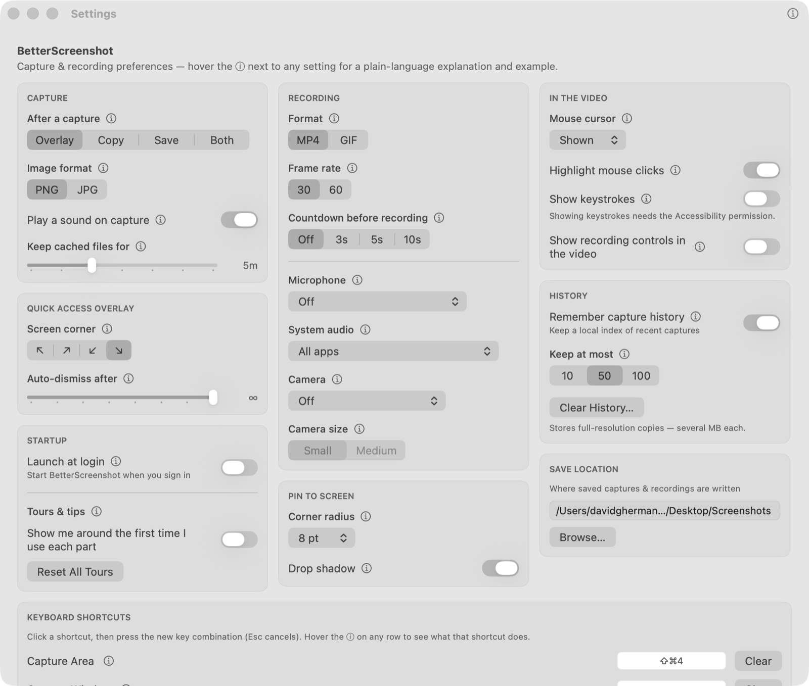
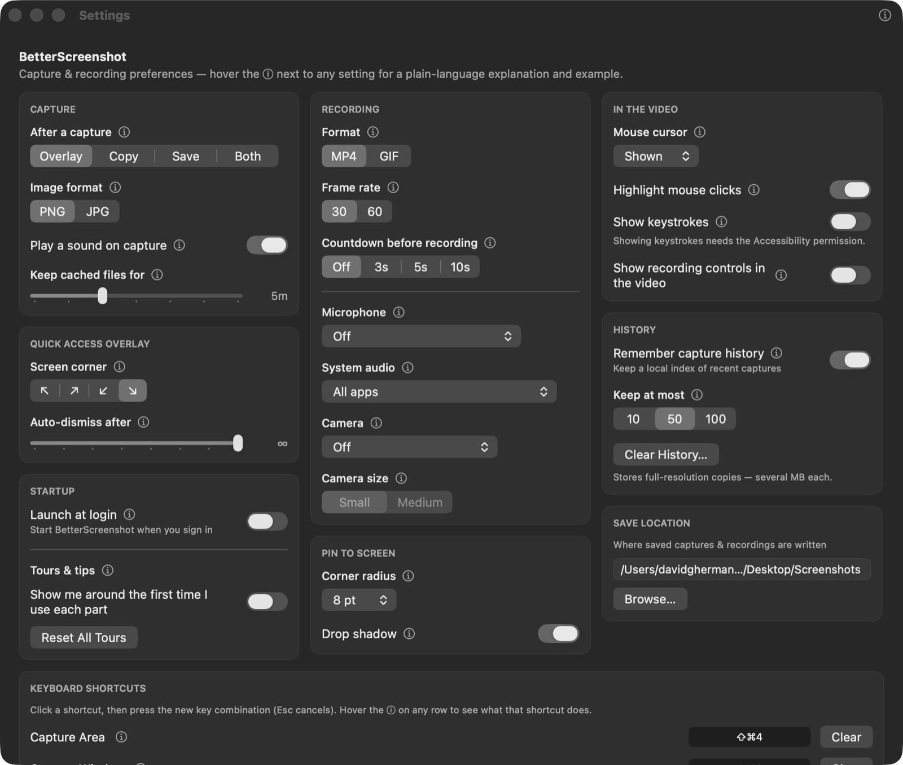
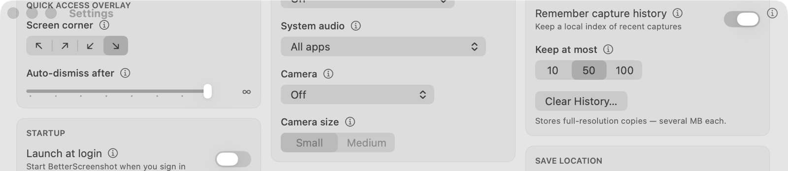
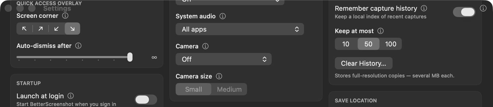

*Probe windows are inactive, so the switches show graphite rather than the accent colour. That is expected, not an issue.*

**Works well:**
- It follows the system appearance and looks right in both light and dark.
- The window sits on the `.sidebar` material (`SettingsWindowController.swift:51`).
- Cards are `Color.primary` 4 % tints with a 0.5 pt hairline and continuous 10 pt corners (`Cards.swift:14-18`, `Design.swift:8-19`), with no dots.
- Section labels are `.caption2` semibold secondary uppercase, exactly like MacStats.
- Controls are native: switches, segmented pickers, sliders, pop-up menus and `.bordered` buttons.
- The ⓘ is an SF `info.circle` that opens a native popover.
- Clear History asks through an `NSAlert` whose destructive button is marked (`SettingsView.swift:555-563`).
- Text uses text styles throughout.
- Spacing tokens (20 / 12 / 12) are applied consistently, and the 3-column masonry reads calmly.

**Issues:**
| # | Severity | Where | Problem | Why it matters | Suggested fix |
|---|---|---|---|---|---|
| S1 | **High** | `SettingsWindowController.swift:46-51` (screenshot `settings-scrolled-overlap.png`) | `.fullSizeContentView` plus `titlebarAppearsTransparent = true` lets the SwiftUI scroll content run under a title bar that has no material or scroll-edge effect. Once scrolled, "QUICK ACCESS OVERLAY" / "Screen corner" sit on top of the traffic lights and the "Settings" title; the "Remember capture history" switch sits against the titlebar ⓘ. | The content (1143 pt) is always taller than the window (815 pt here), so every user who scrolls sees overlapping text in both appearances. Overlap is the anchor-3 failure mode. | Keep a real title-bar background: drop `titlebarAppearsTransparent` (on 26 the standard title bar gets the scroll-edge effect), **or** drop `.fullSizeContentView` so the material starts under the title bar, **or** clip the ScrollView to the safe area (`.clipped()` on a container that respects the top safe-area inset). Re-check the tour dim's window radius afterwards (`TagOverlayController.swift:46-49`). |
| S2 | Medium | `Controls.swift:25-38` (`MenuPicker`) | `.frame(maxWidth: .infinity)` doesn't stretch a `.menu` Picker; each popup sizes to its longest item. Microphone ≈ 212 pt, System audio ≈ 250 pt, Camera ≈ 187 pt, Mouse cursor ≈ 90 pt, Corner radius ≈ 80 pt, all in the same card column. | The ragged right edges stand out next to the otherwise tidy cards. System Settings aligns its popups. | Give the menu pickers one width per column: either fill the column (`.frame(maxWidth: .infinity)` on the Picker **and** `.fixedSize(horizontal: false, …)`, or wrap in a `LabeledContent`-style trailing layout), or use a fixed trailing width. |
| S3 | Low | `ShortcutRecorderField.swift:135-138` | The recorder wells fill with `controlBackgroundColor` and a stroke, so in dark mode they become solid black boxes, the heaviest element on the page. | Slightly heavier than the tinted cards around them. | Use a `Color.primary` ≈ 0.06 tint with the 0.5 pt hairline, the same as `PathField` (`Controls.swift:55-56`). |
| S4 | Low | `SettingsView.swift:73-81` | An in-content "BetterScreenshot" headline and subtitle repeat the window title. | Apple settings windows don't title themselves twice. | Optional: drop the headline and keep the one-line hint as a `.callout` secondary line. |
| S5 | Low | `SettingsView.swift:208` | "Clear History…" is a plain `.bordered` button. | The spec says destructive = red. The confirming `NSAlert` does mark it, so this is a nitpick. | `Button(role: .destructive)`. |

**Why 6:** Everything else about Settings is 8-level native. S1 is a High layout overlap that anyone who scrolls will see, which caps the score below 8, and S2 is visible on first open.

## Floating HUDs — 6/10
The triptychs show each surface over a white page, a busy striped page and a dark page, all on macOS 26 with the glass path.

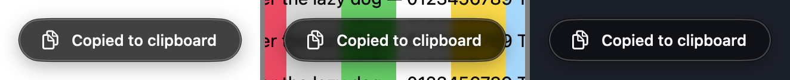

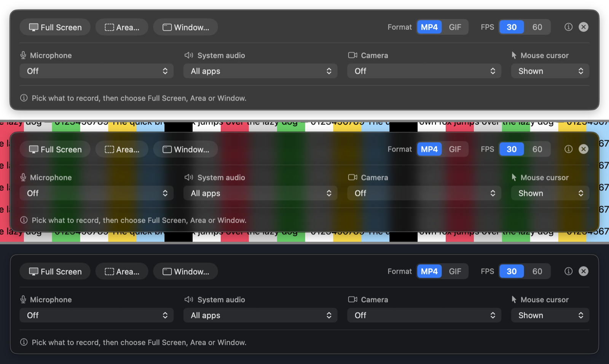
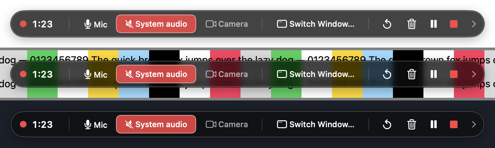
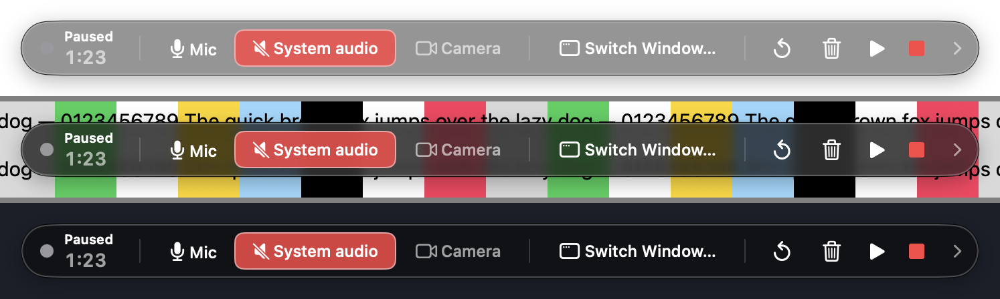
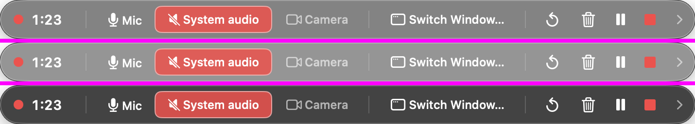
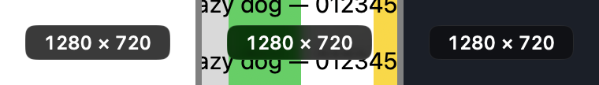
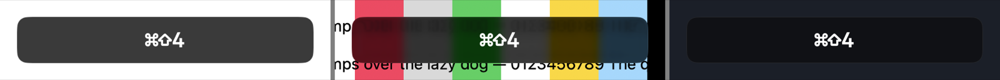

**Works well:**
- Every surface uses `HUDSurfaceView`: continuous corners, a 0.5 pt white-10 % hairline, one system shadow and consistent white type.
- Over busy and dark backgrounds, glass plus the tint reads well and looks the part.
- The record strip's native pop-ups, accent-coloured segments and hint line are tidy.
- The red recording dot is a legitimate status dot, and it stays circular on purpose (`RecordingControlsController.swift:122`).
- The countdown's 24 pt squircle looks right.
- The window-picker title chip is now a real view on the shared surface instead of a hand-drawn black box (`WindowPickerController.swift:78-115`).

**Issues:**
| # | Severity | Where | Problem | Why it matters | Suggested fix |
|---|---|---|---|---|---|
| H1 | **High** | `HUDSurface.swift:30-46, 73-80` together with `RecordingControlsController.swift:236` (screenshots `hud-pill-paused.png`, `pill-glass-over-white-1s-3s-8s.png`) | Over a white page, the live pill's glass lightens from rgb 84 to rgb 127 at 1 s and rgb 166 from 1.5 s on, and stays there (measured to 8 s). White text is then ≈ 2.4:1 and 60 %-white text ≈ 1.4:1. I reproduced it with a bare `HUDSurfaceView` at the pill's geometry (715 × 40, r20, y 110): it stays at rgb 75 **without** a window shadow and flips to rgb 166 **with** `panel.hasShadow = true`. A 715 × 44 surface without a shadow at y 60 also flipped. Toast, strip, countdown and a 200 × 100 box stayed at rgb 75–76. | The spec's acceptance criterion is "white text ≥ 4.5:1 over a white page on glass". The implementer's measurement (8.62:1) used a 200 × 100 box sampled once at 1 s, so it missed this. The pill is visible for the whole of every recording, usually over documents and browsers. | Glass adapts to what is behind it, and a black tint laid *over* it can't stop the glass under it from going near-white. Options: (a) put the tint into the glass itself (`NSGlassEffectView.tintColor = .black.withAlphaComponent(0.4)`) and host content in `glass.contentView`, then re-measure over time; (b) if it still flips, use the `.hudWindow` blur on macOS 26 as well for text-bearing HUDs; (c) at minimum drop `p.hasShadow` on the pill (glass draws its own edge). Add a probe/test that samples the backdrop at 0.5, 2 and 5 s for **each** real HUD, not a proxy box. |
| H2 | Medium | `HUDSurface.swift:17` (`secondaryText = white 60 %`) | In the steady state over white (backdrop rgb 76), 60 %-white text measures **4.31:1**. It is used for the strip captions and hint line, the countdown's "Click to start now", the dimmed camera button and the trim hints. | These are 12 pt texts, so they fall below WCAG AA. It is the same contrast argument C1 made for primary text. | Use 70 % white (≈ 5.2:1 on the same backdrop), or `NSColor.secondaryLabelColor` under the forced dark appearance, and re-measure. |
| H3 | Low | `RecordStripController.swift:92` vs its mode buttons / `ChoiceControl` (`:641-651`) | The outer radius is 12, but the inner mode buttons are capsules (≈ 14 pt radius) and the segments r7/r5 at a 16 pt inset. Inner shapes are rounder than the outer shape, so the corners aren't concentric. | This is subtle, but it is exactly the "concentric corners" rule. | Make the strip radius ≈ inset + inner radius (≈ 20–22), or make the inner buttons r8. |
| H4 | Low | `RecordStripController.swift:210-212, 276-300`; `RecordingControlsController.swift:124-131` | Fixed `systemFont(ofSize: 12/14/10)` instead of text styles. "Paused" is 10 pt, at the floor. | Principle 3: text styles, not fixed point sizes. | `NSFont.preferredFont(forTextStyle:)`-based sizes, as the inspector already does (`EditorChrome.swift:117-120`). |

**Why 6:** This is the most visible part of the redesign and it looks and feels right. H1 is a measured, reproducible legibility failure on the most-watched HUD and it violates an explicit acceptance criterion, so the area can't score above 7. H2 adds a second contrast shortfall.

## Quick Access card + badge — 8/10
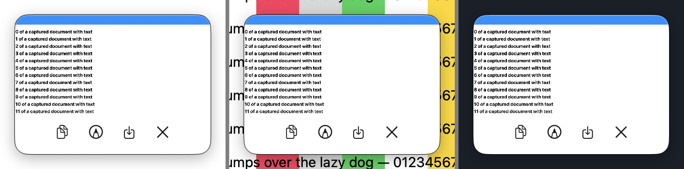
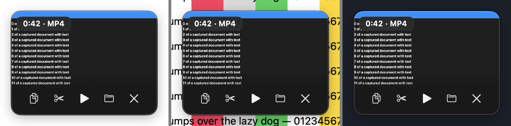

**Works well:**
- The card has continuous 14 pt corners and the icon buttons r7 continuous (`QuickAccessOverlayController.swift:106, 455`).
- The recording badge is a `HUDSurfaceView` r6 at an 8 pt inset, which is concentric with the card (14 − 8 = 6).
- The scrim, the sample band and the glyph-tone logic are untouched, as required.
- Buttons read correctly on both a white and a dark capture.

**Issues:**
| # | Severity | Where | Problem | Why it matters | Suggested fix |
|---|---|---|---|---|---|
| Q1 | Low | `QuickAccessOverlayController.swift:374` | The badge uses fixed 11 pt semibold. | A text-style nit. | `.caption` monospaced digits. |
| Q2 | Low | card edge | There is no 0.5 pt hairline on the card; on a white capture over a white page the edge relies only on the window shadow. | Apple's screenshot thumbnail has a faint border. | Optional 0.5 pt `Color.primary` 10 % border on `container.layer`. |

**Why 8:** Only nitpicks, and the careful constraints were respected.

## Annotation editor — 7/10
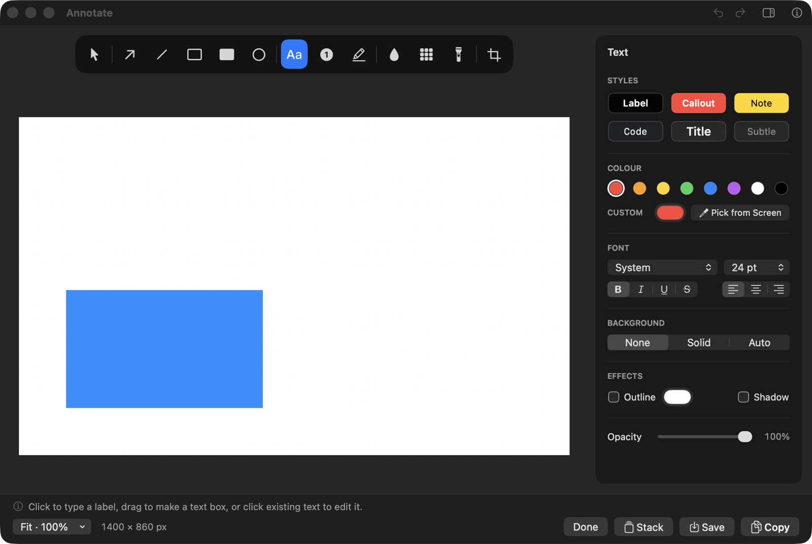
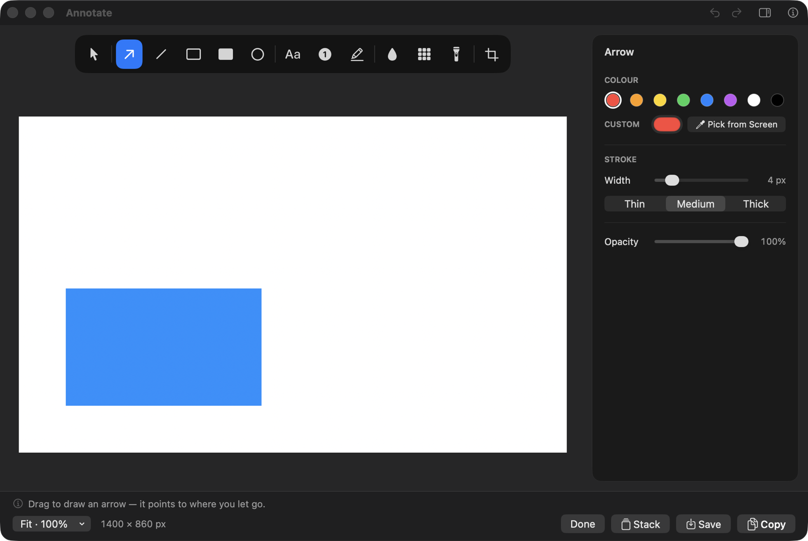

**Works well:**
- The window stays dark, as decided.
- The flat grey is replaced by a dark `.underWindowBackground` material (`EditorWindowController.swift:88`).
- The inspector uses `.caption2` semibold secondary section labels, `.callout` rows and semantic label colours (`EditorChrome.swift:113-138`).
- Native segmented controls, sliders and pop-ups.
- The selection highlight is a continuous path.
- The bottom bar uses the native `.headerView` material with a separator.
- The layout is clean: the tool pill is centred over the canvas column, and the inspector is aligned to the same 12 pt top.

**Issues:**
| # | Severity | Where | Problem | Why it matters | Suggested fix |
|---|---|---|---|---|---|
| E1 | Medium | `EditorWindowController.swift:173`, `EditorInspectorView.swift:86` | Inside the dark window, glass + 40 % black tint gives near-black slabs: pill rgb 19, inspector rgb 26 on a window of rgb 38. They read as opaque black panels, not a material, which is closer to the old custom-dark look than to the Photos editor. | The 40 % tint exists for HUDs over *white pages*. Here the backdrop is always the dark window, so the tint only darkens. | Give `HUDSurfaceView` a tint parameter and use ~0–10 % inside the editor/trim windows, or use a `CardBackground`-style `Color.primary` 6 % tint for the inspector (it's docked content, not a floating control). |
| E2 | Low | `EditorWindowController.swift:173` + `EditorChrome.swift:59` | The pill is r15 at 50 pt tall (neither a capsule like macOS 26 toolbars nor concentric). The tool highlight is r9 at an 8 pt gap, where concentric would be r7. | Concentric-corner rule. | Capsule (r25) with a capsule highlight, or keep r15 and use a r7 highlight. |
| E3 | Low | `EditorWindowController.swift:201-209` | Tool-group separators are 1 pt wide at 13 % white. | Borders should be 0.5 pt hairlines. | Width 0.5. |
| E4 | Low | `EditorChrome.swift:235-280` (`InspectorCheckbox`) | Custom-drawn checkbox with a 1 pt stroke and fixed 12 pt font. | It exists for a documented reason (the system unchecked box is invisible on the HUD), but it is the one hand-drawn control left. | Re-check whether a native checkbox now renders visibly on the glass surface; if not, use a 0.5–1 pt semantic stroke and a text-style font. |
| E5 | Low | bottom bar | Done / Stack / Save / Copy are four equal-weight bordered buttons with no primary. | In Apple's editors the commit action is prominent. | Make Done (or Copy) `.borderedProminent`. |

**Why 7:** Coherent and clearly native in structure. E1 keeps it from feeling like Photos.

## Trim / video editor — 7/10
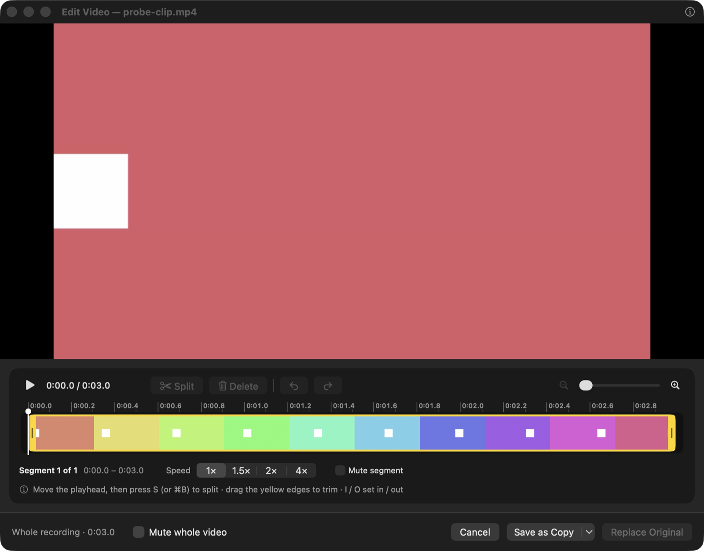

**Works well:**
- The dark material backdrop replaces `NSColor(white: 0.09)` (`TrimWindowController.swift:129`).
- The control card is the shared HUD surface (r12).
- Timeline shapes are continuous (`CutTimelineView.swift:108-260`).
- The native yellow trim colour is kept.
- The bottom bar is native, and Replace Original has the accent look without a Return shortcut (deliberate).

**Issues:**
| # | Severity | Where | Problem | Why it matters | Suggested fix |
|---|---|---|---|---|---|
| T1 | Low | `CutTimelineView.swift:272` | Ruler labels are 9 pt, below the ~10 pt floor. | Legibility; §7 checklist. | `.caption2` (≈10–11 pt). |
| T2 | Low | `TrimWindowController.swift:193-266, 344-349` | Fixed 11–12 pt fonts and hard-coded `NSColor(white: 1, alpha: 0.45…0.9)` text colours; the editor inspector's text-style/semantic treatment wasn't applied here. | Inconsistent with the editor inspector, which was converted. | Reuse `InspectorStyle.font(_:)` / `secondaryLabelColor`. |
| T3 | Low | as E1 | The card is a near-black slab for the same tint reason. | As E1. | As E1. |

**Why 7:** Works and looks consistent. The leftovers are type-level only.

## Tour tags — 7/10 *(code only)*
I tried a tag from the probe, but its panels sit above the host and fell outside my composite capture, so this rating is from code.

**Works well:**
- The bubble, buttons, outline box and dim hole all use continuous corners (`TagViews.swift:41-60, 120`; `TagStyle.swift`).
- The red `#C62D22` is kept, with its WCAG test (`TagContrastTests`, passing).

**Issues:**
| # | Severity | Where | Problem | Why it matters | Suggested fix |
|---|---|---|---|---|---|
| G1 | Low | `TagStyle.swift:53-57` | Fixed 13/12/11 pt fonts. | Text-style rule. | Text styles. |
| G2 | Low | `TagViews.swift:122` | The outline button uses a 1 pt white border. | Hairline rule (though on a saturated red a 1 pt border is defensible). | Keep, or 0.5–1 pt at 80 % white. |
| G3 | Low | `TagOverlayController.swift:46-49` | The dim's window radius (16 on macOS 26) was measured for the old Settings chrome. Settings is now `.fullSizeContentView`, and S1's fix may change it again. | The dim could spill past or fall short of rounded corners. | Re-measure after fixing S1. |

**Why 7:** Consistent with the decision, with type nits. It was not verified by eye.

## History window — 7/10 *(code only: the window reads the owner's real history, so I did not open it)*
**Works well:**
- Native SwiftUI with a `.bar` toolbar background and text styles throughout.
- Cell (r8) and thumbnail (r6) are now `.continuous` (`HistoryWindowController.swift:309, 334-337`).
- The selected state is an accent 15 % fill with a 2 pt accent stroke.

**Issues:**
| # | Severity | Where | Problem | Why it matters | Suggested fix |
|---|---|---|---|---|---|
| Y1 | Low | `HistoryWindowController.swift:309` vs `:333-334` | The thumbnail is r6 inside a r8 cell with 6 pt padding (concentric would be r2, or r12 for the cell). | Concentric rule. | Cell r12 with a r6 thumbnail. |
| Y2 | Low | `HistoryItemInteraction.swift` / `HistoryCell` | Cells have no hover feedback (no hover handling in `App/History/`). | §7 "hover + press feedback on custom clickable things". | `Color.primary` 0.07 hover fill on the cell shape. |
| Y3 | Low | `HistoryWindowController.swift:298` | The placeholder uses `Color.gray.opacity(0.12)`. | Minor: not a semantic token. | `Color.primary.opacity(0.06)`. |

**Why 7:** Already native and untouched beyond the corner curves. Small polish gaps; not seen by eye.

## DesignKit + code hygiene — 7/10
**Works well:**
- `HUDStyle` and `RecordingHUDStyle` are deleted, with no references left.
- The acceptance grep (`cornerRadius` without `cornerCurve`/`.continuous`) shows only initialiser parameters and the two deliberate circles (`RecordingControlsController.swift:122`, `CameraBubbleController.swift:51`).
- The only remaining `NSBezierPath(roundedRect:xRadius:)` uses are annotation *content* (`TextAnnotation.swift:90`) and a round handle (`EditorCanvasView.swift:309`); both are fine.
- No `UnevenRoundedRectangle` without a style, and no `RoundedRectangle(` without `.continuous`.
- Glass is behind `#if compiler(>=6.2)` + `#available(macOS 26, *)` with a blur fallback (`HUDSurface.swift:54-89`).
- No opaque window greys remain.
- `swift build` passes and `scripts/test.sh` passes: DesignKit 3, CaptureKit 120, OverlayKit 50, EditorKit 155, RecordingKit 92, HistoryKit 41, TourKit 117.

**Issues:**
| # | Severity | Where | Problem | Why it matters | Suggested fix |
|---|---|---|---|---|---|
| K1 | Medium | `HUDSurface.swift:38-47` | HUD content and the tint are added as *siblings above* the `NSGlassEffectView`, not into its `contentView`. The glass therefore can't adapt the content, and the overlay tint can't stop the glass from adapting (see H1). | This is the most likely root cause of H1. It also makes the glass look like the old blur (little of the glass character survives a 40 % black overlay). | On 26, host content in `glass.contentView` and use `glass.tintColor` for the darkening; keep the sibling tint only in the blur fallback. |
| K2 | Medium | `Packages/DesignKit/Tests/DesignKitTests/main.swift` | The 3 tests check layer properties only. Nothing checks rendered contrast over time or per real HUD, which is how H1 shipped while the progress note claimed "8.62:1". | Regression risk on the app's central visual guarantee. | Keep a probe (not a unit test) that renders each real HUD over white and samples at 0.5/2/5 s; record the numbers in the progress doc. |
| K3 | Low | `Cards.swift:22-74`, `WindowMaterial.swift:27-35`, `Design.swift:15-22` | `CardButtonStyle`, `SubtleButtonStyle`, `WindowMaterialView`, `cardHoverFill`/`cardPressedFill`/`smallButton*` have no callers. | Speculative API (owner rule: minimum code). | Mention it / delete when convenient. |
| K4 | Low | macOS 14/15 path | The fallback blur path was never rendered (this Mac runs macOS 26). | Unverified on the deployment target. | One screenshot pass on a 14/15 VM or CI runner. |

**Why 7:** Tidy, well-guarded, and the one-recipe goal was met. K1/K2 are the structural reason the headline contrast bug exists and wasn't caught.

## Cross-cutting issues
- **The contrast guarantee is measured on proxies, not on real surfaces over time.** H1, H2 and K2 are one story: the adaptive glass behaves differently per geometry and window configuration, and a single 1-second sample of a 200 × 100 box can't vouch for the pill.
- **Text styles were applied unevenly.** Settings and the editor inspector use them; the strip, pill, trim window, tour tags and badges still use fixed 9–14 pt fonts.
- **The 40 % tint is applied everywhere, including in-window panels whose backdrop is already dark (E1, T3).** That makes them black slabs. The tint should depend on context.
- **Concentric radii are right in the new token code (Quick Access badge) but not in several older nested shapes** (strip, tool pill, History cell).

## Top fixes (ranked by impact ÷ effort)
1. **Fix the Settings title-bar overlap (S1):** drop `titlebarAppearsTransparent` or `.fullSizeContentView` in `SettingsWindowController.swift:46-49`. It's one line, and every Settings user who scrolls sees the bug.
2. **Stop the pill's glass flipping light (H1/K1):** move the darkening into `NSGlassEffectView.tintColor` with content in `contentView` (`HUDSurface.swift:38-47, 73-80`), and/or drop `hasShadow` on the pill (`RecordingControlsController.swift:236`). Re-measure each real HUD over white at 0.5/2/5 s; if any still flips, use the `.hudWindow` blur on 26 for text-bearing HUDs.
3. **Raise HUD secondary text to 70 % white (H2):** one constant at `HUDSurface.swift:17`, taking 4.3:1 to ≈ 5.2:1.
4. **Equalise the Settings popup widths (S2):** `Controls.swift:25-38`.
5. **Use a lighter tint for in-window panels (E1/T3):** add a tint parameter to `HUDSurfaceView` and use ~0–10 % in the editor inspector, tool pill and trim card.

After those: concentric radii (H3, E2, Y1), 0.5 pt separators (E3), text styles in the strip/pill/trim/tags (H4, T1, T2, G1), hover on History cells (Y2), and deleting the unused DesignKit API (K3).

## Method & limits
- **Build and tests:** `swift build` and `scripts/test.sh` on `feat/native-look` @ `a807ef7` (both green).
- **Code:** read against the spec's §5 acceptance criteria and the design-language §7 checklist, including the spec's greps.
- **Screenshots:** from a throwaway probe outside the repo, based on the existing harness and extended with the recording pill, Quick Access cards, trim window (generated 3 s MP4), ⓘ popover, Settings scrolled, and time-series contrast sampling. All probe windows were parked just above the desktop behind the owner's windows and captured with `CGWindowListCreateImage`. HUDs were composited over three full-screen backdrops (white, busy stripes, dark). Contrast figures are WCAG 2.x from sampled backdrop pixels.
- **Machine:** a 14″ MacBook (1470 × 956 pt, Dock at the bottom), macOS 26.6.2, system appearance Dark, Swift 6.2.3.
- **Limits:**
  - **Inactive windows:** they render their material in the inactive (more opaque) state, so Settings/editor translucency over a busy background could not be judged. Controls show graphite.
  - **Light mode:** it was forced per-app while the system was Dark. The light-mode ⓘ popover rendered dark with black text; that is an artifact of the mismatch, not counted.
  - **Replicas and code-only surfaces:** the size chip and keystroke overlay are replicas (same `HUDSurfaceView`, radius and font as the code), because their views are module-internal or need Accessibility permission. The window-picker chip, pin close button, tour tag and History window were reviewed from code only.
  - **H1 conditions:** it was measured with probe windows at desktop level. It reproduced deterministically in 4 runs, but the exact trigger (shadow plus geometry) should be confirmed in the real app at `.statusBar` level over a white page.
  - **Fallback path:** the macOS 14/15 blur path was not rendered.
- **Screenshots** are in `docs/reviews/2026-09-29-native-look/` (uncommitted, ≈ 3.9 MB).
